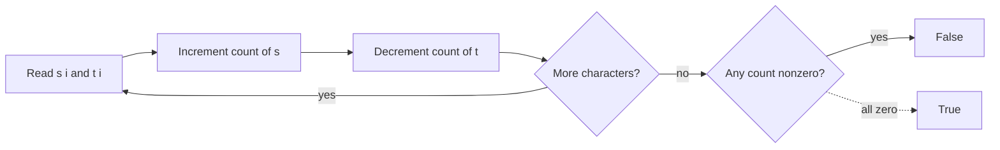

# 242. Valid Anagram

https://leetcode.com/problems/valid-anagram/

## Problem in your own words

Two strings are anagrams when one can be rearranged into the other. That means they have the same length and the same count of each character. You should return true when the multisets of characters match, and false otherwise. The original order of either string does not matter.

## Easy analogy

Two scrambled piles of letter tiles form the same word if, for every letter, both piles contain the same number of tiles. You can line the tiles up alphabetically, or you can tally them. The tally is faster when the alphabet is small.

## Diagram



```text
s = "anagram"
t = "nagaram"
count['a']: +1 +1 +1  then three -1  -> 0
count['n']: ends at 0, and so on for every letter
```

## Intuition before code

Sorting both strings and comparing them is correct and easy to explain: anagrams share one sorted form. It costs `O(n log n)`. With a fixed lowercase alphabet, a length-26 array is enough. Walk both strings once, add one string and subtract the other. If every slot returns to zero, the counts matched. Unequal lengths can never be anagrams, so reject them before counting.

## Walkthrough with a tiny input, step by step

Input: `s = "ab"`, `t = "ba"`. Counts start at all zeros. Assume `'a' -> 0`, `'b' -> 1`.

- Index 0: `s` contributes `a` so slot 0 becomes 1. `t` contributes `b` so slot 1 becomes -1.
- Index 1: `s` contributes `b` so slot 1 returns to 0. `t` contributes `a` so slot 0 returns to 0.
- Every slot is 0. Return true.

Input: `s = "ab"`, `t = "aa"`. After the same process slot 0 is `-1` (two `a` in `t`, one in `s`) and slot 1 is `+1`. Return false. Input: `s = "a"`, `t = "ab"` fails the length check immediately.

## Java solution (complete, correct, commented)

```java
class Solution {
    public boolean isAnagram(String s, String t) {
        if (s.length() != t.length()) {
            return false;
        }
        int[] count = new int[26];
        for (int i = 0; i < s.length(); i++) {
            count[s.charAt(i) - 'a']++;
            count[t.charAt(i) - 'a']--;
        }
        for (int c : count) {
            if (c != 0) {
                return false;
            }
        }
        return true;
    }
}
```

## Python solution (complete, correct, commented)

```python
class Solution:
    def isAnagram(self, s: str, t: str) -> bool:
        if len(s) != len(t):
            return False
        count = [0] * 26
        for i in range(len(s)):
            count[ord(s[i]) - ord("a")] += 1
            count[ord(t[i]) - ord("a")] -= 1
        return all(c == 0 for c in count)
```

`sorted(s) == sorted(t)` is correct too. Each `sorted` call copies the characters and sorts them, so it is `O(n log n)` time and `O(n)` extra space. Do not slice the strings; a slice such as `s[:]` is another full copy.

## Time and space complexity with why

- Time: `O(n)` where `n` is the length of the strings. One pass to update counts, one pass over 26 slots.
- Space: `O(1)` extra, because the count array size is the alphabet, not `n`.
- If the alphabet is Unicode, replace the array with a hash map. Time stays `O(n)` expected and space becomes `O(k)` for the number of distinct characters.

## Pitfalls and how to talk through this in an interview in under 2 minutes

Say: “Same length and same character counts. I will add one string and subtract the other in a 26-slot array.” State the lowercase assumption. Mention unequal lengths, empty strings (true), and a character that appears more often in one string. If the interviewer says “any Unicode,” switch to a map and do not subtract from `'a'`. Sorting is your one-sentence backup. Do not compare the strings after reversing them; an anagram is not a reversal.
