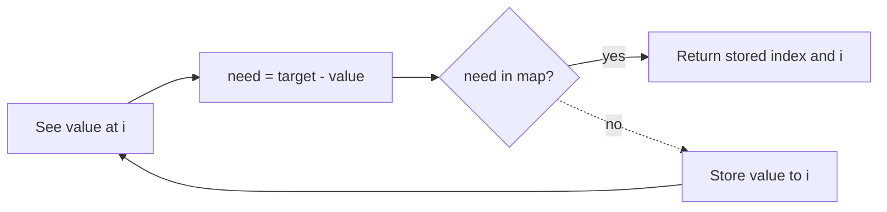

# 1. Two Sum

https://leetcode.com/problems/two-sum/

## Problem in your own words

You are given an array of integers and a target. Find two different indices whose values add up to the target, and return those indices in either order. Exactly one solution exists. You may not use the same element twice, even if twice its value equals the target. The array is not sorted, and the values are not necessarily positive.

## Easy analogy

You walk through a market with a shopping list that says “the two prices must add to 10.” For each price tag you see, you ask the clerk whether the matching price (10 minus this tag) was already written in the ledger. If yes, you point at the two stalls. If no, you write this stall’s price and its stall number into the ledger and keep walking.

## Diagram



```text
nums:     [2, 7, 11, 15]     target 9
i = 0:    need 7  miss  map {2:0}
i = 1:    need 2  hit   return [0, 1]
```

## Intuition before code

For each value `x`, the only partner that works is `target - x`. Remember every previous value’s index. When the partner is already in the map, you have both indices. Put the current value into the map only after the lookup, otherwise a single copy of `target / 2` would match itself. A double loop is correct and too slow. Sorting then two pointers finds the values but scrambles the original indices unless you sort pairs of `(value, index)`.

## Walkthrough with a tiny input, step by step

Input: `nums = [3, 2, 4]`, `target = 6`.

- `i = 0`, value `3`, need `3`. Map empty. Store `3 → 0`.
- `i = 1`, value `2`, need `4`. Miss. Store `2 → 1`. Map is `{3:0, 2:1}`.
- `i = 2`, value `4`, need `2`. Hit index `1`. Return `[1, 2]`.

Notice index 0 also holds a `3`, but we never pair it with itself because the lookup happened before the first insert, and the second `3` is not in this input. For `[3, 3]` and target `6`: first `3` is stored, second `3` looks up need `3` and finds index 0.

## Java solution (complete, correct, commented)

```java
import java.util.HashMap;
import java.util.Map;

class Solution {
    public int[] twoSum(int[] nums, int target) {
        Map<Integer, Integer> indexOf = new HashMap<>();
        for (int i = 0; i < nums.length; i++) {
            int need = target - nums[i];
            Integer partner = indexOf.get(need);
            if (partner != null) {
                return new int[] { partner, i };
            }
            indexOf.put(nums[i], i);
        }
        // The problem promises exactly one answer.
        return new int[0];
    }
}
```

`target - nums[i]` is safe in 32-bit Java `int` arithmetic for the usual constraints only if you accept two’s-complement wrap. When values can be near `Integer.MIN_VALUE` or `MAX_VALUE`, compute the complement in a `long`:

```java
long need = (long) target - nums[i];
```

and store `Integer` keys only when `need` fits in an `int`. Under the LeetCode constraints the complement always fits, so the `int` version above is correct for this problem.

## Python solution (complete, correct, commented)

```python
class Solution:
    def twoSum(self, nums: list[int], target: int) -> list[int]:
        index_of = {}
        for i, value in enumerate(nums):
            need = target - value
            if need in index_of:
                return [index_of[need], i]
            index_of[value] = i
        return []
```

Python integers do not overflow. No slicing: a slice of `nums` would copy the array and is unnecessary.

## Time and space complexity with why

- Time: `O(n)` expected. One pass, expected `O(1)` per hash operation.
- Space: `O(n)` for the map, which stores every index until the partner is found. In the worst case the partner is the last element.

## Pitfalls and how to talk through this in an interview in under 2 minutes

Say: “For each number I look up `target - x` in a map of value to index, then I store `x`.” Emphasize two different indices and the duplicate-value case `[3, 3]`. Say you return indices, not the values. If they want all pairs, switch the map value to a list and keep scanning. If they ban hash maps, sort `(value, index)` pairs and move two pointers inward, still returning original indices. Mention expected linear time and linear extra memory.
