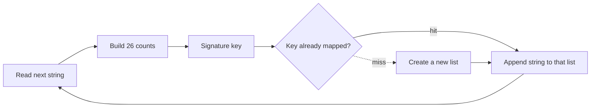

# 49. Group Anagrams

https://leetcode.com/problems/group-anagrams/

## Problem in your own words

You are given an array of strings. Group the strings that are anagrams of each other, and return the groups. Order of the groups does not matter, and order inside a group does not matter. Two strings belong together when they contain the same characters with the same frequencies, even if the characters appear in different orders.

## Easy analogy

Imagine mail slots labeled by a recipe card: “two A, one B, zero C, …” Every word is dropped into the slot whose recipe matches its letter counts. Words that are rearrangements of each other land in the same slot. You never compare every word to every other word.

## Diagram



```text
"eat" -> #1#0#0#1#1#0...     list ["eat"]
"tea" -> same key            list ["eat", "tea"]
"tan" -> #1#0#0#0#0...#1#1   list ["tan"]
"ate" -> same as eat         list ["eat", "tea", "ate"]
```

## Intuition before code

An anagram group is an equivalence class under “same multiset of characters.” Pick a canonical key for that multiset. Sorting each string produces a key in `O(k log k)`. Counting 26 letters produces a key in `O(k)` and is the one to prefer. The key must separate different counts: joining counts with no delimiter makes `1,11` and `11,1` look alike, so put a separator between numbers. Append the original string, not the key, to the group.

## Walkthrough with a tiny input, step by step

Input: `["eat", "tea", "tan"]`.

- `"eat"`: counts a=1, e=1, t=1. Key `#1#0#0#1#1#0...`. New list `["eat"]`.
- `"tea"`: same counts. Append. List `["eat", "tea"]`.
- `"tan"`: a=1, n=1, t=1. Different key. New list `["tan"]`.

Return both lists. `"eat"` and `"tan"` are not merged because `e` and `n` differ.

## Java solution (complete, correct, commented)

```java
import java.util.ArrayList;
import java.util.HashMap;
import java.util.List;
import java.util.Map;

class Solution {
    public List<List<String>> groupAnagrams(String[] strs) {
        Map<String, List<String>> groups = new HashMap<>();
        for (String word : strs) {
            int[] count = new int[26];
            for (int i = 0; i < word.length(); i++) {
                count[word.charAt(i) - 'a']++;
            }
            // '#' keeps 1,11 distinct from 11,1
            StringBuilder keyBuilder = new StringBuilder();
            for (int c : count) {
                keyBuilder.append('#').append(c);
            }
            String key = keyBuilder.toString();
            groups.computeIfAbsent(key, ignored -> new ArrayList<>()).add(word);
        }
        return new ArrayList<>(groups.values());
    }
}
```

## Python solution (complete, correct, commented)

```python
class Solution:
    def groupAnagrams(self, strs: list[str]) -> list[list[str]]:
        groups: dict[tuple[int, ...], list[str]] = {}
        for word in strs:
            count = [0] * 26
            for ch in word:
                count[ord(ch) - ord("a")] += 1
            # A tuple is hashable and keeps each count in its own slot.
            key = tuple(count)
            groups.setdefault(key, []).append(word)
        return list(groups.values())
```

`tuple(sorted(word))` also works. `sorted(word)` copies the characters and sorts them, which is `O(k log k)` per word and `O(k)` extra space for that copy. Building the count tuple is `O(k)` time and copies only 26 integers. Do not use `word[:]` as a key; a slice copies the string and equal anagrams would not share a key unless you sort the slice.

## Time and space complexity with why

- Time: `O(n k)` where `n` is the number of strings and `k` is the length of the longest one. Each character is counted once, and building the key scans 26 slots per string.
- Space: `O(n k)` to store the groups (the output) plus the keys. The map does not hide the output size.

## Pitfalls and how to talk through this in an interview in under 2 minutes

Say: “I hash a 26-count signature and append each original string to that bucket.” Call out the delimiter bug and empty strings (one group of empty strings). Say the result order is undefined. If characters are not lowercase English, key a hash map of counts or sort the string. Mention `O(nk)` versus the sort-key `O(nk log k)`. Do not sort the entire array of strings as one blob; sort or count inside each string.
