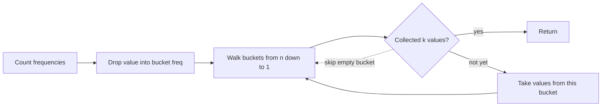

# 347. Top K Frequent Elements

https://leetcode.com/problems/top-k-frequent-elements/

## Problem in your own words

You are given an array of integers and an integer `k`. Return the `k` values that appear most often. The answer may be in any order. The problem promises that the answer is unique, so you do not have to break ties. You need the values, not the frequencies themselves.

## Easy analogy

Count how many times each song was played, then line up bins labeled 1 play, 2 plays, up to `n` plays. Drop each song into the bin of its play count. Walk from the fullest bin downward and pick songs until you have `k`. You never sort the songs by title.

## Diagram



```text
nums = [1,1,1,2,2,3], k = 2
freq: 1→3, 2→2, 3→1
bucket[3] = [1]
bucket[2] = [2]
bucket[1] = [3]
walk: take 1, then 2, stop
```

## Intuition before code

Frequency is the only ranking key. A hash map computes it in one pass. A heap of size `k` then extracts the top frequencies in `O(n log k)`. That is a good answer. Bucket sort is better here because a frequency is an integer between 1 and `n`, so you can index an array by frequency and collect from the high end. No comparison sort is required, which is why this version is `O(n)`.

## Walkthrough with a tiny input, step by step

Input: `[1, 1, 1, 2, 2, 3]`, `k = 2`.

- Count: `1` appears 3 times, `2` appears 2 times, `3` appears 1 time.
- Place them: index 3 holds `[1]`, index 2 holds `[2]`, index 1 holds `[3]`.
- Start at index 3. Take `1`. One value collected.
- Index 2. Take `2`. Two values collected. Stop.
- Return `[1, 2]`.

## Java solution (complete, correct, commented)

Bucket sort, `O(n)` time. The heap alternative is below it.

```java
import java.util.ArrayList;
import java.util.HashMap;
import java.util.List;
import java.util.Map;

class Solution {
    public int[] topKFrequent(int[] nums, int k) {
        Map<Integer, Integer> freq = new HashMap<>();
        for (int value : nums) {
            freq.merge(value, 1, Integer::sum);
        }

        // Frequency is at most nums.length, so the bucket index is valid.
        List<Integer>[] buckets = new ArrayList[nums.length + 1];
        for (Map.Entry<Integer, Integer> entry : freq.entrySet()) {
            int f = entry.getValue();
            if (buckets[f] == null) {
                buckets[f] = new ArrayList<>();
            }
            buckets[f].add(entry.getKey());
        }

        int[] answer = new int[k];
        int filled = 0;
        for (int f = buckets.length - 1; f >= 1 && filled < k; f--) {
            if (buckets[f] == null) {
                continue;
            }
            for (int value : buckets[f]) {
                answer[filled++] = value;
                if (filled == k) {
                    break;
                }
            }
        }
        return answer;
    }
}
```

Heap alternative, `O(n log k)` time. Use a min-heap ordered by frequency so the least frequent of the current top `k` sits on top and can be evicted.

```java
import java.util.HashMap;
import java.util.Map;
import java.util.PriorityQueue;

class SolutionHeap {
    public int[] topKFrequent(int[] nums, int k) {
        Map<Integer, Integer> freq = new HashMap<>();
        for (int value : nums) {
            freq.merge(value, 1, Integer::sum);
        }
        PriorityQueue<int[]> heap = new PriorityQueue<>((a, b) -> Integer.compare(a[1], b[1]));
        for (Map.Entry<Integer, Integer> entry : freq.entrySet()) {
            heap.offer(new int[] { entry.getKey(), entry.getValue() });
            if (heap.size() > k) {
                heap.poll();
            }
        }
        int[] answer = new int[k];
        for (int i = 0; i < k; i++) {
            answer[i] = heap.poll()[0];
        }
        return answer;
    }
}
```

## Python solution (complete, correct, commented)

```python
class Solution:
    def topKFrequent(self, nums: list[int], k: int) -> list[int]:
        freq: dict[int, int] = {}
        for value in nums:
            freq[value] = freq.get(value, 0) + 1

        buckets: list[list[int]] = [[] for _ in range(len(nums) + 1)]
        for value, f in freq.items():
            buckets[f].append(value)

        answer: list[int] = []
        for f in range(len(buckets) - 1, 0, -1):
            for value in buckets[f]:
                answer.append(value)
                if len(answer) == k:
                    return answer
        return answer
```

Heap alternative:

```python
import heapq

class SolutionHeap:
    def topKFrequent(self, nums: list[int], k: int) -> list[int]:
        freq: dict[int, int] = {}
        for value in nums:
            freq[value] = freq.get(value, 0) + 1
        # nsmallest on (freq, value) keeps the k largest if we negate freq
        return heapq.nlargest(k, freq.keys(), key=freq.get)
```

`buckets = [[]] * (n + 1)` is a bug: every slot would be the same list. The comprehension above builds distinct lists. No slicing of `nums` is required. `heapq.nlargest` is `O(n log k)` and copies the `k` results.

## Time and space complexity with why

- Bucket sort: `O(n)` time. Counting is linear, placing into buckets is linear in the number of distinct values, and the downward scan touches each bucket at most once. Space is `O(n)` for the map, the buckets, and the answer.
- Heap: `O(n)` to count, then `O(d log k)` to push distinct values, which is `O(n log k)` at worst. Space `O(n)` for the map plus `O(k)` for the heap.

## Pitfalls and how to talk through this in an interview in under 2 minutes

Say: “Count with a map, bucket by frequency, read from the high bucket down until I have `k`.” Mention that frequency cannot exceed `n`, so the bucket array is sized `n + 1`. Mention the shared-list bug in Python. Offer the heap if they ask for `k` much smaller than `n` and they do not need a linear guarantee. Do not sort the whole frequency list unless you are out of time; that is `O(n log n)`. The answer order does not matter. `k` is at least 1 under the usual constraints.
