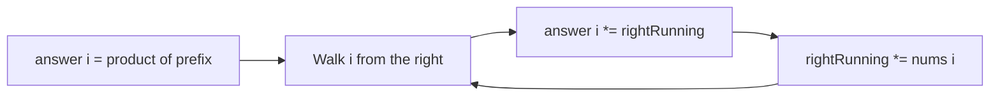

# 238. Product of Array Except Self

https://leetcode.com/problems/product-of-array-except-self/

## Problem in your own words

For each index, compute the product of every element in the array except the value at that index. Return an array of those products. You must do it without using division. The output does not count as extra space toward the follow-up that asks for `O(1)` extra memory. Zeros are allowed, so a prefix or a suffix can be zero.

## Easy analogy

Each seat in a row wants the product of everyone else’s numbers. Let each seat first collect the product of everyone to its left. Then walk back from the right, carrying a running product of everyone already visited on the right, and multiply that into the seat. Left luggage times right luggage is everyone except the seat itself.

## Diagram

```text
nums:    1    2    3    4
left:    1    1    2    6     left[i] = product of nums[0..i-1]
right:  24   12    4    1     right[i] = product of nums[i+1..n-1]
answer: 24   12    8    6

one-array version:
answer starts as the left products
rightRunning moves from the end:  -.-> multiply into answer[i], then *= nums[i]
```



## Intuition before code

`answer[i] = prefix[i] * suffix[i]`, where `prefix[i]` excludes `nums[i]` and `suffix[i]` excludes `nums[i]`. Division would be `total / nums[i]`, and it breaks on zero and is forbidden. Two extra arrays make the idea obvious. You can reuse the output array for the prefixes, then fold the suffix in with one integer, which is the `O(1)` extra-memory version. The running suffix starts at 1, the empty product.

## Walkthrough with a tiny input, step by step

Input: `[1, 2, 3, 4]`.

- Build left products into `answer`: `[1, 1, 1*1, 1*2] = [1, 1, 2, 6]`.
- `right = 1`.
- `i = 3`: `answer[3] = 6 * 1 = 6`. Then `right = 1 * 4 = 4`.
- `i = 2`: `answer[2] = 2 * 4 = 8`. Then `right = 4 * 3 = 12`.
- `i = 1`: `answer[1] = 1 * 12 = 12`. Then `right = 12 * 2 = 24`.
- `i = 0`: `answer[0] = 1 * 24 = 24`. Then `right = 24 * 1 = 24`.
- Result `[24, 12, 8, 6]`.

With a zero, for example `[1, 0, 3]`: products are `[0, 3, 0]`. The zero’s own slot gets the product of the others; every other slot includes the zero and becomes zero. No division by zero occurs.

## Java solution (complete, correct, commented)

```java
class Solution {
    public int[] productExceptSelf(int[] nums) {
        int n = nums.length;
        int[] answer = new int[n];
        // answer[i] will first hold the product of nums[0..i-1]
        answer[0] = 1;
        for (int i = 1; i < n; i++) {
            answer[i] = answer[i - 1] * nums[i - 1];
        }
        // Fold in the product of nums[i+1..n-1] from the right.
        int right = 1;
        for (int i = n - 1; i >= 0; i--) {
            answer[i] = answer[i] * right;
            right = right * nums[i];
        }
        return answer;
    }
}
```

LeetCode guarantees that every prefix product, suffix product, and answer value fits in a 32-bit signed integer, so `int` does not overflow on this problem. If that promise is removed, multiply with `long` and define what you return when the product exceeds 32 bits:

```java
long product = (long) answer[i] * right;
answer[i] = (int) product; // only if the caller still wants a truncated int
right = (int) ((long) right * nums[i]);
```

Prefer a `long[]` result when the real product must be exact.

## Python solution (complete, correct, commented)

```python
class Solution:
    def productExceptSelf(self, nums: list[int]) -> list[int]:
        n = len(nums)
        answer = [1] * n
        for i in range(1, n):
            answer[i] = answer[i - 1] * nums[i - 1]
        right = 1
        for i in range(n - 1, -1, -1):
            answer[i] *= right
            right *= nums[i]
        return answer
```

Python integers grow automatically, so overflow is not a concern. `answer = [1] * n` is a new list of integers, which is what we want. Do not build the answer with slices such as `nums[:i]`: each slice copies, and multiplying a slice in a loop is quadratic time and extra memory.

## Time and space complexity with why

- Time: `O(n)`. Two passes, a constant amount of work per index.
- Extra space: `O(1)` besides the output array. The output itself is `O(n)` and is required. The two-array teaching version uses `O(n)` extra space for a separate prefix and suffix.

## Pitfalls and how to talk through this in an interview in under 2 minutes

Say: “Left product times right product, built without division, suffix folded into the same array with one running variable.” Mention zeros and the empty-product value 1 at both ends. Mention a one-element array: the only answer is `[1]`, the product of no other elements. Do not special-case zeros unless you used division. State the 32-bit guarantee, and offer `long` if they drop it.
