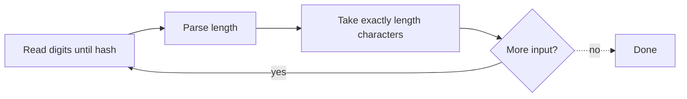

# 271. Encode and Decode Strings

https://leetcode.com/problems/encode-and-decode-strings/

## Problem in your own words

Design a codec that turns a list of strings into one string, and later turns that one string back into the same list. Strings may contain any characters, including whatever delimiter you might have wanted to use. The empty list and empty strings inside the list must survive the round trip. This is a chunked framing problem, not a search problem.

## Easy analogy

Shipping labels on boxes in one truck: before each box you write how many inches long it is, then a mark, then the box. The mark can appear inside a box because you do not hunt for it. You trust the length, skip that many inches, and read the next label. Without the length, a box that contains the mark would look like two boxes.

## Diagram

```text
["leet", "code"]
encode:  4 # l e e t 4 # c o d e
         ^length ^payload of exactly 4 chars

decode cursor:
i at '4' -> read until '#' -> length 4 -> take "leet"
next i at the second '4' -> take "code"
a '#' inside a payload is not a delimiter because you skip by length
```



## Intuition before code

A delimiter-only format breaks when the delimiter appears in the data. A length prefix tells the decoder exactly how many characters belong to this string, so the payload is copied by count, not by searching. The format here is `length + '#' + payload`, repeated. The `#` only ends the length header. Digits inside a payload are safe because they are consumed as payload, not as the next header, as long as you advance the cursor by the parsed length.

## Walkthrough with a tiny input, step by step

Input: `["hi", ""]`.

- Encode `"hi"`: length 2, then `#`, then `hi` → `2#hi`.
- Encode `""`: length 0, then `#`, then nothing → `0#`.
- Full string: `2#hi0#`.

Decode:

- Cursor at 0. Digits until `#`: `"2"`. Payload is the next 2 characters: `"hi"`. Cursor moves to the `0`.
- Digits until `#`: `"0"`. Payload length 0: append `""`. Cursor is at the end.
- Result `["hi", ""]`.

A payload that contains `#`, such as `"a#b"`, encodes as `3#a#b`. The decoder reads length 3 and takes `a#b` without treating the inner `#` as a header.

## Java solution (complete, correct, commented)

LeetCode’s signature is `Codec`. The same methods are shown on `Solution` so the snippet matches the usual study style.

```java
import java.util.ArrayList;
import java.util.List;

class Solution {
    public String encode(List<String> strs) {
        StringBuilder out = new StringBuilder();
        for (String word : strs) {
            out.append(word.length()).append('#').append(word);
        }
        return out.toString();
    }

    public List<String> decode(String s) {
        List<String> words = new ArrayList<>();
        int i = 0;
        while (i < s.length()) {
            int j = i;
            while (s.charAt(j) != '#') {
                j++;
            }
            int length = Integer.parseInt(s.substring(i, j));
            int start = j + 1;
            int end = start + length;
            words.add(s.substring(start, end));
            i = end;
        }
        return words;
    }
}
```

Lengths fit in a 32-bit `int` because a Java `String` length is an `int`. `substring` copies in older Java releases and may share the backing array in others; either way the logical result is a new string of `length` characters. If a hostile length could exceed the remaining input, check `end <= s.length()` before slicing. Well-formed input from `encode` always satisfies that.

## Python solution (complete, correct, commented)

```python
class Solution:
    def encode(self, strs: list[str]) -> str:
        parts: list[str] = []
        for word in strs:
            parts.append(f"{len(word)}#{word}")
        return "".join(parts)

    def decode(self, s: str) -> list[str]:
        words: list[str] = []
        i = 0
        n = len(s)
        while i < n:
            j = i
            while s[j] != "#":
                j += 1
            length = int(s[i:j])
            start = j + 1
            end = start + length
            # s[start:end] copies `length` characters. That copy is the decoded string.
            words.append(s[start:end])
            i = end
        return words
```

Each slice costs time and space proportional to its length, which you must pay anyway to materialize the output string. Do not decode by splitting on `#`: payloads may contain `#`. Joining with `""` is one allocation; repeated `+=` on the encoded string can be quadratic in CPython if you build it naively in a loop without the join.

## Time and space complexity with why

- Time: `O(L)` for both methods, where `L` is the total number of characters across all strings. Each character is written once and read once.
- Space: `O(L)` for the encoded string and for the decoded list. The chunks are the data, so you cannot do better in the worst case.

## Pitfalls and how to talk through this in an interview in under 2 minutes

Say: “I frame each string as its length, a hash mark, and then exactly that many characters.” Give the example of a payload that contains `#`. Mention empty strings (`0#`) and an empty list (empty encoded string). Mention that you parse the length as a number and then skip, you do not search for the next delimiter. If they ask about binary data, the same frame works on bytes. Chunks are not escaped; the length is the escape.
