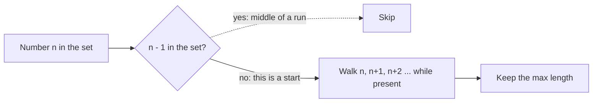

# 128. Longest Consecutive Sequence

https://leetcode.com/problems/longest-consecutive-sequence/

## Problem in your own words

You are given an unsorted array of integers. Return the length of the longest run of consecutive values, such as `1, 2, 3, 4`. The numbers do not need to sit next to each other in the array. Duplicates do not extend a run. You should aim for linear time, so sorting the array is not the target solution.

## Easy analogy

Pour every number into a bowl (a set). A streak only starts at a number whose left neighbor is not in the bowl. From each start, count upward `start, start+1, start+2, …` until the bowl runs out. You never start in the middle, so each number is counted in at most one streak.

## Diagram

```text
nums: 100, 4, 200, 1, 3, 2
set:  {100, 4, 200, 1, 3, 2}

4 has left neighbor 3  -.-> skip, not a start
1 has no 0              -> start, walk 1-2-3-4, length 4
100 has no 99           -> start, walk 100, length 1
200 has no 199          -> start, length 1
```



## Intuition before code

Sorting makes consecutives adjacent and is `O(n log n)`. A set answers “is `x` present?” in expected constant time. The linear trick is to start a walk only when `n - 1` is absent. Each walk’s steps are consecutive members, and across all walks each element is visited once as a start check and at most once as a `+1` step. Duplicates collapse when you insert into the set.

## Walkthrough with a tiny input, step by step

Input: `[100, 4, 200, 1, 3, 2]`.

- Set = `{1, 2, 3, 4, 100, 200}`.
- `100`: `99` absent. Length 1. Best = 1.
- `4`: `3` present. Skip.
- `200`: `199` absent. Length 1. Best stays 1.
- `1`: `0` absent. `2` present, `3` present, `4` present, `5` absent. Length 4. Best = 4.
- `3`: `2` present. Skip.
- `2`: `1` present. Skip.
- Return 4.

## Java solution (complete, correct, commented)

```java
import java.util.HashSet;
import java.util.Set;

class Solution {
    public int longestConsecutive(int[] nums) {
        Set<Integer> values = new HashSet<>();
        for (int value : nums) {
            values.add(value);
        }
        int best = 0;
        for (int value : values) {
            // Only the left edge of a run starts a walk.
            // Guard MIN_VALUE: in Java, MIN_VALUE - 1 wraps to MAX_VALUE.
            if (value != Integer.MIN_VALUE && values.contains(value - 1)) {
                continue;
            }
            int length = 1;
            // value + length stays in a long so a value near Integer.MAX_VALUE
            // does not wrap and look like a negative neighbor.
            long next = (long) value + 1;
            while (next <= Integer.MAX_VALUE && values.contains((int) next)) {
                length++;
                next++;
            }
            if (length > best) {
                best = length;
            }
        }
        return best;
    }
}
```

`value - 1` can overflow if `value` is `Integer.MIN_VALUE`. In Java, `Integer.MIN_VALUE - 1` wraps to `Integer.MAX_VALUE`, and a false “left neighbor” could skip a real start. Guard it:

```java
if (value != Integer.MIN_VALUE && values.contains(value - 1)) {
    continue;
}
```

The LeetCode value range fits in `int`, and `n` is up to `10^5`, so the longest run’s endpoints are still `int`s that were in the input. The `long` walk is the safe habit when the interviewer drops that assumption.

## Python solution (complete, correct, commented)

```python
class Solution:
    def longestConsecutive(self, nums: list[int]) -> int:
        values = set(nums)
        best = 0
        for value in values:
            if value - 1 in values:
                continue
            length = 1
            next_value = value + 1
            while next_value in values:
                length += 1
                next_value += 1
            if length > best:
                best = length
        return best
```

`set(nums)` is one `O(n)` pass and `O(n)` memory; it is the right copy, not a slice. Python integers do not overflow, so `value - 1` and `value + 1` are exact. Slicing `nums[:]` before the set would be a useless extra copy.

## Time and space complexity with why

- Time: `O(n)` expected. Building the set is linear. The start check is `O(1)` expected per element. The inner `while` runs once per element across the whole algorithm, because each number has only one predecessor and only starts are expanded.
- Space: `O(n)` for the set.

## Pitfalls and how to talk through this in an interview in under 2 minutes

Say: “Put the numbers in a set. Only start counting at a value whose predecessor is missing, then walk forward.” Explain why that is still linear: each element is in at most one walk. Mention duplicates, the empty array (answer 0), and a single element (answer 1). Mention negative numbers; consecutiveness is mathematical, not about array order. If they ask what goes wrong at `Integer.MIN_VALUE`, explain the Java wrap on `value - 1`.
