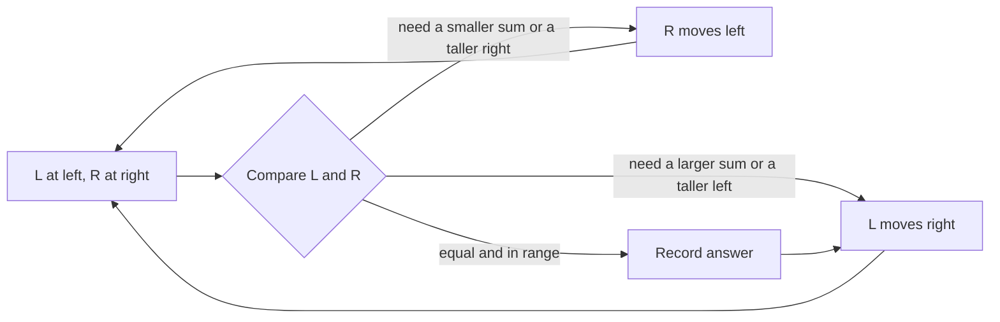

# Two Pointers — Pattern Study

## Problem in your own words

Two pointers keep two indices into the same array, usually after a sort or on a structure that is already ordered in the way you care about (sorted values, or a left/right scan of a string). Each step throws away a whole region that cannot contain a better answer, so you move exactly one pointer. The pair of indices describes the current candidate: a pair of characters, a pair of heights, or the two ends of a range that must sum with a fixed third value.

## Easy analogy

You and a friend stand at opposite ends of a bookshelf that is sorted by height. You want two books whose heights add to a target. If the sum is too small, you step inward from the short end, because every book further left is even shorter. If the sum is too large, your friend steps inward from the tall end. You never both jump at random, and you meet in the middle after one pass.

## Diagram

```text
sorted:  [1, 2, 2, 3, 4, 5]
          L              R
sum too small -> L++
sum too large -> R--
equal         -> record, then L++ and R-- and skip duplicates

discarded side is the one that cannot improve the sum:
L -.-> values left of L are smaller, so they stay too small
R -.-> values right of R are larger, so they stay too large
```



## Intuition before code

A pointer move is a proof that the abandoned side is useless:

- Sorted two-sum: if `a[L] + a[R]` is too small, every `R' <= R` paired with this `L` is also too small, so only `L++` can help.
- Palindrome: skip non-letters, then the outer characters must match, so both pointers move inward only after a match.
- Container water: width shrinks by 1 every step. The only way to beat the current area is a taller limiting line, so you move the pointer at the shorter line.

When the problem asks for unique combinations, the array must be sorted so equal values sit together, and you skip them after recording a hit. Do that on the fixed index and on both moving pointers.

## Walkthrough with a tiny input, step by step

Sorted array `[1, 2, 4, 7]`, target sum `8`.

- `L = 0` (`1`), `R = 3` (`7`), sum `8`. Record. Move both inward.
- `L = 1` (`2`), `R = 2` (`4`), sum `6`, which is too small. `L++`.
- `L` meets `R`. Stop.

One pass, no nested search over the right side.

## Java solution (complete, correct, commented)

Sorted two-sum skeleton. Callers that need 3Sum wrap this in an outer index.

```java
class Solution {
    public int[] twoSumSorted(int[] nums, int target) {
        int left = 0;
        int right = nums.length - 1;
        while (left < right) {
            // long: two large ints can overflow a 32-bit sum
            long sum = (long) nums[left] + nums[right];
            if (sum == target) {
                return new int[] { left, right };
            } else if (sum < target) {
                left++;
            } else {
                right--;
            }
        }
        return new int[0];
    }
}
```

## Python solution (complete, correct, commented)

```python
class Solution:
    def twoSumSorted(self, nums: list[int], target: int) -> list[int]:
        left, right = 0, len(nums) - 1
        while left < right:
            total = nums[left] + nums[right]
            if total == target:
                return [left, right]
            if total < target:
                left += 1
            else:
                right -= 1
        return []
```

Python integers do not overflow. Moving indices is `O(1)`. Slicing `nums[left:right]` inside the loop would copy the window every time and turn a linear scan into quadratic work. Do not slice.

## Time and space complexity with why

- Time: `O(n)` after the array is sorted. Each step moves `left` or `right` inward, so there are at most `n` steps.
- Space: `O(1)` extra if you sort in place. Sorting itself is `O(n log n)` time and may use `O(log n)` or `O(n)` memory depending on the sort.
- If the array was not sorted and you need original indices, sorting pairs costs `O(n)` extra space.

## Pitfalls and how to talk through this in an interview in under 2 minutes

Say: “The array is sorted, so I put a pointer at each end and move the side that cannot contain the answer.” State the invariant: everything outside `[left, right]` has been rejected for a reason you can say in one sentence. Mention duplicates if the output must be unique. Mention `long` sums in Java. If the data is not sorted and the question is membership, a hash map is the better pattern; two pointers are for ordered ranges.
