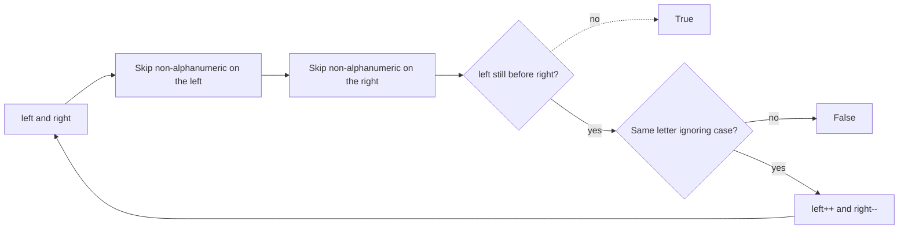

# 125. Valid Palindrome

https://leetcode.com/problems/valid-palindrome/

## Problem in your own words

A string is a palindrome for this problem when it reads the same forward and backward after you ignore everything that is not a letter or digit, and after you ignore letter case. `"A man, a plan, a canal: Panama"` counts as a palindrome. An empty string, or a string of only punctuation, also counts, because there is nothing left that could mismatch.

## Easy analogy

You point at the first and last characters of a sentence and walk toward the middle. Whenever a finger lands on a space or a comma, that finger keeps moving until it lands on a letter or a digit. Then you compare the two letters without caring about capitals. If they differ, it is not a palindrome. If your fingers meet, it is.

## Diagram

```text
"A man, a plan, a canal: Panama"
letters only: a m a n a p l a n a c a n a l p a n a m a
L and R walk that sequence inward

"ab:a"
index: 0:a  1:b  2::  3:a
L=0 R=3  compare a,a  then L=1 R=2
R is ':' so R moves to 1, now R < L, stop -> true
```



## Intuition before code

The useful characters form a sequence, and that sequence must equal its reverse. Building a cleaned copy is easy and uses extra memory. Two pointers do the same comparison in place: each pointer skips junk on its own side, then one comparison decides whether to continue. You stop when the pointers cross. Filtering into a new string is a fine first answer; mention the `O(n)` extra space and then offer the pointer version.

## Walkthrough with a tiny input, step by step

Input: `"A b, a"` (indices: `A`, space, `b`, comma, space, `a`).

- `left = 0` (`A`), `right = 5` (`a`). Both are alphanumeric. Lowercase both are `a`. Match. Move to `1` and `4`.
- `left` is a space, so it skips to index `2` (`b`). `right` is a space, so it skips to the comma at index `3`, then to `b` at index `2`.
- Now `left == right`, so the loop stops. Return true.

Input: `"ab"`.

- Compare `a` and `b`. They differ. Return false.

## Java solution (complete, correct, commented)

```java
class Solution {
    public boolean isPalindrome(String s) {
        int left = 0;
        int right = s.length() - 1;
        while (left < right) {
            while (left < right && !Character.isLetterOrDigit(s.charAt(left))) {
                left++;
            }
            while (left < right && !Character.isLetterOrDigit(s.charAt(right))) {
                right--;
            }
            if (Character.toLowerCase(s.charAt(left)) != Character.toLowerCase(s.charAt(right))) {
                return false;
            }
            left++;
            right--;
        }
        return true;
    }
}
```

## Python solution (complete, correct, commented)

```python
class Solution:
    def isPalindrome(self, s: str) -> bool:
        left, right = 0, len(s) - 1
        while left < right:
            while left < right and not s[left].isalnum():
                left += 1
            while left < right and not s[right].isalnum():
                right -= 1
            if s[left].lower() != s[right].lower():
                return False
            left += 1
            right -= 1
        return True
```

A filter such as `cleaned = [ch.lower() for ch in s if ch.isalnum()]` then `cleaned == cleaned[::-1]` is correct. The slice `cleaned[::-1]` copies the whole cleaned string, so you pay `O(n)` extra time and space on top of the filter. The pointer version uses `O(1)` extra memory and does not slice.

## Time and space complexity with why

- Time: `O(n)`. Each pointer moves at most `n` steps, and each character is examined a constant number of times.
- Space: `O(1)` extra. You do not allocate a cleaned copy. (The recursive call stack of a naive reverse would be extra; this loop does not.)

## Pitfalls and how to talk through this in an interview in under 2 minutes

Say: “Two pointers inward, skip non-alphanumeric characters, compare case-insensitively.” Mention empty and punctuation-only strings are true. Mention digits count as characters. Do not use `replaceAll` in a loop. Watch the inner `while` so `left` does not pass `right` and read off the string. In Java, `Character.toLowerCase` is the right case fold for this alphabet; do not subtract `'A'` by hand unless you only have letters.
