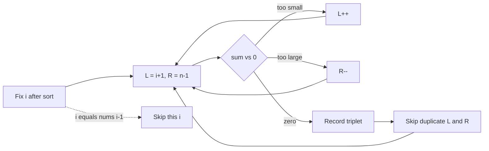

# 15. 3Sum

https://leetcode.com/problems/3sum/

## Problem in your own words

Find every group of three integers in the array that add up to zero. The three numbers must come from three different indices. Two groups that contain the same values in a different order count as the same group, so the answer should list each unique triplet once. The array is not sorted when you receive it, and it may contain negatives and duplicates.

## Easy analogy

Sort the receipt amounts. For each amount you freeze as the first number, you need two later amounts that add to the opposite of it. Those two sit on a sorted shelf, so you use one finger at each end of the remaining shelf. If the three-way total is too low, move the left finger right. If it is too high, move the right finger left. If you hit zero, write the triplet down and slide past any copies of those same amounts so you do not write it twice.

## Diagram

```text
sorted:  [-4, -1, -1, 0, 1, 2]
          i   L            R
i = -4, need pair sum 4
-1 + 2 = 1 too small -> L++
-1 + 2 = 1 too small -> L++
0 + 2 = 2 too small, L meets R

i = -1 (first -1), need pair sum 1
L at second -1, R at 2: -1+2=1 -> record [-1,-1,2]
skip duplicate L and R
L at 0, R at 1: 0+1=1 -> record [-1,0,1]

next i is also -1  -.-> skip, same fixed value as previous i
```



## Intuition before code

Three nested loops are `O(n^3)`. Sorting gives you monotonic two-pointer searches. Fix the smallest value of the triplet at `i` (after sorting, that is just “the value at `i`”), then solve two-sum for `-nums[i]` on the subarray to the right. Uniqueness comes from three skips: skip a repeated `nums[i]`, and after a hit skip repeated `nums[L]` and `nums[R]`. If `nums[i]` is already greater than zero, every later sum is positive and you can stop.

## Walkthrough with a tiny input, step by step

Input: `[-1, 0, 1, 2, -1, -4]`. After sort: `[-4, -1, -1, 0, 1, 2]`.

- `i` at `-4`. Left and right never add to `4`. No triplet.
- `i` at the first `-1`. `-1 + 2 = 1`, which equals `-nums[i]`. Record `[-1, -1, 2]`. Skip the duplicate left `-1` (already consumed) and move inward. Next, `0 + 1 = 1`. Record `[-1, 0, 1]`.
- `i` at the second `-1`. It equals the previous fixed value. Skip.
- `i` at `0`. Pair `1 + 2 = 3`, too big, and shrinking the right side only gets smaller but the left is already the next index. No new triplet that starts with `0` in this array (`0+1+2=3`).
- Later values are positive. Stop.

Answer: `[[-1, -1, 2], [-1, 0, 1]]`.

## Java solution (complete, correct, commented)

```java
import java.util.ArrayList;
import java.util.Arrays;
import java.util.List;

class Solution {
    public List<List<Integer>> threeSum(int[] nums) {
        Arrays.sort(nums);
        List<List<Integer>> answer = new ArrayList<>();
        int n = nums.length;
        for (int i = 0; i < n; i++) {
            if (i > 0 && nums[i] == nums[i - 1]) {
                continue;
            }
            // Sorted: a positive fixed value cannot start a zero sum.
            if (nums[i] > 0) {
                break;
            }
            int left = i + 1;
            int right = n - 1;
            while (left < right) {
                long sum = (long) nums[i] + nums[left] + nums[right];
                if (sum == 0) {
                    answer.add(Arrays.asList(nums[i], nums[left], nums[right]));
                    left++;
                    right--;
                    while (left < right && nums[left] == nums[left - 1]) {
                        left++;
                    }
                    while (left < right && nums[right] == nums[right + 1]) {
                        right--;
                    }
                } else if (sum < 0) {
                    left++;
                } else {
                    right--;
                }
            }
        }
        return answer;
    }
}
```

The `long` sum matters when the interviewer allows values near `±10^9`. Under the original constraints (`±10^5`) the sum fits in a 32-bit `int`, but the wider add is the safe default.

## Python solution (complete, correct, commented)

```python
class Solution:
    def threeSum(self, nums: list[int]) -> list[list[int]]:
        nums.sort()
        answer: list[list[int]] = []
        n = len(nums)
        for i in range(n):
            if i > 0 and nums[i] == nums[i - 1]:
                continue
            if nums[i] > 0:
                break
            left, right = i + 1, n - 1
            while left < right:
                total = nums[i] + nums[left] + nums[right]
                if total == 0:
                    answer.append([nums[i], nums[left], nums[right]])
                    left += 1
                    right -= 1
                    while left < right and nums[left] == nums[left - 1]:
                        left += 1
                    while left < right and nums[right] == nums[right + 1]:
                        right -= 1
                elif total < 0:
                    left += 1
                else:
                    right -= 1
        return answer
```

`nums.sort()` sorts in place, `O(n log n)` time and `O(n)` auxiliary memory in CPython’s Timsort. Do not slice a fresh window (`nums[i+1:]`) on every `i`; that copy is `O(n)` per start and makes the algorithm quadratic in memory traffic. Python integers do not overflow.

## Time and space complexity with why

- Time: `O(n^2)`. The sort is `O(n log n)`. Each of the `n` starts runs a linear two-pointer scan, and the scans do not restart from scratch in a nested way that would be cubic: each scan is `O(n)`.
- Space: `O(1)` extra beyond the output and the sort’s temporary memory, if you sort the input in place. The output can be `O(n^2)` triplets in a crafted array.

## Pitfalls and how to talk through this in an interview in under 2 minutes

Say: “Sort, then for each index solve two-sum with pointers on the right, and skip duplicates at all three positions.” Walk one triplet on a tiny sorted array. Mention you do not reuse an index. Mention the early break when `nums[i] > 0`. If they want the count only, you can count without storing lists. If they ban sorting, a hash set per fixed `i` is also `O(n^2)` expected time and easier to get duplicate bugs in.
