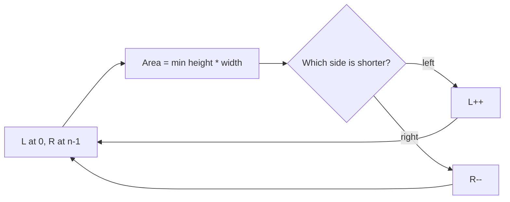

# 11. Container With Most Water

https://leetcode.com/problems/container-with-most-water/

## Problem in your own words

You are given an array where each value is the height of a vertical line at that index. Pick two lines so that, together with the x-axis, they form a container that holds as much water as possible. The area is the distance between the indices times the shorter of the two heights. You need the maximum area, not the pair of indices. Lines between the two sides do not raise the water; they are ignored.

## Easy analogy

You and a friend stand at the outer walls of a series of fences. The water height is limited by the shorter fence. The width is the gap between you. Each move, one of you steps inward, which makes the gap smaller by one. Stepping the taller fence inward cannot help: the short fence still limits the height, and the gap got smaller. So the shorter person steps inward, hoping the next fence is taller.

## Diagram

```text
height:  1  8  6  2  5  4  8  3  7
         L                       R
width 8, limiting height 1, area 8
L is shorter -> L moves
   L                    R
width 7, height 7, area 49
R is shorter (3 < 8) -> R moves
   L                 R
width 6, height 7, area 42
and so on, always moving the shorter side

shorter side moves; the taller side stays
taller side -.-> discarded only when it becomes the short one later
```



## Intuition before code

Every pair is a candidate, and checking all pairs is `O(n^2)`. Start with the widest container. When you shrink the width by one, the area improves only if the limiting height increases enough to pay for the lost width. The limiting height is the shorter line. Moving the taller line keeps that same limit and shrinks width, so that move is never the one that finds a strictly better partner for this shorter line. Move the shorter side. Each index is the left or right pointer at most once, so the scan is linear.

## Walkthrough with a tiny input, step by step

Input: `[1, 8, 6, 2, 5, 4, 8, 3, 7]`.

- `L = 0` height 1, `R = 8` height 7. Width 8. Area `min(1, 7) * 8 = 8`. Best = 8. Left is shorter, so `L = 1`.
- Heights 8 and 7, width 7. Area `7 * 7 = 49`. Best = 49. Right is shorter, so `R = 7`.
- Heights 8 and 3, width 6. Area `3 * 6 = 18`. Right is shorter, so `R = 6`.
- Heights 8 and 8, width 5. Area `8 * 5 = 40`. Best stays 49. Sides are equal; moving either is fine. Move left (the `<=` branch).
- Continue until `L` meets `R`. The best remains 49, from indices 1 and 8.

## Java solution (complete, correct, commented)

```java
class Solution {
    public int maxArea(int[] height) {
        int left = 0;
        int right = height.length - 1;
        long best = 0;
        while (left < right) {
            long h = Math.min(height[left], height[right]);
            long width = (long) right - left;
            long area = h * width;
            if (area > best) {
                best = area;
            }
            // Move the side that limits the height.
            if (height[left] <= height[right]) {
                left++;
            } else {
                right--;
            }
        }
        return (int) best;
    }
}
```

Under the LeetCode constraints (`n <= 10^5`, height `<= 10^4`) the area fits in a 32-bit signed integer (`10^4 * 10^5 = 10^9`). The `long` multiply is there so a larger height limit cannot overflow `int` before the comparison. If the product can exceed `Integer.MAX_VALUE`, change the return type or document the cast.

## Python solution (complete, correct, commented)

```python
class Solution:
    def maxArea(self, height: list[int]) -> int:
        left, right = 0, len(height) - 1
        best = 0
        while left < right:
            h = min(height[left], height[right])
            width = right - left
            area = h * width
            if area > best:
                best = area
            if height[left] <= height[right]:
                left += 1
            else:
                right -= 1
        return best
```

Python integers do not overflow. Index motion does not slice the list. A slice `height[left:right+1]` each iteration would copy the window and make the scan quadratic.

## Time and space complexity with why

- Time: `O(n)`. The window starts at width `n - 1` and shrinks by one each iteration until the pointers meet.
- Space: `O(1)` extra. A handful of integers.

## Pitfalls and how to talk through this in an interview in under 2 minutes

Say: “Start at both ends. The area is limited by the shorter line, so I move that pointer inward and keep the best area.” Explain why you do not move the taller one: width would drop and the limit would not rise. Mention two lines only, width is index difference, and equal heights can move either side. Mention `long` if heights get large. Do not confuse this with the trapping-rain-water histogram, which cares about every bar between the sides.
