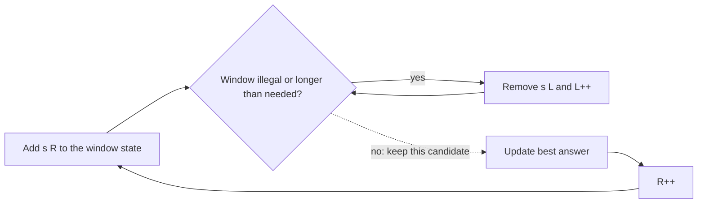

# Sliding Window — Pattern Study

## Problem in your own words

A sliding window is a contiguous subarray or substring whose left and right edges move only forward. You expand the right edge to take in a new element, update a small piece of state (a sum, a count, a deficit), and shrink the left edge while the window is invalid or while a shorter valid window might exist. The answer is usually the best width, the best sum, or the best substring seen while the window satisfied the condition. Because both edges move forward at most `n` times, the scan is linear.

## Easy analogy

A bus window looking out at a row of houses. You only slide the view forward. When a house enters on the right, you update your notes. When the view contains something you cannot keep (a repeated letter, too many replacements), you drop houses from the left until the view is legal again. You never jump the left edge backward, and you never reopen a house you already passed.

## Diagram

```text
s:  a  b  c  a  b  c  b  b
    L        R
expand R
if window breaks the rule, advance L until it is legal again
L only moves right  -.-> abandoned prefix is not reconsidered

valid window: [L, R] inclusive
width = R - L + 1
```



## Intuition before code

Write down the window state in one sentence before coding:

- Stock price: the state is the minimum price so far. The “window” is the span from that buy day to today. This one is so thin it is a single running minimum, which is still the same left-edge idea.
- No repeated characters: state is the last index of each character. The left edge jumps to just after the previous copy.
- Replacement: state is counts inside the window and the highest count. The window is legal while `width - maxCount <= k`.
- Minimum window that covers a pattern: state is how many pattern characters are satisfied. Expand until covered, then shrink while it stays covered, and remember the shortest.

Shrink loops must make progress. Each character enters once and leaves once.

## Walkthrough with a tiny input, step by step

Longest substring without a repeat, input `"abba"`.

- `R` at `a`. Window `"a"`. Best 1.
- `R` at first `b`. Window `"ab"`. Best 2.
- `R` at second `b`. Repeat. Move `L` to the character after the previous `b`. Window `"b"`. Best stays 2.
- `R` at `a`. Window `"ba"`. Best stays 2.

## Java solution (complete, correct, commented)

Skeleton for “longest subarray whose state stays valid.” Concrete problems in this folder fill in `add`, `invalid`, and `remove`.

```java
class Solution {
    public int longestValidWindow(int[] nums) {
        int left = 0;
        int best = 0;
        for (int right = 0; right < nums.length; right++) {
            add(nums[right]);
            while (left <= right && invalid(left, right)) {
                remove(nums[left]);
                left++;
            }
            best = Math.max(best, right - left + 1);
        }
        return best;
    }

    private void add(int value) { }
    private void remove(int value) { }
    private boolean invalid(int left, int right) { return false; }
}
```

## Python solution (complete, correct, commented)

```python
class Solution:
    def longest_valid_window(self, nums: list[int]) -> int:
        left = 0
        best = 0
        for right, value in enumerate(nums):
            self.add(value)
            while left <= right and self.invalid(left, right):
                self.remove(nums[left])
                left += 1
            best = max(best, right - left + 1)
        return best

    def add(self, value: int) -> None:
        pass

    def remove(self, value: int) -> None:
        pass

    def invalid(self, left: int, right: int) -> bool:
        return False
```

Do not slice `nums[left:right+1]` to recompute the state. That copy costs `O(window)` per step and turns the linear scan into `O(n^2)`.

## Time and space complexity with why

- Time: `O(n)` when `add` and `remove` are `O(1)`. The inner `while` advances `left`, and `left` never exceeds `n`.
- Space: `O(1)` or `O(alphabet)` for counts, or `O(k)` if the state map holds characters currently in the window.

## Pitfalls and how to talk through this in an interview in under 2 minutes

Say: “I grow the right edge and pull the left edge forward whenever the window breaks the rule. Each index enters and leaves once.” State the invariant: after the shrink loop, `[left, right]` is valid, and you have recorded its score. Off-by-one on width (`right - left` versus `right - left + 1`) is the usual bug. For minimum windows, update the answer while shrinking, not only after expanding. If the condition is not about a contiguous range, this pattern does not apply.
