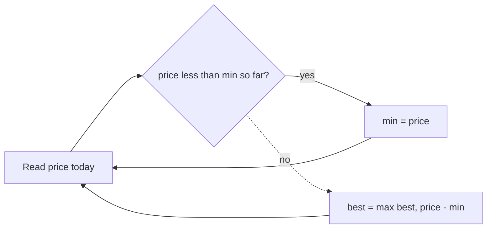

# 121. Best Time to Buy and Sell Stock

https://leetcode.com/problems/best-time-to-buy-and-sell-stock/

## Problem in your own words

You are given a price for a stock on each day. You may buy on one day and sell on a later day. Return the largest profit you can make. If every later day is cheaper, return 0. You cannot sell before you buy, and you complete at most one buy and one sell.

## Easy analogy

You walk through a week of fruit prices. You remember the cheapest price you have already passed. Today’s profit, if you sold today, is today’s price minus that remembered cheap day. You write down the best such profit. If today is a new cheap price, you remember today instead, because a sale has to be in the future and today cannot sell to itself.

## Diagram

```text
prices:  7  1  5  3  6  4
min:     7  1  1  1  1  1
profit:  0  0  4  2  5  3
best:             4     5

day of price 6 sells against the min at price 1
earlier 7 is discarded as a buy once 1 is seen
7 -.-> not a future buy after we pass it, and it was never a good buy
```



## Intuition before code

Every sell day pairs with the minimum price strictly before it. One pass can remember that minimum. Checking every pair of days is `O(n^2)`. Kadane’s algorithm on the daily differences is the same idea in disguise: the best subarray sum of changes equals the best rise from a low point. The running-minimum version is easier to explain. You never look ahead; when you see a price, the best buy so far is already known.

## Walkthrough with a tiny input, step by step

Input: `[7, 1, 5, 3, 6, 4]`.

- Price `7`. Minimum becomes `7`. Profit if sold today is `0`.
- Price `1`. New minimum `1`. Profit `0`.
- Price `5`. Profit `5 - 1 = 4`. Best = `4`.
- Price `3`. Profit `3 - 1 = 2`. Best stays `4`.
- Price `6`. Profit `6 - 1 = 5`. Best = `5`.
- Price `4`. Profit `3`. Best stays `5`.

Return `5`. Input `[7, 6, 4, 3]` never beats `0`.

## Java solution (complete, correct, commented)

```java
class Solution {
    public int maxProfit(int[] prices) {
        int minPrice = Integer.MAX_VALUE;
        int best = 0;
        for (int price : prices) {
            if (price < minPrice) {
                minPrice = price;
            } else {
                int profit = price - minPrice;
                if (profit > best) {
                    best = profit;
                }
            }
        }
        return best;
    }
}
```

`price - minPrice` does not overflow a 32-bit `int` under the usual constraints (prices fit in `int` and profit is non-negative and at most the max price). If prices can be any `int`, a negative `minPrice` and a large `price` can overflow. Compute `long profit = (long) price - minPrice` and keep `best` as a `long` in that variant.

## Python solution (complete, correct, commented)

```python
class Solution:
    def maxProfit(self, prices: list[int]) -> int:
        min_price = float("inf")
        best = 0
        for price in prices:
            if price < min_price:
                min_price = price
            else:
                profit = price - min_price
                if profit > best:
                    best = profit
        return best
```

Python integers do not overflow. No slice is required. `prices[i+1:]` inside the loop would copy the tail on every day and make the scan quadratic.

## Time and space complexity with why

- Time: `O(n)`. One pass, constant work per day.
- Space: `O(1)`. Two integers: the cheapest price so far and the best profit.

## Pitfalls and how to talk through this in an interview in under 2 minutes

Say: “I track the minimum price to the left of today and the best difference.” Emphasize sell must be after buy, so you update the minimum before you would sell on that same day; the `if` branch does that by not selling on the day the minimum updates. Mention a strictly decreasing array returns 0. If they allow many transactions, the strategy changes: sum every upward difference. Do not confuse this with “cooldown” or “fee” variants until they ask.
