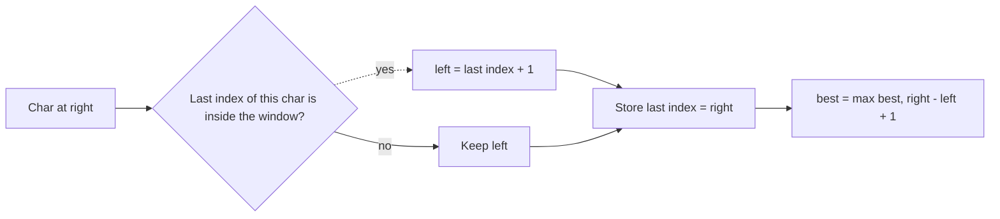

# 3. Longest Substring Without Repeating Characters

https://leetcode.com/problems/longest-substring-without-repeating-characters/

## Problem in your own words

Given a string, find the length of the longest contiguous piece that contains no repeated character. The piece must be a substring, so the characters stay in order and stay adjacent. You need the length, not the substring itself. An empty string has length 0. A string of one character has length 1.

## Easy analogy

You highlight a passage with a marker. Each new letter extends the highlight. If that letter already appears inside the highlight, you move the start of the highlight to just after the earlier copy, then you extend. You keep the longest highlight you ever had. You do not restart from scratch at every index.

## Diagram

```text
s:     a  b  c  a  b  c  b  b
index  0  1  2  3  4  5  6  7
[0,2] "abc"
index 3 'a' repeats at 0 -> left jumps to 1, window "bca"
index 4 'b' repeats at 1 -> left jumps to 2, window "cab"
index 5 'c' repeats at 2 -> left jumps to 3, window "abc"
index 6 'b' repeats at 4 -> left jumps to 5, window "cb"
index 7 'b' repeats at 6 -> left jumps to 7, window "b"
best length 3

old left -.-> discarded when a repeat pulls left forward
```



## Intuition before code

A window is valid when every character inside it is unique. When you add a character whose previous position is still inside the window, the new window must start after that previous position. Store the last index of each character. The left edge only moves forward: if an old occurrence is already left of `left`, it is not in the window and you ignore it. A set of characters currently in the window also works, with an explicit shrink loop. The index array (or map) jumps `left` in one step.

## Walkthrough with a tiny input, step by step

Input: `"abba"`. Last-index map starts empty. `left = 0`.

- Index 0, `a`. No previous index. Store `a → 0`. Window length 1. Best 1.
- Index 1, `b`. Store `b → 1`. Length 2. Best 2.
- Index 2, `b`. Previous `b` is at 1, which is `>= left`. Set `left = 2`. Store `b → 2`. Window is `"b"`, length 1. Best stays 2.
- Index 3, `a`. Previous `a` is at 0, which is `< left`, so it is outside. `left` stays 2. Store `a → 3`. Window `"ba"`, length 2. Best stays 2.

Return 2.

## Java solution (complete, correct, commented)

```java
import java.util.Arrays;

class Solution {
    public int lengthOfLongestSubstring(String s) {
        // Last index where each ASCII character was seen. -1 means never.
        int[] last = new int[128];
        Arrays.fill(last, -1);
        int left = 0;
        int best = 0;
        for (int right = 0; right < s.length(); right++) {
            char c = s.charAt(right);
            if (last[c] >= left) {
                left = last[c] + 1;
            }
            last[c] = right;
            int length = right - left + 1;
            if (length > best) {
                best = length;
            }
        }
        return best;
    }
}
```

The LeetCode string is ASCII letters, digits, symbols, and spaces, so 128 slots cover it. For arbitrary Unicode, use a `HashMap<Character, Integer>` instead of the array. No integer overflow: lengths fit in `int` because a Java string length does.

## Python solution (complete, correct, commented)

```python
class Solution:
    def lengthOfLongestSubstring(self, s: str) -> int:
        last: dict[str, int] = {}
        left = 0
        best = 0
        for right, ch in enumerate(s):
            previous = last.get(ch, -1)
            if previous >= left:
                left = previous + 1
            last[ch] = right
            length = right - left + 1
            if length > best:
                best = length
        return best
```

A dict keyed by character handles Unicode. Do not slice `s[left:right+1]` to test uniqueness with a set on every step; each slice copies the window and the total time becomes quadratic. The index map updates in expected `O(1)` per character.

## Time and space complexity with why

- Time: `O(n)`. One pass, constant work per character with an array, expected constant work with a hash map.
- Space: `O(1)` for a fixed ASCII table (128), or `O(min(n, alphabet))` for a map of characters you have seen. The map does not shrink, so it holds every distinct character in the string, which is at most the alphabet size.

## Pitfalls and how to talk through this in an interview in under 2 minutes

Say: “I keep a window and the last index of each character. When the character repeats inside the window, I jump the left edge to just after that earlier index.” Stress `previous >= left`, not merely “seen before,” because an old index left of the window is irrelevant. Mention `" "` (length 1), `""` (length 0), and `"bbbb"` (length 1). Off-by-one: the new left is `previous + 1`, not `previous`.
