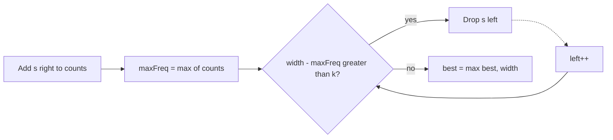

# 424. Longest Repeating Character Replacement

https://leetcode.com/problems/longest-repeating-character-replacement/

## Problem in your own words

You are given a string of uppercase letters and an integer `k`. In one operation you may change any character to another uppercase letter. Return the length of the longest substring you can make into all the same character using at most `k` changes. The substring is contiguous. You do not have to name which character you repeat.

## Easy analogy

You slide a magnifying glass over a row of colored beads. Inside the glass, you are allowed to repaint at most `k` beads. The easiest color to unify is the one that already appears most often: you repaint the others. If you would need more than `k` repaints, the glass is too wide, so you drop a bead from the left until the repaint count fits again.

## Diagram

```text
s = A A B A B, k = 1
window [0,2] "AAB"  maxFreq 2, changes 3-2=1, ok, length 3
window [0,3] "AABA" maxFreq 3, changes 4-3=1, ok, length 4
window [0,4] "AABAB" maxFreq 3, changes 5-3=2 > k
    shrink left -.-> drop index 0
window [1,4] "ABAB" maxFreq 2? see note below
we keep a non-decreasing maxFreq in the usual solution
changes = width - maxFreq
```



## Intuition before code

Inside a window, if the most frequent character appears `maxFreq` times, every other character must be replaced. The number of replacements is `width - maxFreq`. You want the widest window where that quantity is at most `k`. Expand to the right. While the window needs more than `k` replacements, shrink from the left.

There is a subtle but valid shortcut: `maxFreq` does not have to decrease when you shrink. Suppose the best window so far has length `best`, which required some `maxFreq`. A later window is only interesting if it is longer than `best`. A longer window needs a `maxFreq` at least as large as the old one to stay within `k` (`width - maxFreq <= k` implies `maxFreq >= width - k`). So a stale, slightly high `maxFreq` can only cause you to shrink until the window is short enough, and you will not miss a longer valid window. Updating `maxFreq` only upward is `O(1)` per step. Recomputing the true max from 26 counts is also `O(1)` per shrink and easier to justify; both are accepted if you explain them.

## Walkthrough with a tiny input, step by step

Input: `s = "AABABBA"`, `k = 1`. Counts of `A` and `B` only.

- `"A"` → maxFreq 1, changes 0, best 1.
- `"AA"` → maxFreq 2, changes 0, best 2.
- `"AAB"` → maxFreq 2, changes 1, best 3.
- `"AABA"` → maxFreq 3, changes 1, best 4.
- Add the next `B`. Window `"AABAB"`, width 5, maxFreq 3, changes 2, which is over budget. Shrink once: drop the first `A`. Window `"ABAB"`, width 4. Even if maxFreq stays 3, changes are `4 - 3 = 1`, which is legal. Best stays 4.
- Add `B`. Window width 5, count of `B` becomes 3, maxFreq 3, changes 2. Shrink once. Width 4, changes `4 - 3 = 1`. Best stays 4.
- Add `A`. Count of `A` becomes 3, width 5, maxFreq at least 3, changes 2. Shrink. Width 4. Best stays 4.

Return 4. One optimal substring is `"AABA"` (change the `B`).

## Java solution (complete, correct, commented)

```java
class Solution {
    public int characterReplacement(String s, int k) {
        int[] count = new int[26];
        int left = 0;
        int maxFreq = 0;
        int best = 0;
        for (int right = 0; right < s.length(); right++) {
            int idx = s.charAt(right) - 'A';
            count[idx]++;
            if (count[idx] > maxFreq) {
                maxFreq = count[idx];
            }
            // Replacements needed if we turn the window into its most common letter.
            while (right - left + 1 - maxFreq > k) {
                count[s.charAt(left) - 'A']--;
                left++;
                // maxFreq is intentionally not recomputed. A longer window would
                // need an even larger frequency, which we would have recorded.
            }
            int width = right - left + 1;
            if (width > best) {
                best = width;
            }
        }
        return best;
    }
}
```

## Python solution (complete, correct, commented)

```python
class Solution:
    def characterReplacement(self, s: str, k: int) -> int:
        count = [0] * 26
        left = 0
        max_freq = 0
        best = 0
        for right, ch in enumerate(s):
            idx = ord(ch) - ord("A")
            count[idx] += 1
            if count[idx] > max_freq:
                max_freq = count[idx]
            while right - left + 1 - max_freq > k:
                count[ord(s[left]) - ord("A")] -= 1
                left += 1
            width = right - left + 1
            if width > best:
                best = width
        return best
```

No slicing. `s[left:right+1].count(ch)` inside the loop would copy the window and rescan it, which is quadratic. The count array is updated in `O(1)`.

## Time and space complexity with why

- Time: `O(n)`. Each index is added once and removed at most once. Updating `maxFreq` is `O(1)`.
- Space: `O(1)`. Twenty-six counters, regardless of `n`.

If you recompute `maxFreq` from the array on every shrink, time is still `O(26 n)`, which is `O(n)`.

## Pitfalls and how to talk through this in an interview in under 2 minutes

Say: “The widest window where replacements = length minus the top frequency, and that quantity is at most `k`.” Be ready to explain the non-decreasing `maxFreq`. If you do not want that argument, say you rescan 26 counts when you shrink. Mention `k = 0` means the longest run of one character. Mention the window is a substring, not a subsequence. Do not try to pre-pick the target character with 26 separate passes unless you want an obviously correct backup: that is also `O(26 n)`.
