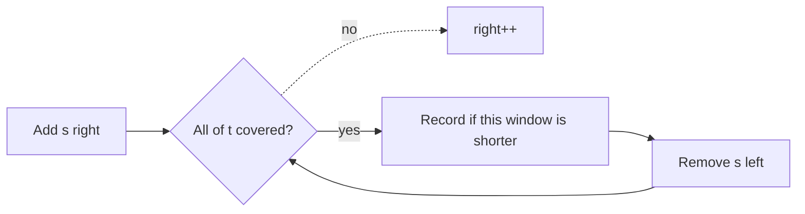

# 76. Minimum Window Substring

https://leetcode.com/problems/minimum-window-substring/

## Problem in your own words

You are given a string `s` and a string `t`. Find the shortest contiguous piece of `s` that contains every character of `t`, including duplicates. If `t` has two `'A'`s, the window needs at least two `'A'`s. If several windows have that minimum length, any one of them is acceptable. If no window covers `t`, return an empty string. Order inside the window does not have to match `t`; this is a cover, not a subsequence alignment.

## Easy analogy

`t` is a shopping list with quantities. You walk the aisle (`s`) and toss items into the cart. When the cart first satisfies the list, you try to put back items from the front of the cart until it would break the list. You write down the shortest cart span that still satisfied the list, then you keep walking in case a later, tighter span works.

## Diagram

```text
s = A D O B E C O D E B A N C
t = A B C

need: A1 B1 C1
expand until A, B, C are all in the cart: "ADOBEC"
shrink from the left while still covered
'D' can leave, 'O' can leave, 'B' cannot without breaking
record a candidate, then drop the char that breaks coverage
and expand again

missing item -.-> keep expanding, do not record
extra item on the left -.-> shrink it away
```



## Intuition before code

Coverage is a multiset check. Count what `t` needs. As the window grows, count what you have. Track how many distinct characters are currently at their required count (`formed`). When `formed` equals the number of distinct characters in `t`, the window is valid. Then move `left` forward, recording the minimum each time the window is still valid, until removing one more character breaks coverage. Then expand again. Both pointers only move forward, so this is `O(n)`.

Comparing two full count arrays on every step also works and is `O(alphabet)` per step. The `formed` counter makes the validity test `O(1)`.

## Walkthrough with a tiny input, step by step

Input: `s = "ADOBECODEBANC"`, `t = "ABC"`. Need one `A`, one `B`, and one `C`. `required = 3`.

- Expand through index 5 (`C`). Window `"ADOBEC"` covers `t`. `formed = 3`. Length 6 is the best so far.
- Shrink once: drop the leading `A`. `formed` falls to 2. `left` now sits on `D`.
- Keep expanding. The second `B` does not raise `formed`, because one `B` is already in the window. The `A` at index 10 brings `formed` back to 3. The window is `"DOBECODEBA"`, length 10, which is worse than 6, so it is not recorded.
- Shrink while still covered: drop `D`, `O`, and the first `B` (a second `B` remains). Coverage holds, but the length is still at least 6.
- Dropping the first `C` breaks coverage. `left` moves on.
- Expand to the final `C`. The window from the current `left` is covered again.
- Shrink `O`, `D`, and `E`. The window is `"BANC"`, length 4, which becomes the best.
- Drop `B`. Coverage breaks. Nothing shorter appears after that.
- Return `"BANC"`.

## Java solution (complete, correct, commented)

```java
class Solution {
    public String minWindow(String s, String t) {
        if (t.length() > s.length()) {
            return "";
        }
        int[] need = new int[128];
        int required = 0;
        for (int i = 0; i < t.length(); i++) {
            char c = t.charAt(i);
            if (need[c] == 0) {
                required++;
            }
            need[c]++;
        }
        int[] have = new int[128];
        int formed = 0;
        int bestLen = Integer.MAX_VALUE;
        int bestLeft = 0;
        int left = 0;
        for (int right = 0; right < s.length(); right++) {
            char c = s.charAt(right);
            have[c]++;
            if (need[c] > 0 && have[c] == need[c]) {
                formed++;
            }
            while (formed == required && left <= right) {
                int len = right - left + 1;
                if (len < bestLen) {
                    bestLen = len;
                    bestLeft = left;
                }
                char drop = s.charAt(left);
                have[drop]--;
                if (need[drop] > 0 && have[drop] < need[drop]) {
                    formed--;
                }
                left++;
            }
        }
        if (bestLen == Integer.MAX_VALUE) {
            return "";
        }
        return s.substring(bestLeft, bestLeft + bestLen);
    }
}
```

ASCII 128 matches the usual character set for this problem. For Unicode, use maps. `substring` copies the answer once.

## Python solution (complete, correct, commented)

```python
class Solution:
    def minWindow(self, s: str, t: str) -> str:
        if len(t) > len(s):
            return ""
        need: dict[str, int] = {}
        for ch in t:
            need[ch] = need.get(ch, 0) + 1
        required = len(need)
        have: dict[str, int] = {}
        formed = 0
        best_len = float("inf")
        best_left = 0
        left = 0
        for right, ch in enumerate(s):
            have[ch] = have.get(ch, 0) + 1
            if ch in need and have[ch] == need[ch]:
                formed += 1
            while formed == required and left <= right:
                length = right - left + 1
                if length < best_len:
                    best_len = length
                    best_left = left
                drop = s[left]
                have[drop] -= 1
                if drop in need and have[drop] < need[drop]:
                    formed -= 1
                left += 1
        if best_len == float("inf"):
            return ""
        # One slice at the end. Slicing inside the loop would copy every candidate.
        return s[best_left:best_left + best_len]
```

## Time and space complexity with why

- Time: `O(n + m)` where `n` is `len(s)` and `m` is `len(t)`. Each index of `s` is added once and removed at most once. Building `need` scans `t`.
- Space: `O(alphabet)` for the count tables, or `O(m)` distinct characters of `t` plus characters seen in `s` if you use hash maps. The answer string is `O(n)` in the worst case and is the output.

## Pitfalls and how to talk through this in an interview in under 2 minutes

Say: “Expand until every character in `t` is covered with the right multiplicity, then shrink from the left while it stays covered, and remember the shortest span.” Mention duplicates in `t`. Mention returning `""` when coverage never happens. Mention you update the best window during the shrink, before you drop the character that breaks it. Filtering `s` to only characters that appear in `t` is an optional speedup and is easy to get wrong with indices; the plain two-pointer scan is the one to code first.
