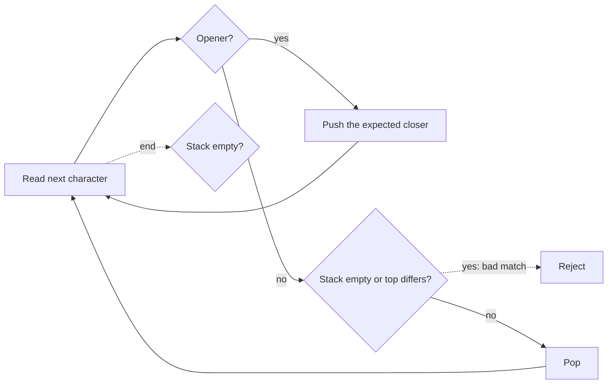

# Stack — Pattern Study

## Problem in your own words

A stack remembers things in the reverse of the order you will need them. You push an opening event (a bracket, a height that is still waiting for a warmer day, a function call) and you pop it when the matching closer arrives. The top of the stack is always the most recent unmatched opener. If the input is well nested, the stack is empty at the end. The pattern is “the nearest unmatched predecessor,” and the stack keeps those predecessors in order without scanning backward.

## Easy analogy

A stack of plates. You can only take the top plate. When you open a parenthesis, you put a plate on the stack that says which closer you expect. When a closer arrives, it must match the top plate. You cannot close an inner plate before the outer one if the top is the inner one; the top is always the innermost unmatched opener. Leftover plates mean something was never closed.

## Diagram

```text
input: ( [ ] )

push expected ')'     stack: )
push expected ']'     stack: ) ]
see ']' matches top   pop       stack: )
see ')' matches top   pop       stack: empty

mismatch or empty pop -.-> reject
leftover plates at the end -.-> reject
```



## Intuition before code

Nesting is last-in, first-out. The most recently opened bracket must close first. A counter works for a single bracket type (`+1` on open, `-1` on close, never negative). Mixed bracket types need identity, not just a count: a stack of expected closers stores that identity. Push the closer, not the opener, so the later comparison is “does this character equal the top?” One comparison, no lookup table required at pop time. You can still keep a small map from opener to closer if you would rather push openers.

Other stack problems in this family (daily temperatures, largest rectangle) store indices instead of characters. The idea is the same: pop values that the current element finishes, and leave the ones still waiting.

## Walkthrough with a tiny input, step by step

Input: `"([])"`.

- `'('` pushes `')'`. Stack: `)`.
- `'['` pushes `']'`. Stack: `)`, `]`.
- `']'` equals the top. Pop. Stack: `)`.
- `')'` equals the top. Pop. Stack empty.
- End. Empty stack. Return true.

Input: `"([)]"`.

- Push `')'`, push `']'`.
- `')'` arrives. Top is `']'`. Not equal. Return false.

## Java solution (complete, correct, commented)

```java
import java.util.ArrayDeque;
import java.util.Deque;

class Solution {
    public boolean isValid(String s) {
        Deque<Character> expected = new ArrayDeque<>();
        for (int i = 0; i < s.length(); i++) {
            char c = s.charAt(i);
            if (c == '(') {
                expected.push(')');
            } else if (c == '[') {
                expected.push(']');
            } else if (c == '{') {
                expected.push('}');
            } else if (expected.isEmpty() || expected.pop() != c) {
                return false;
            }
        }
        return expected.isEmpty();
    }
}
```

`ArrayDeque` is the usual stack. `Stack` is a legacy synchronized class; avoid it in new code. No integer overflow here.

## Python solution (complete, correct, commented)

```python
class Solution:
    def isValid(self, s: str) -> bool:
        expected: list[str] = []
        pairs = {"(": ")", "[": "]", "{": "}"}
        for ch in s:
            if ch in pairs:
                expected.append(pairs[ch])
            elif not expected or expected.pop() != ch:
                return False
        return not expected
```

A list append and pop from the end are `O(1)`. Do not slice the stack (`expected[:-1]`) to pop; that copies the whole list. Do not use string concatenation to simulate the stack.

## Time and space complexity with why

- Time: `O(n)`. Each character is pushed at most once and popped at most once.
- Space: `O(n)` when the string is a long run of openers. A balanced string still uses `O(n)` in the worst case (`(((...)))` holds `n/2` frames before the closers arrive).

## Pitfalls and how to talk through this in an interview in under 2 minutes

Say: “I push the closer I expect, and every closer must match the top. The stack must be empty at the end.” Mention three failure modes: closer too early (empty stack), wrong type on top, and leftover openers. A single counter fails on `"([)]"`. If they ask for the index of the mismatch, push indices. If they ask for the minimum additions to balance, that is a different counting problem; do not force a stack into it without restating the goal.
