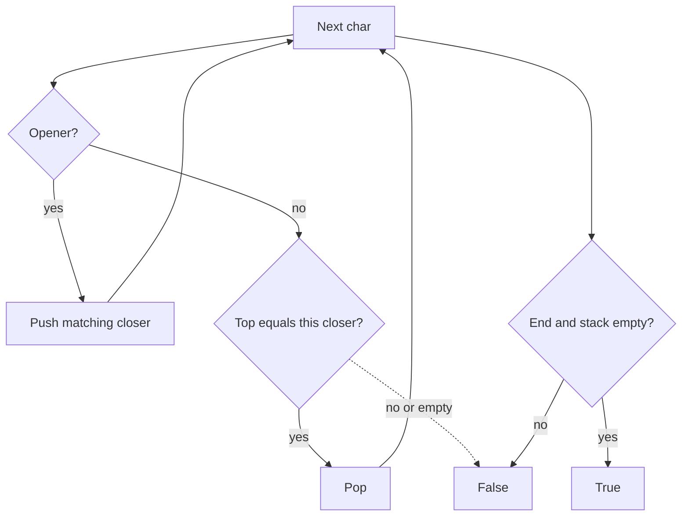

# 20. Valid Parentheses

https://leetcode.com/problems/valid-parentheses/

## Problem in your own words

A string contains only the brackets `()[]{}`. It is valid when every opener has a matching closer of the same type, the closer comes after the opener, and pairs are properly nested. `"()[]{}"` is valid. `"(]"` is not, because the types cross. `"([)]"` is not, because the pairs are interleaved. An empty string is valid. You return a boolean.

## Easy analogy

You are stacking lids next to a row of pots, and each pot must take the lid you most recently set down, of the matching shape. If someone hands you a lid when no pot is waiting, or the lid shape is not the top one, the kitchen is out of order. At the end, no pot should still be waiting for a lid.

## Diagram

```text
"( [ ] )"

step 1 push ')'     stack: )
step 2 push ']'     stack: ) ]
step 3 ']' matches  pop       stack: )
step 4 ')' matches  pop       stack: empty  -> true

"([)]"
step 3 sees ')' but top is ']'  -.-> reject, do not pop the outer ')'
```



## Intuition before code

The closer you need next is always the closer for the most recent unmatched opener. That is a stack. Push the expected closer when you see an opener so the pop side is a direct character compare. Three ways to fail: a closer on an empty stack, a closer that is not the top expected character, or openers left over at the end. A running count cannot tell `(` from `[`, so it accepts `"([)]"`.

## Walkthrough with a tiny input, step by step

Input: `"{[]}"`.

- `'{'` pushes `'}'`. Stack: `}`.
- `'['` pushes `']'`. Stack: `}`, `]`.
- `']'` matches. Pop. Stack: `}`.
- `'}'` matches. Pop. Stack empty.
- Return true.

Input: `"("`.

- Push `')'`. End of string. Stack is not empty. Return false.

Input: `")"`.

- Closer and the stack is empty. Return false immediately.

## Java solution (complete, correct, commented)

```java
import java.util.ArrayDeque;
import java.util.Deque;

class Solution {
    public boolean isValid(String s) {
        Deque<Character> expected = new ArrayDeque<>();
        for (int i = 0; i < s.length(); i++) {
            char c = s.charAt(i);
            if (c == '(') {
                expected.push(')');
            } else if (c == '[') {
                expected.push(']');
            } else if (c == '{') {
                expected.push('}');
            } else if (expected.isEmpty() || expected.pop() != c) {
                // A closer with nothing open, or the wrong opener on top.
                return false;
            }
        }
        return expected.isEmpty();
    }
}
```

## Python solution (complete, correct, commented)

```python
class Solution:
    def isValid(self, s: str) -> bool:
        expected: list[str] = []
        pairs = {"(": ")", "[": "]", "{": "}"}
        for ch in s:
            if ch in pairs:
                expected.append(pairs[ch])
            elif not expected or expected.pop() != ch:
                return False
        return not expected
```

`expected.pop()` removes the last element in `O(1)`. `expected[:-1]` would copy the remaining stack on every closer and make the scan quadratic. No string slicing is required.

## Time and space complexity with why

- Time: `O(n)`. One pass, and each bracket is pushed at most once and popped at most once.
- Space: `O(n)` for a string of only openers. The map of three pairs is `O(1)`.

## Pitfalls and how to talk through this in an interview in under 2 minutes

Say: “Stack of expected closers. Match the top, and require an empty stack at the end.” Walk `"([)]"` as the example a counter gets wrong. Mention empty string is true. Mention odd length can return false immediately as a micro-optimization, not as the real check. If the alphabet of brackets grows, keep the pair map and the same loop. Do not try to delete matched pairs from the middle of a string with repeated `replace`; that is quadratic and harder to prove.
