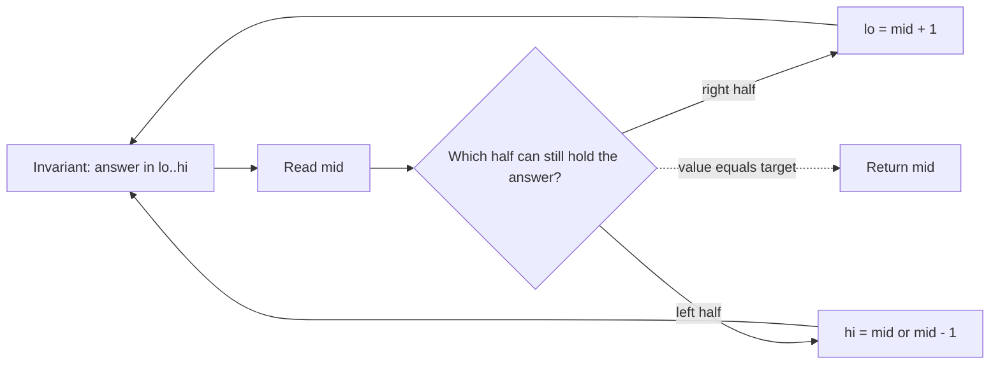

# Binary Search — Pattern Study

## Problem in your own words

Binary search finds a boundary in a sorted range by repeatedly cutting the range in half. The sorted order might be the values themselves, or a rotated sorted array where one half is still fully sorted. The loop does not “search for the value” so much as it keeps a true statement about the interval that still contains the answer. That statement is the loop invariant. When the interval shrinks to one index, the invariant tells you that index is the answer, or that the value is absent.

## Easy analogy

You are guessing a number between 1 and 100. After each guess, the host says “too low” or “too high,” and you throw away the half that cannot contain the number. You write down the rule you believe: “the target, if it exists, is still inside `left..right`.” A rotated dial is the same game with one extra observation: one side of the current guess is a clean increasing run, and you can tell whether the target sits in that run.

## Diagram

```text
inclusive loop: answer is inside [lo, hi], or absent if the loop ends
lo = 0, hi = n - 1
mid = lo + (hi - lo) / 2

if a[mid] is too small: lo = mid + 1     discard [lo, mid]
if a[mid] is too large: hi = mid - 1     discard [mid, hi]
if equal: return mid

discarded half -.-> not searched again

rotated min, half-open style while lo < hi:
if a[mid] > a[hi]: the min is in (mid, hi]   lo = mid + 1
else:              the min is in [lo, mid]   hi = mid
```



## Intuition before code

Pick the invariant before the loop, and make every branch preserve it.

Two common shapes:

1. Inclusive `while (lo <= hi)`, used when any index might be the target and you return as soon as `nums[mid] == target`. On a miss you set `lo = mid + 1` or `hi = mid - 1`, discarding `mid`. If the loop ends, `lo > hi` and the target is absent.
2. Boundary `while (lo < hi)`, used when you want the first index where a predicate becomes true (the minimum in a rotated array). You never discard `mid` when it might still be the boundary: `hi = mid`. The other side is impossible, so `lo = mid + 1`. When `lo == hi`, that index is the boundary.

Compute `mid` as `lo + (hi - lo) / 2`, not `(lo + hi) / 2`. The sum of two large indices can overflow a 32-bit `int`.

On a rotated sorted array, at least one of `[lo, mid]` and `[mid, hi]` is sorted. Compare the endpoints of the sorted half with the target (or compare `nums[mid]` with `nums[hi]` when you are hunting the minimum). Discard the half that cannot contain the answer, and the same invariant still holds.

## Walkthrough with a tiny input, step by step

Classic search, `nums = [1, 3, 5, 7]`, target `5`.

- `lo = 0`, `hi = 3`. `mid = 1`, value `3`, which is too small. Discard the left half including `mid`. `lo = 2`.
- `lo = 2`, `hi = 3`. `mid = 2`, value `5`. Return index `2`.

Rotated minimum, `nums = [4, 5, 1, 2, 3]`.

- `lo = 0`, `hi = 4`. `mid = 2`, value `1`. `1 <= nums[hi]` (`3`), so the min is in `[0, 2]`. `hi = 2`.
- `lo = 0`, `hi = 2`. `mid = 1`, value `5`. `5 > nums[hi]` (`1`), so the min is to the right of `mid`. `lo = 2`.
- `lo == hi == 2`. Return `nums[2]`, which is `1`.

## Java solution (complete, correct, commented)

Inclusive search on a fully sorted array. Rotated variants in this folder keep the same `mid` arithmetic and change the discard rule.

```java
class Solution {
    public int binarySearch(int[] nums, int target) {
        int lo = 0;
        int hi = nums.length - 1;
        while (lo <= hi) {
            // Avoid lo + hi overflow on 32-bit ints.
            int mid = lo + (hi - lo) / 2;
            if (nums[mid] == target) {
                return mid;
            } else if (nums[mid] < target) {
                lo = mid + 1;
            } else {
                hi = mid - 1;
            }
        }
        return -1;
    }
}
```

## Python solution (complete, correct, commented)

```python
class Solution:
    def binarySearch(self, nums: list[int], target: int) -> int:
        lo, hi = 0, len(nums) - 1
        while lo <= hi:
            mid = lo + (hi - lo) // 2
            if nums[mid] == target:
                return mid
            if nums[mid] < target:
                lo = mid + 1
            else:
                hi = mid - 1
        return -1
```

Python integers do not overflow, but `lo + (hi - lo) // 2` is still the form to memorize because Java needs it. Do not slice `nums[lo:hi+1]` to recurse on a copy: each slice copies the half, and the search becomes `O(n)` time and space instead of `O(log n)` time and `O(1)` space.

## Time and space complexity with why

- Time: `O(log n)`. Each step discards at least half of the remaining inclusive range (or moves a boundary inward), so the width drops exponentially.
- Space: `O(1)` for the loop. A recursive version uses `O(log n)` stack frames.

## Pitfalls and how to talk through this in an interview in under 2 minutes

Say the invariant out loud: “the answer is inside `[lo, hi]`.” Then show one branch that shrinks `lo` and one that shrinks `hi`, and say why `mid` is included or excluded. Mention overflow on `mid`. Mention infinite loops: `hi = mid` together with `while (lo <= hi)` can stall when `lo == mid`. Pair `while (lo < hi)` with `hi = mid`, and pair `while (lo <= hi)` with `hi = mid - 1`. Off-by-one is the whole problem. If the array is not monotonic, do not binary search it until you name the half that is still sorted.
