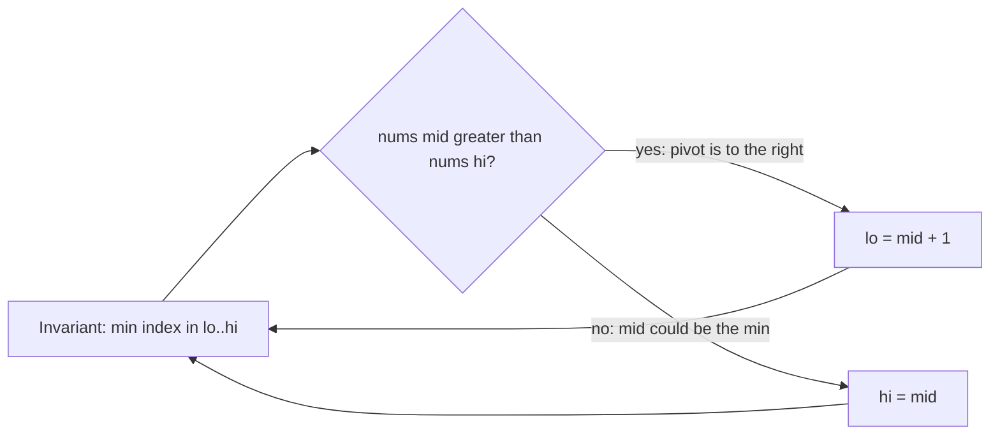

# 153. Find Minimum in Rotated Sorted Array

https://leetcode.com/problems/find-minimum-in-rotated-sorted-array/

## Problem in your own words

You are given an array that was sorted in increasing order and then rotated some number of places. Every element is unique. The rotation moves a suffix to the front, so the array looks like two increasing runs, and the smallest element is the start of the original array. Return that minimum value. A rotation of zero means the array is still fully sorted, and the minimum is the first element. You should do better than a linear scan.

## Easy analogy

A circular calendar of increasing dates was cut and the right piece was moved to the front. You open it in the middle. If the middle date is later than the date at the right edge, you are still in the higher first run, and the drop to January is somewhere to the right. If the middle date is earlier than the right edge, you are already in the run that contains January, and the drop is at the middle or to its left. You never need to look at the discarded side again.

## Diagram

```text
rotated: [4, 5, 6, 7, 0, 1, 2]
          lo       mid      hi
nums[mid] = 7 > nums[hi] = 2
min is strictly right of mid
lo = mid + 1          [0, 1, 2]
                   lo mid hi
nums[mid] = 1 <= nums[hi] = 2
min is in [lo, mid]
hi = mid
then lo meets the 0

left run -.-> discarded when mid is greater than hi
```



## Intuition before code

In a rotated strictly increasing array, the minimum is the only element that is smaller than the element before it (except when the array is not rotated). Binary search can find that drop. Compare `nums[mid]` with `nums[hi]`. If `nums[mid] > nums[hi]`, then `mid` is in the left run and every index from `lo` through `mid` is larger than `nums[hi]`, so the minimum is in `mid + 1 .. hi`. If `nums[mid] <= nums[hi]`, then the right side from `mid` to `hi` is increasing (all values unique), so the minimum is in `lo .. mid`. Use `while (lo < hi)` and `hi = mid` so you do not skip the minimum when it sits at `mid`.

## Walkthrough with a tiny input, step by step

Input: `[3, 4, 5, 1, 2]`.

- `lo = 0`, `hi = 4`, `mid = 2`, `nums[mid] = 5`, `nums[hi] = 2`. `5 > 2`, so `lo = 3`.
- `lo = 3`, `hi = 4`, `mid = 3`, `nums[mid] = 1`, `nums[hi] = 2`. `1 <= 2`, so `hi = 3`.
- `lo == hi == 3`. Return `nums[3]`, which is `1`.

Input: `[1, 2, 3]` (not rotated).

- `mid` points at `2`, `nums[hi]` is `3`. `2 <= 3`, so `hi = mid`. The range collapses toward index 0. Return `1`.

## Java solution (complete, correct, commented)

```java
class Solution {
    public int findMin(int[] nums) {
        int lo = 0;
        int hi = nums.length - 1;
        // Invariant: the minimum's index is inside [lo, hi].
        while (lo < hi) {
            int mid = lo + (hi - lo) / 2;
            if (nums[mid] > nums[hi]) {
                // mid is in the high left run. The min is to its right.
                lo = mid + 1;
            } else {
                // The right side is sorted and mid is inside the valley's run.
                hi = mid;
            }
        }
        return nums[lo];
    }
}
```

`lo + (hi - lo) / 2` avoids overflow of `lo + hi` in a 32-bit `int`. Comparing values does not overflow. Duplicates are a different problem (154): `nums[mid] == nums[hi]` no longer tells you which side is sorted, and you may only move `hi` by one.

## Python solution (complete, correct, commented)

```python
class Solution:
    def findMin(self, nums: list[int]) -> int:
        lo, hi = 0, len(nums) - 1
        # Invariant: the minimum's index is inside [lo, hi].
        while lo < hi:
            mid = lo + (hi - lo) // 2
            if nums[mid] > nums[hi]:
                lo = mid + 1
            else:
                hi = mid
        return nums[lo]
```

No slicing. `min(nums[lo:hi+1])` each step would copy the range and turn the search linear. Python’s `//` is the floor division you want for a non-negative index.

## Time and space complexity with why

- Time: `O(log n)`. The index range at least halves every iteration.
- Space: `O(1)`. Three integers.

A linear scan is `O(n)` and correct, and it is the fallback when duplicates destroy the half-discard proof.

## Pitfalls and how to talk through this in an interview in under 2 minutes

Say: “The minimum index stays inside `[lo, hi]`. If `nums[mid] > nums[hi]`, I discard `mid` and everything left of it. Otherwise I discard everything right of `mid` but keep `mid`.” Mention the not-rotated array and a one-element array. Mention `mid = lo + (hi - lo) / 2` and why `while (lo < hi)` pairs with `hi = mid`. If duplicates are allowed, say the worst case becomes `O(n)` because equal endpoints do not identify a sorted half.
