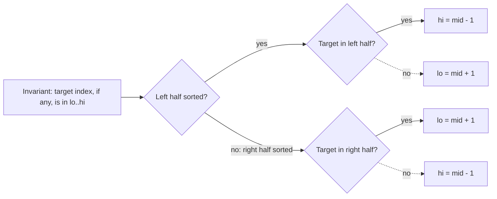

# 33. Search in Rotated Sorted Array

https://leetcode.com/problems/search-in-rotated-sorted-array/

## Problem in your own words

You are given a rotated sorted array of distinct integers and a target. Return the index of the target, or `-1` if it is not in the array. The array was increasing, then rotated, so it consists of two increasing runs. You need an `O(log n)` search. A full scan would find the value and would miss the required bound.

## Easy analogy

A dictionary was split and the second volume was shelved before the first. You open the middle. One side of the opening is a normal A-to-Z run. If the word you want would live in that normal run, you keep that side. If it would not, you keep the other side, which still contains the seam and the rest of the alphabet. You repeat until the page is the word or the shelf section is empty.

## Diagram

```text
nums: [4, 5, 6, 7, 0, 1, 2], target 0
lo=0 hi=6 mid=3 value 7
[lo..mid] = [4,5,6,7] is sorted (4 <= 7)
target 0 is not inside [4, 7]  -.-> discard left, lo = mid + 1

lo=4 hi=6 mid=5 value 1
[lo..mid] = [0, 1] is sorted
target 0 is inside [0, 1] -> hi = mid - 1

lo=4 hi=4 mid=4 value 0 -> return 4

a half that cannot hold the target -.-> discarded
the other half stays inside [lo, hi]
```



## Intuition before code

At every mid, at least one side is strictly increasing because the single rotation point lies in at most one side. Detect the sorted side with `nums[lo] <= nums[mid]` (left half sorted) or not (right half sorted). A target lies in a sorted half only when it is between that half’s endpoints, inclusive of the endpoint that is not `mid` and exclusive of `mid` once you have checked equality. If it lies in the sorted half, discard the other half. If it does not, it must be in the unsorted half, which you keep. Check `nums[mid] == target` before the half logic. Distinct values make the endpoint tests unambiguous.

## Walkthrough with a tiny input, step by step

Input: `[4, 5, 6, 7, 0, 1, 2]`, target `0`.

- `lo = 0`, `hi = 6`, `mid = 3`, value `7`. Not the target. `nums[0] = 4 <= 7`, so the left half is sorted. Target `0` is not in `[4, 7)`. Discard the left half: `lo = 4`.
- `lo = 4`, `hi = 6`, `mid = 5`, value `1`. Not the target. `nums[4] = 0 <= 1`, so the left half `[0, 1]` is sorted. Target `0` is in `[0, 1)`. `hi = 4`.
- `lo = 4`, `hi = 4`, `mid = 4`, value `0`. Return `4`.

Target `3` in the same array: the range shrinks until `lo > hi`, and you return `-1`.

## Java solution (complete, correct, commented)

```java
class Solution {
    public int search(int[] nums, int target) {
        int lo = 0;
        int hi = nums.length - 1;
        // Invariant: if target is present, its index is inside [lo, hi].
        while (lo <= hi) {
            int mid = lo + (hi - lo) / 2;
            if (nums[mid] == target) {
                return mid;
            }
            if (nums[lo] <= nums[mid]) {
                // Left half [lo, mid] is sorted.
                if (nums[lo] <= target && target < nums[mid]) {
                    hi = mid - 1;
                } else {
                    lo = mid + 1;
                }
            } else {
                // Right half [mid, hi] is sorted.
                if (nums[mid] < target && target <= nums[hi]) {
                    lo = mid + 1;
                } else {
                    hi = mid - 1;
                }
            }
        }
        return -1;
    }
}
```

`nums[lo] <= nums[mid]` uses `<=` so a range of length one (`lo == mid`) is treated as sorted. The `mid` formula avoids `int` overflow on the index sum. Values are only compared, not added, so value overflow does not apply. All elements are distinct under this problem; duplicates are LeetCode 81 and can force a linear worst case.

## Python solution (complete, correct, commented)

```python
class Solution:
    def search(self, nums: list[int], target: int) -> int:
        lo, hi = 0, len(nums) - 1
        # Invariant: if target is present, its index is inside [lo, hi].
        while lo <= hi:
            mid = lo + (hi - lo) // 2
            if nums[mid] == target:
                return mid
            if nums[lo] <= nums[mid]:
                # Left half [lo, mid] is sorted.
                if nums[lo] <= target < nums[mid]:
                    hi = mid - 1
                else:
                    lo = mid + 1
            else:
                # Right half [mid, hi] is sorted.
                if nums[mid] < target <= nums[hi]:
                    lo = mid + 1
                else:
                    hi = mid - 1
        return -1
```

No slicing. Copying `nums[lo:mid]` to test membership would be linear per step. Python’s chained comparison `nums[lo] <= target < nums[mid]` is the same pair of inequalities as the Java version.

## Time and space complexity with why

- Time: `O(log n)`. One halving comparison path, the same shape as ordinary binary search.
- Space: `O(1)` extra.

Finding the pivot first (`O(log n)`) and then binary searching one of the two sorted runs is also `O(log n)`. The single loop above does both decisions together.

## Pitfalls and how to talk through this in an interview in under 2 minutes

Say: “If the target exists, it is still inside `[lo, hi]`. One half is sorted. I test whether the target sits in that sorted half and discard the other half.” Mention distinct elements, return `-1`, and the `<=` when `lo == mid`. Mention index overflow. Walk a target that lives in the unsorted half so you show you do not always follow the sorted side. If duplicates appear, say you may have to move `lo` or `hi` by one when `nums[lo] == nums[mid]`.
