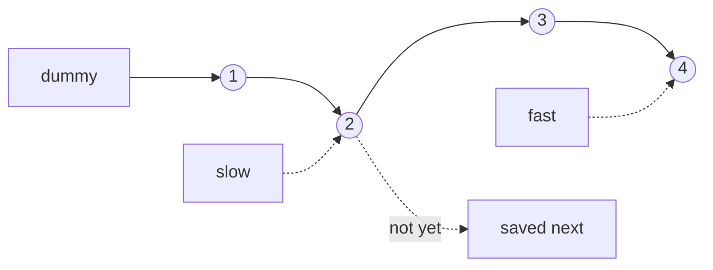

# Linked-list patterns (NeetCode / Blind 75)

## Problem in your own words

Singly linked lists give you a node value and one `next` pointer, and nothing else: no random access, no length unless you walk, and no way back unless you saved a pointer yourself. The list problems in this set all come down to rewiring `next` without losing the rest of the chain, or walking two pointers at different speeds so one of them knows something the other does not. Heads are fragile because the first node can be deleted or replaced, so a dummy node that sits in front of the real head is often the whole trick.

## Easy analogy

Think of a conga line in the dark. Each person only holds the shoulder of the person in front. If you let go before grabbing the next shoulder, the rest of the line wanders off. A clipboard holder standing before the first dancer (the dummy) never gets removed, so you always have someone whose `next` you can edit, even when the first dancer leaves.

## Diagram

Two speeds, and the link we deliberately do not follow yet:



```
dummy -> 1 -> 2 -> 3 -> 4 -> null
           ^slow      ^fast
slow stays n nodes behind fast, so when fast falls off,
slow is standing on the predecessor we need.
```

## Intuition

Memorize five moves and most of these problems are combinations of them.

1. **Save, rewire, advance.** Before `curr.next = ...`, store `next = curr.next`. That local variable is the only copy of the tail.
2. **Dummy head.** `dummy.next = head`. Build or delete from `dummy`, return `dummy.next`. The real head is then just another node.
3. **Slow and fast.** Fast moves two steps, slow moves one. They meet inside a cycle (Floyd), or slow lands on the middle when fast hits the end.
4. **Fixed gap.** Put fast `n` (or `n + 1` if you started on a dummy) steps ahead. Then move both one step at a time. The gap is the invariant.
5. **Merge by heads.** Two or k sorted lists: always take the smaller current head and advance only that list. A heap is just "who has the smallest head right now?" when there are more than two lists.

Reverse is move (1). Merge-two is (2) + (5). Cycle is (3). Reorder is (3) + reverse + a zip merge. Remove-nth is (2) + (4). Merge-k is (5) with a heap, or the same merge-two used as a divide-and-conquer combine step.

## Step-by-step tiny walkthrough

List `1 -> 2 -> 3`, reverse with three pointers.

| step | prev | curr | saved next | action |
| --- | --- | --- | --- | --- |
| 0 | null | 1 | — | start |
| 1 | null | 1 | 2 | `1.next = null` |
| 2 | 1 | 2 | 3 | `2.next = 1` |
| 3 | 2 | 3 | null | `3.next = 2` |
| 4 | 3 | null | — | stop, return prev |

Result: `3 -> 2 -> 1 -> null`. The same "save then rewire" move shows up when you reverse only the second half of a list before zipping it back.

## Java

```java
import java.util.*;

class Solution {
    class ListNode { int val; ListNode next; ListNode(int x){val=x;} }

    // Iterative reverse. Recursive form is in 19-reverse-linked-list.
    public ListNode reverse(ListNode head) {
        ListNode prev = null, curr = head;
        while (curr != null) {
            ListNode nxt = curr.next;
            curr.next = prev;
            prev = curr;
            curr = nxt;
        }
        return prev;
    }

    // Dummy + two sorted lists. Attach the smaller head, then the leftover.
    public ListNode mergeTwo(ListNode a, ListNode b) {
        ListNode dummy = new ListNode(0), tail = dummy;
        while (a != null && b != null) {
            if (a.val <= b.val) { tail.next = a; a = a.next; }
            else { tail.next = b; b = b.next; }
            tail = tail.next;
        }
        tail.next = (a != null) ? a : b;
        return dummy.next;
    }
}
```

## Python

```python
class ListNode:
    def __init__(self, x):
        self.val = x
        self.next = None

class Solution:
    def reverse(self, head):
        prev, curr = None, head
        while curr:
            nxt = curr.next
            curr.next = prev
            prev, curr = curr, nxt
        return prev

    def merge_two(self, a, b):
        dummy = tail = ListNode(0)
        while a and b:
            if a.val <= b.val:
                tail.next, a = a, a.next
            else:
                tail.next, b = b, b.next
            tail = tail.next
        tail.next = a or b
        return dummy.next
```

## Complexity

A single walk is **O(n) time** and **O(1) extra memory** when you only store a handful of pointers. Recursion on the list is **O(n) stack**. A heap over k list heads is **O(n log k)** because each of the n nodes is pushed and popped once. You almost never need the length up front; if you catch yourself counting nodes and then walking again, a gap pointer or a middle pointer usually does the same job in one pass.

## Pitfalls

- Losing `curr.next` before you rewire. The tail is gone and you cannot reconstruct it.
- Returning `head` after a delete or reverse that moved the first node. Return `dummy.next` or the final `prev`.
- Comparing node values when you meant node identity (`slow == fast`, not `slow.val == fast.val`) for cycle detection.
- Off-by-one on the gap: from a dummy you walk `n + 1` steps so `slow` lands on the predecessor, not on the victim.
- Forgetting the odd-length middle. Decide which half owns the middle node before you cut `slow.next = null`.
- Heap ties in Python: `ListNode` is not ordered, so push `(val, unique_id, node)`.

## 2-minute interview script

"I'll treat the list as a chain of next pointers and never move a pointer until I've saved the node it was pointing at. If the head might change I put a dummy in front and return dummy.next at the end. For reverse I keep prev, curr, and next: save next, point curr back at prev, then slide both forward. For two sorted lists I walk a tail and always splice in the smaller head, then attach whichever list remains. For a cycle I run Floyd: slow moves one, fast moves two, they meet only if there is a loop, and I stop when fast or fast.next is null. For the nth from the end I don't compute the length; I open a gap of n plus one from a dummy so when fast falls off, slow is the node just before the one I delete. Reorder is three of those moves in a row: middle with slow and fast, reverse the second half, then zip them. Merge k lists is the same two-list merge, either with a heap of current heads or divide and conquer. Edge cases I say out loud: empty list, one node, deleting the head, and a cycle of length one."
