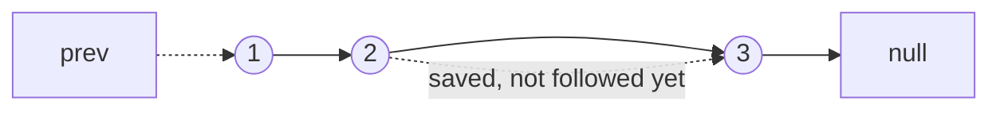

# 19. Reverse Linked List (LC 206)

**Link:** https://leetcode.com/problems/reverse-linked-list/

## Problem in your own words

You are given the head of a singly linked list. Return the head of the list with every link flipped, so the old tail becomes the new head and the old head points at null. You should rewire the existing nodes. The iterative solution uses a constant amount of extra memory; the recursive solution is the same idea written as "reverse the tail, then point the tail back at me."

## Easy analogy

You are turning a line of people around. Each person is holding the next person's hand. You cannot let go until you have remembered who was next, otherwise the rest of the line is lost. Once you remember, you turn that person around to face the people you have already flipped.

## Diagram



After one rewire, `1` points backward and `2` is the new current. The dotted arrow is the old `next` you saved in a local variable:

```
before:  null <- no    1 -> 2 -> 3 -> null
after 1:  null <- 1    2 -> 3 -> null
after 2:  null <- 1 <- 2    3 -> null
after 3:  null <- 1 <- 2 <- 3
return 3
```

## Intuition

Three names are enough: `prev` (already reversed), `curr` (the node you are flipping), and `nxt` (the still-unreversed tail). The order inside the loop is fixed: read `curr.next` into `nxt`, point `curr.next` at `prev`, then slide `prev = curr` and `curr = nxt`. When `curr` is null, `prev` is the new head.

The recursive version reverses `head.next` first. The recursive call returns the new head (the old tail). Then `head.next` is the last node of that reversed tail, and `head.next.next = head` makes it point back. `head.next = null` so the old head does not keep a forward edge.

## Step-by-step tiny walkthrough

Input: `1 -> 2 -> 3 -> null`.

1. `prev = null`, `curr = 1`. Save `nxt = 2`. Set `1.next = null`. Slide: `prev = 1`, `curr = 2`.
2. Save `nxt = 3`. Set `2.next = 1`. Slide: `prev = 2`, `curr = 3`.
3. Save `nxt = null`. Set `3.next = 2`. Slide: `prev = 3`, `curr = null`.
4. Loop ends. Return `3`. List is `3 -> 2 -> 1 -> null`.

Recursive picture for the same list: the call on `3` hits the base case and returns `3`. The call on `2` sets `3.next = 2` and `2.next = null`. The call on `1` sets `2.next = 1` and `1.next = null`. Every frame returns `3`.

## Java

```java
class Solution {
    class ListNode { int val; ListNode next; ListNode(int x){val=x;} }

    public ListNode reverseList(ListNode head) {
        ListNode prev = null;
        ListNode curr = head;
        while (curr != null) {
            ListNode nxt = curr.next;
            curr.next = prev;
            prev = curr;
            curr = nxt;
        }
        return prev;
    }

    // Same result, O(n) call stack. Mention this; ship the loop unless asked.
    public ListNode reverseListRecursive(ListNode head) {
        if (head == null || head.next == null) return head;
        ListNode newHead = reverseListRecursive(head.next);
        head.next.next = head;
        head.next = null;
        return newHead;
    }
}
```

## Python

```python
class ListNode:
    def __init__(self, x):
        self.val = x
        self.next = None

class Solution:
    def reverseList(self, head):
        prev, curr = None, head
        while curr:
            nxt = curr.next
            curr.next = prev
            prev, curr = curr, nxt
        return prev

    def reverseListRecursive(self, head):
        if head is None or head.next is None:
            return head
        new_head = self.reverseListRecursive(head.next)
        head.next.next = head
        head.next = None
        return new_head
```

## Complexity

**Iterative:** `O(n)` time, `O(1)` extra memory. Each node is visited once and the only storage is three pointers.

**Recursive:** `O(n)` time and `O(n)` stack. The depth equals the length, because each call waits on `head.next` before it rewires. A long list can overflow the call stack even though the algorithm is correct.

## Pitfalls

- Writing `curr.next = prev` before saving `curr.next`. The tail is unreachable.
- Returning `head`. After the loop `head` is the old first node, whose `next` is null. The new head is `prev`.
- In the recursive version, forgetting `head.next = null`. The old head still points forward and you have a cycle of two nodes.
- Base case must include both null and a single node. A single node is already reversed.
- Do not allocate new nodes. The problem is a rewiring, and extra nodes hide the bug if you accidentally drop a link.

## 2-minute interview script

"I'll reverse the list in place with three pointers. prev starts null, curr starts at the head. In each step I stash curr.next, point curr back at prev, then advance prev and curr. When curr falls off the end, prev is the new head, so I return prev, not the original head. Empty list and a single node both fall out naturally: the loop never runs or runs once and prev is that only node. The recursive version is the same stitch: reverse the tail, then set head.next.next = head and head.next = null, and return the head that the recursive call returned, which is the old tail. I prefer the loop because the stack would be O(n). Time is linear either way; extra memory is constant for the loop. The bug I watch for is losing the next pointer, and in the recursive form, forgetting to null out head.next, which would leave a two-node cycle."
