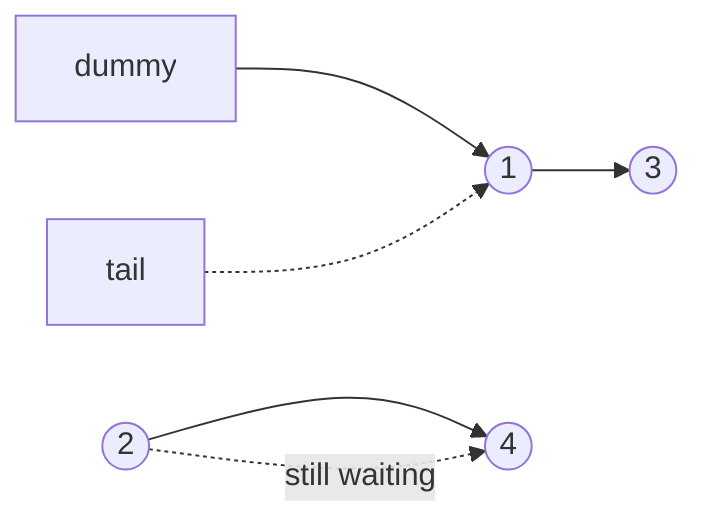

# 20. Merge Two Sorted Lists (LC 21)

**Link:** https://leetcode.com/problems/merge-two-sorted-lists/

## Problem in your own words

You have two singly linked lists, each already sorted in nondecreasing order. Build one sorted list that contains every node from both. The clean way is to reuse the existing nodes and only change `next` pointers, rather than allocating a new node per value. Either input may be empty, and equal values may appear in both lists.

## Easy analogy

Two stacks of graded papers, each pile sorted by score. You look at the top of both piles, take the lower score, and put it face-down on a new pile. When one stack runs out you drop the entire remaining stack on top. A blank cover sheet (the dummy) gives you a place to start so you never special-case the first real sheet.

## Diagram



```
a: 1 -> 3 -> null
b: 2 -> 4 -> null

dummy -> 1 -> 2 -> 3 -> 4
take 1, then 2, then 3, then splice the rest of b (just 4)
```

The dotted edge is the list you have not consumed yet. `tail` only ever grows forward.

## Intuition

Keep a `tail` that is the last node of the merged result. Compare `a.val` and `b.val`, attach the smaller node, and advance only that list. When one pointer becomes null, the other list is still sorted and every remaining value is at least as large as what you have already placed, so one assignment `tail.next = a or b` finishes the job. The dummy means `tail` always exists, even before the first real node, so the loop has no "first insertion" branch. Return `dummy.next`.

## Step-by-step tiny walkthrough

`a = 1 -> 3`, `b = 2 -> 4`.

1. `1 <= 2`, attach `1`, `a` moves to `3`. Result: `dummy -> 1`.
2. `3 > 2`, attach `2`, `b` moves to `4`. Result: `dummy -> 1 -> 2`.
3. `3 <= 4`, attach `3`, `a` becomes null. Result: `dummy -> 1 -> 2 -> 3`.
4. Loop ends because `a` is null. `tail.next = b`, which is `4`.
5. Return `dummy.next`: `1 -> 2 -> 3 -> 4`.

If `a` is empty at the start, the loop never runs and `tail.next = b` returns the second list unchanged.

## Java

```java
class Solution {
    class ListNode { int val; ListNode next; ListNode(int x){val=x;} }

    public ListNode mergeTwoLists(ListNode a, ListNode b) {
        ListNode dummy = new ListNode(0);
        ListNode tail = dummy;
        while (a != null && b != null) {
            if (a.val <= b.val) {
                tail.next = a;
                a = a.next;
            } else {
                tail.next = b;
                b = b.next;
            }
            tail = tail.next;
        }
        tail.next = (a != null) ? a : b;
        return dummy.next;
    }
}
```

## Python

```python
class ListNode:
    def __init__(self, x):
        self.val = x
        self.next = None

class Solution:
    def mergeTwoLists(self, a, b):
        dummy = tail = ListNode(0)
        while a and b:
            if a.val <= b.val:
                tail.next = a
                a = a.next
            else:
                tail.next = b
                b = b.next
            tail = tail.next
        tail.next = a if a else b
        return dummy.next
```

## Complexity

**Time `O(n + m)`.** Each iteration attaches one node and neither list is revisited. The final splice is `O(1)`.

**Extra memory `O(1)`.** The dummy is one node. Recursion would be `O(n + m)` stack and is unnecessary. You do not allocate a node per value; you relink the inputs, so the output shares nodes with the inputs.

## Pitfalls

- Forgetting to advance `tail`. You keep writing `dummy.next` and lose the growing chain.
- Moving both lists in one iteration. Only the list you attached should advance.
- Building a new node and forgetting to copy the rest of the chain. Relinking is shorter and cannot drop a suffix if the final splice is present.
- Strict `<` versus `<=`. Either is sorted. `<=` keeps the left list's node first on ties, which is a stable merge. Say that out loud if the interviewer cares about stability.
- Returning `dummy` instead of `dummy.next`. The dummy value is not part of the list.

## 2-minute interview script

"Both lists are sorted, so I only ever need to look at the two current heads. I'll make a dummy node and a tail that starts on it. While both lists remain, I attach the smaller head to tail, advance that list, and move tail forward. When one list runs out, the other is still sorted and belongs entirely after what I've built, so I splice it on in one assignment. I return dummy.next so the fake head is not part of the answer. Empty inputs fall out: if one list is null the loop is skipped and I return the other. Ties: I use less-than-or-equal so the node from the first list stays ahead, which makes the merge stable. Time is linear in the total number of nodes, extra memory is the dummy. I won't recurse; the same recurrence would use a call frame per node. The bug I watch is forgetting to advance tail, which would orphan everything after the first node."
