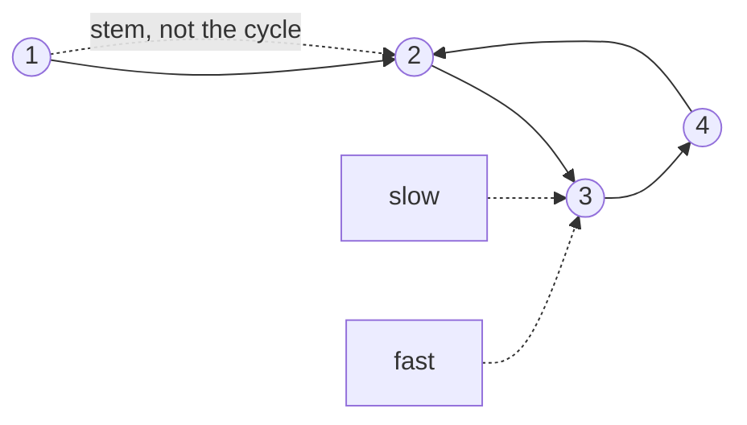

# 21. Linked List Cycle (LC 141)

**Link:** https://leetcode.com/problems/linked-list-cycle/

## Problem in your own words

A singly linked list may contain a cycle: some node's `next` points at an earlier node instead of eventually reaching null. Return true if you would loop forever by following `next`, and false if you reach null. You may use only a constant amount of extra memory, so "put every node in a set" is the easy answer you mention and then replace.

## Easy analogy

Two people run around a circular track, one twice as fast as the other. If the track is a loop, the faster runner laps the slower one. If the track is a straight road with an end, the faster runner falls off the end and they never meet. You do not need to know how long the road is.

## Diagram



```
1 -> 2 -> 3 -> 4
     ^         |
     +---------+

slow and fast both land on 3 (or another node inside the loop).
The dotted edge from 1 is the stem: it is not part of the meeting argument
beyond "both runners enter the loop."
```

## Intuition

Floyd's tortoise and hare: `slow` moves one step, `fast` moves two. Outside a cycle, `fast` reaches null and you return false. Inside a cycle, `fast` gains one step on `slow` every iteration, so the gap shrinks until they stand on the same node. That meeting cannot happen on a null-terminated list because the two pointers only meet if `fast` has wrapped around.

Start both at `head` and move before you compare. If you compare first, `head == head` is a false cycle.

You do not need the cycle length or the entry node for a boolean. (The entry node is LC 142: after they meet, put one pointer back at `head` and walk both one step; they meet at the entrance.)

## Step-by-step tiny walkthrough

List: `1 -> 2 -> 3 -> 4 -> 2` (cycle from 4 back to 2).

| iter | slow | fast | equal? |
| --- | --- | --- | --- |
| start | 1 | 1 | do not check yet |
| 1 | 2 | 3 | no |
| 2 | 3 | 2 | no |
| 3 | 4 | 4 | yes, return true |

No cycle, `1 -> 2 -> 3`:

| iter | slow | fast |
| --- | --- | --- |
| 1 | 2 | 3 |
| 2 | 3 | null (`3.next` is null, stop before the move) |

`fast.next` is null, so the loop condition fails and you return false. You never dereference null.

## Java

```java
class Solution {
    class ListNode { int val; ListNode next; ListNode(int x){val=x;} }

    public boolean hasCycle(ListNode head) {
        ListNode slow = head;
        ListNode fast = head;
        while (fast != null && fast.next != null) {
            slow = slow.next;
            fast = fast.next.next;
            if (slow == fast) return true;
        }
        return false;
    }
}
```

## Python

```python
class ListNode:
    def __init__(self, x):
        self.val = x
        self.next = None

class Solution:
    def hasCycle(self, head):
        slow = fast = head
        while fast and fast.next:
            slow = slow.next
            fast = fast.next.next
            if slow is fast:
                return True
        return False
```

## Complexity

**Time `O(n)`.** If there is no cycle you walk each node at most twice (`fast` skips ahead and stops). If there is a cycle, once both pointers are inside it, `fast` gains one step per turn, so they meet in at most `cycleLength` more iterations. The stem before the cycle is walked once. Overall linear in the number of distinct nodes.

**Extra memory `O(1)`.** Two pointers. A hash set of seen nodes is also `O(n)` time but `O(n)` memory, and it answers the same boolean. Floyd is the expected answer when the statement says constant memory.

## Pitfalls

- Comparing `slow.val == fast.val`. Different nodes can share a value, and the same node is the only proof of a cycle. Compare references (`==` in Java, `is` in Python).
- Checking equality before the first move. Both pointers are `head`, so you return true for every non-null list.
- Moving `fast` by two without testing `fast.next`. A tail node makes `fast.next.next` throw.
- Advancing `slow` by two as well. Then they move together and never meet inside a long cycle unless they started on the same node.
- Trying to "mark" `node.val` as visited. Values are not a free scratchpad; the list may legitimately contain any int, and you would mutate input the caller can see.

## 2-minute interview script

"I'll use Floyd's cycle finding. Two pointers start at the head. Each iteration the slow one moves one node and the fast one moves two. If the list ends, fast or fast.next becomes null and I return false. If there is a cycle, once both are in the loop the fast pointer closes the gap by one node each turn, so they land on the same object and I return true. I compare node identity, not values, because values can repeat. I move first and then compare, otherwise head equals head on the first check. Time is linear in the number of nodes, memory is two pointers. A hash set also works but uses linear memory, so I mention it and then give Floyd. I won't compute the cycle length for a yes/no answer. If they ask where the cycle starts, I reset one pointer to the head after the meeting and walk both one step at a time until they meet again."
