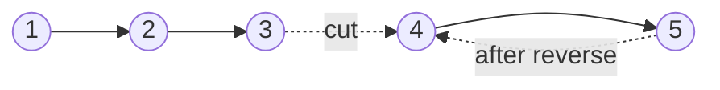

# 22. Reorder List (LC 143)

**Link:** https://leetcode.com/problems/reorder-list/

## Problem in your own words

A singly linked list `L0 -> L1 -> ... -> Ln-1 -> Ln` should be rearranged in place into `L0 -> Ln -> L1 -> Ln-1 -> L2 -> ...`. You do not return a new head; you edit `next` pointers. The usual way to see it is three smaller problems you already know: find the middle, reverse the second half, then merge the two halves by alternating nodes.

## Easy analogy

A deck of cards in a row. You split it in half, flip the second half over, and then riffle-shuffle one card from each hand. The first half stays in the original order; the second half comes off in reverse, which is exactly the "last, second last, ..." order the problem wants.

## Diagram



```
1 -> 2 -> 3 -> 4 -> 5

middle (first of the two policies below): slow lands on 3
cut:  1 -> 2 -> 3 -> null     and     4 -> 5
rev:  1 -> 2 -> 3             and     5 -> 4
zip:  1 -> 5 -> 2 -> 4 -> 3
```

The dotted edge is the link you cut, and later the reversed direction of the second half. You never walk from `3` into `4` again until the zip places nodes one at a time.

## Intuition

**Find the middle** with slow and fast. Use the guard `fast.next != null && fast.next.next != null` so that on an even length, `slow` stops on the left middle. `second = slow.next`, then `slow.next = null` splits the list. The first half is the same length or one longer, so the zip never runs out of first-half nodes before the second half.

**Reverse the second half** with the ordinary prev/curr/next loop. The old middle's successor becomes the new tail of the second half.

**Zip.** While the reversed half remains, splice one node from it between nodes of the first half:

```
next1 = first.next
next2 = second.next
first.next = second
second.next = next1
first = next1
second = next2
```

Stop when `second` is null. If the length is odd, one node remains in the first half and already points at null because of the cut.

## Step-by-step tiny walkthrough

Input `1 -> 2 -> 3 -> 4`.

1. Middle. `slow = 1`, `fast = 1`. `fast` can move two steps: `slow = 2`, `fast = 3`. `fast.next` is `4` and `fast.next.next` is null, so stop. `slow` is `2`.
2. Cut. `second = 3`, `2.next = null`. Halves: `1 -> 2` and `3 -> 4`.
3. Reverse second. `4 -> 3`.
4. Zip.
   - Take `4`: `1 -> 4 -> 2`, remaining second is `3`.
   - Take `3`: `1 -> 4 -> 2 -> 3`.
5. Done. That is `L0, Ln, L1, Ln-1`.

Odd example `1 -> 2 -> 3 -> 4 -> 5` leaves `slow` on `3`, reverses `5 -> 4`, and zips to `1 -> 5 -> 2 -> 4 -> 3`.

## Java

```java
class Solution {
    class ListNode { int val; ListNode next; ListNode(int x){val=x;} }

    public void reorderList(ListNode head) {
        if (head == null || head.next == null) return;

        ListNode slow = head, fast = head;
        while (fast.next != null && fast.next.next != null) {
            slow = slow.next;
            fast = fast.next.next;
        }

        ListNode second = slow.next;
        slow.next = null;

        ListNode prev = null;
        while (second != null) {
            ListNode nxt = second.next;
            second.next = prev;
            prev = second;
            second = nxt;
        }
        second = prev;

        ListNode first = head;
        while (second != null) {
            ListNode next1 = first.next;
            ListNode next2 = second.next;
            first.next = second;
            second.next = next1;
            first = next1;
            second = next2;
        }
    }
}
```

## Python

```python
class ListNode:
    def __init__(self, x):
        self.val = x
        self.next = None

class Solution:
    def reorderList(self, head):
        if not head or not head.next:
            return
        slow = fast = head
        while fast.next and fast.next.next:
            slow = slow.next
            fast = fast.next.next

        second, slow.next = slow.next, None
        prev = None
        while second:
            nxt = second.next
            second.next = prev
            prev = second
            second = nxt

        first, second = head, prev
        while second:
            next1, next2 = first.next, second.next
            first.next = second
            second.next = next1
            first, second = next1, next2
```

## Complexity

**Time `O(n)`.** Middle is one walk, reverse is a walk of `n / 2`, zip is another `n / 2`. No nested scans.

**Extra memory `O(1)`.** A handful of pointers. Putting the nodes in an array and rewriting links from both ends is `O(n)` time and `O(n)` memory; say it as the backup if pointer rewiring gets messy, then do the three-phase version.

## Pitfalls

- Forgetting `slow.next = null`. The first half still runs into the second, and the zip builds a cycle.
- Using `while (fast != null && fast.next != null)` without adjusting the split. That parks `slow` on the right middle for an even list. It can still work, but then the second half is longer and the zip loop must stop when `first` is exhausted too, or you drop a node. Pick one policy and match the loop to it. The code above keeps the first half longer-or-equal and loops only on `second`.
- Losing `first.next` or `second.next` before the splice. Same bug as reverse.
- Returning a new head. The head node never changes; the method is `void`.
- Reversing the first half by mistake. Then `Ln` would become the head, and the required order starts with `L0`.

## 2-minute interview script

"I need L0, Ln, L1, Ln-1, and so on, in place. I'll do it in three passes I already know. First, slow and fast pointers find the middle; I stop slow on the left middle when the length is even, so the first half is never shorter. I cut slow.next. Second, I reverse the second half with prev, curr, and next. Third, I zip: while the reversed half still has nodes, I splice its head between the current first-half node and that node's old successor, saving both next pointers before I write. The head of the list stays the same, so the function returns void. Empty and one-node lists return immediately. Time is linear, memory is a few pointers. The bug I watch is forgetting to cut the list, which makes the zip cycle, and saving next pointers too late. If I get the even-length middle wrong I say which half owns the extra node and I make the zip stop on the shorter half."
