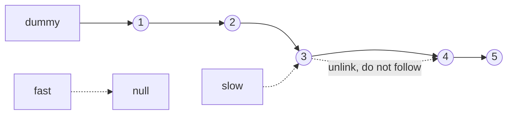

# 23. Remove Nth Node From End of List (LC 19)

**Link:** https://leetcode.com/problems/remove-nth-node-from-end-of-list/

## Problem in your own words

You are given the head of a singly linked list and an integer `n`. Delete the node that sits `n` places from the end (the last node is `n = 1`) and return the head of what remains. `n` is always valid: it is at least 1 and at most the length, so you do not have to handle "n is too big," but you do have to handle deleting the head itself. One pass with a dummy and two pointers is enough; you do not need the length.

## Easy analogy

Two people walk a single-file line, and the person in front is told to stay exactly `n` people ahead. When the leader steps off the end of the line, the follower is standing immediately behind the person who should leave. A host standing before the first person (the dummy) is who you ask when the person who leaves is the first in line.

## Diagram



```
n = 2, delete 4 (second from the end)

dummy -> 1 -> 2 -> 3 -> 4 -> 5 -> null
                  ^slow              ^fast fell off

gap was n+1. slow is the predecessor.
slow.next = slow.next.next  =>  dummy -> 1 -> 2 -> 3 -> 5
```

The dotted edge from `3` to `4` is the pointer you drop. `4` becomes unreachable and is the deleted node.

## Intuition

You need the predecessor of the target, because a singly linked list cannot unlink a node from the node itself. A dummy whose `next` is the real head is the predecessor of the head, so deleting the head is the same code as deleting any other node.

Open a gap of `n + 1` by walking `fast` that many steps from the dummy while `slow` stays put. Then walk both one step at a time until `fast` is null. The gap never changes, so `slow` is directly in front of the nth-from-end node. `slow.next = slow.next.next` deletes it. Return `dummy.next`.

Why `n + 1` and not `n`: if `fast` has just walked off the list, the node `n` steps behind `fast`'s last real position is the target, and you want to stand one behind the target. Starting both on the dummy, that is `n + 1` hops.

## Step-by-step tiny walkthrough

List `1 -> 2 -> 3 -> 4 -> 5`, `n = 2`.

1. `dummy -> 1 -> 2 -> 3 -> 4 -> 5`. Both pointers sit on `dummy`.
2. Move `fast` three times (`n + 1`): `dummy -> 1 -> 2 -> 3`. `fast` is `3`. `slow` is still `dummy`.
3. Move both until `fast` is null.
   - `fast = 4`, `slow = 1`
   - `fast = 5`, `slow = 2`
   - `fast = null`, `slow = 3`
4. `3.next` is `4`. Set `3.next = 5`. List is `1 -> 2 -> 3 -> 5`.
5. Return `dummy.next`.

Delete the head: `1 -> 2`, `n = 2`. `fast` walks `3` steps from dummy and is already null (`dummy -> 1 -> 2 -> null`). The second loop does not run. `slow` is dummy, `dummy.next = 2`. Return `2`.

## Java

```java
class Solution {
    class ListNode { int val; ListNode next; ListNode(int x){val=x;} }

    public ListNode removeNthFromEnd(ListNode head, int n) {
        ListNode dummy = new ListNode(0);
        dummy.next = head;
        ListNode fast = dummy;
        ListNode slow = dummy;
        for (int i = 0; i < n + 1; i++) {
            fast = fast.next;
        }
        while (fast != null) {
            fast = fast.next;
            slow = slow.next;
        }
        slow.next = slow.next.next;
        return dummy.next;
    }
}
```

## Python

```python
class ListNode:
    def __init__(self, x):
        self.val = x
        self.next = None

class Solution:
    def removeNthFromEnd(self, head, n):
        dummy = ListNode(0)
        dummy.next = head
        fast = slow = dummy
        for _ in range(n + 1):
            fast = fast.next
        while fast:
            fast = fast.next
            slow = slow.next
        slow.next = slow.next.next
        return dummy.next
```

## Complexity

**Time `O(L)`** where `L` is the length. One sprint of `n + 1` steps and one synchronized walk. No second pass to measure the length.

**Extra memory `O(1)`.** Dummy plus two pointers. The two-pass version (count `L`, then walk `L - n` steps to the predecessor) is also `O(L)` time and `O(1)` memory and is perfectly fine. The one-pass gap is what interviewers are usually fishing for once you have offered the count.

## Pitfalls

- Moving `fast` only `n` steps from the dummy. `slow` then stops on the target, and `slow.next = slow.next.next` deletes the node after the one you wanted. For `n = 2` on `1..5` you would delete `5` instead of `4`.
- Starting both pointers on `head` and moving `n + 1` anyway. When `n == length`, `fast` walks off during the sprint and you null-pointer.
- Forgetting the dummy and special-casing "delete head" with a length count. It works, but the off-by-one between "index from the start" and "n from the end" is where people drop the first node accidentally.
- `slow.next` is never null when `n` is valid. If you are tempted to null-check it, your gap is wrong; fix the gap rather than swallowing the crash.
- Returning `head` after deleting the first node. `head` still points at the removed node. Return `dummy.next`.

## 2-minute interview script

"I need the predecessor of the nth node from the end, including when that node is the head. I'll put a dummy in front of the head so the head has a predecessor. Then I place fast and slow on the dummy and walk fast forward n plus one steps. That gap is the whole trick: when fast later falls off the end, slow is just before the node I want to delete. I move both pointers one step at a time until fast is null, then set slow.next to slow.next.next. I return dummy.next, not the original head, because the head might have been the deleted node. n is guaranteed in range, so fast never goes null during the opening sprint. Time is one linear pass, memory is constant. If I blank on the plus one, I can count the length and delete the node at index length minus n, still linear, and then explain the one-pass version once the predecessor math is clear. The classic bug is opening a gap of n instead of n plus one and deleting the wrong node."
