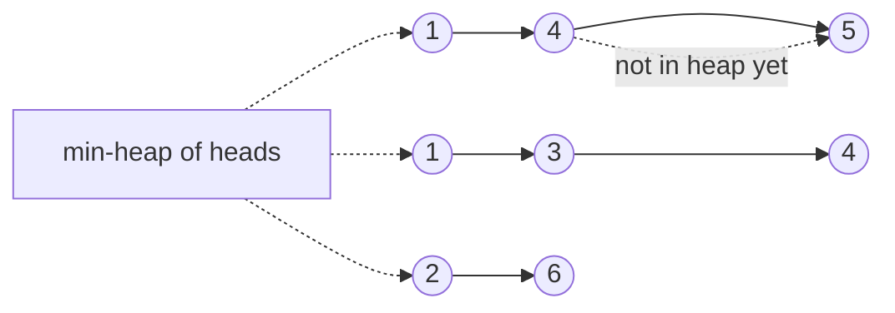

# 24. Merge k Sorted Lists (LC 23)

**Link:** https://leetcode.com/problems/merge-k-sorted-lists/

## Problem in your own words

You are given `k` singly linked lists, each sorted in nondecreasing order. Return one sorted list containing every node. `k` may be zero, and any of the lists may be empty. Reusing the existing nodes is fine. The direct idea is a min-heap of the current head of each list: always pop the smallest head, append it, and push that node's successor. Divide and conquer — repeatedly merge lists in pairs with the two-list merge — has the same complexity and is worth mentioning.

## Easy analogy

`k` cashiers each have a sorted line of customers. A single speaker always calls the customer who has the smallest ticket number among the people currently at the front of a line. When that customer steps forward, the next person in the same line becomes the new front and may be called later. You never look past the front, because the lines are sorted.

## Diagram



```
lists:  1 -> 4 -> 5
        1 -> 3 -> 4
        2 -> 6

heap starts with the three heads: 1, 1, 2
pop 1 (first list), push 4
pop 1 (second list), push 3
pop 2, push 6
pop 3, push 4
...
result: 1 -> 1 -> 2 -> 3 -> 4 -> 4 -> 5 -> 6
```

Dotted edges from the heap point at the only nodes the heap is allowed to see. The rest of each list stays attached behind its head and is not a heap entry yet.

## Intuition

At every moment the next output node is the minimum among the `k` current heads. A linear scan of those heads is `O(k)` per node, which makes the whole algorithm `O(k N)` and is the slow answer. A binary heap stores at most one node per list, so "give me the min head" is `O(log k)`.

After you pop a node you append it to a dummy-tailed result and, if it has a successor, push that successor. The successor is the new head of that list. Empty lists are not pushed.

**Divide and conquer.** Merge list 0 with 1, 2 with 3, and so on, using the linear two-pointer merge. Replace each pair with its merged list and repeat until one list remains. Each round is `O(N)` and there are `O(log k)` rounds.

Java's `PriorityQueue` comparator must not subtract values that can overflow. Constraints here are small, but `Integer.compare` is the habit. Python heap entries must be tuples `(val, tie_breaker, node)` because nodes are not ordered, and equal values would otherwise compare the nodes and throw.

## Step-by-step tiny walkthrough

Lists: `[1 -> 4]`, `[2]`, `[]`.

1. Seed the heap with `1` and `2`. Skip the empty list. Heap: `(1, id0)`, `(2, id1)`.
2. Pop `1`, append it, push `4`. Result: `1`. Heap: `2`, `4`.
3. Pop `2`, append it, `2` has no next. Result: `1 -> 2`. Heap: `4`.
4. Pop `4`, append it. Result: `1 -> 2 -> 4`.
5. Return `dummy.next`.

Pairwise picture for three non-empty lists `A, B, C`: merge `A` with `B` to get `AB`, then merge `AB` with `C`. That is the same algorithm with a lopsided tree; balanced pairing avoids an `O(k N)` degeneration when you always fold the next list into a growing giant.

## Java

```java
import java.util.PriorityQueue;

class Solution {
    class ListNode { int val; ListNode next; ListNode(int x){val=x;} }

    public ListNode mergeKLists(ListNode[] lists) {
        PriorityQueue<ListNode> heap = new PriorityQueue<>(
            (x, y) -> Integer.compare(x.val, y.val)
        );
        if (lists != null) {
            for (ListNode node : lists) {
                if (node != null) heap.offer(node);
            }
        }
        ListNode dummy = new ListNode(0);
        ListNode tail = dummy;
        while (!heap.isEmpty()) {
            ListNode node = heap.poll();
            tail.next = node;
            tail = node;
            if (node.next != null) heap.offer(node.next);
        }
        return dummy.next;
    }
}
```

## Python

```python
import heapq

class ListNode:
    def __init__(self, x):
        self.val = x
        self.next = None

class Solution:
    def mergeKLists(self, lists):
        heap = []
        for i, node in enumerate(lists or []):
            if node is not None:
                heapq.heappush(heap, (node.val, i, node))
        dummy = tail = ListNode(0)
        while heap:
            _, i, node = heapq.heappop(heap)
            tail.next = node
            tail = node
            if node.next is not None:
                heapq.heappush(heap, (node.next.val, i, node.next))
        return dummy.next
```

Divide and conquer, same two-list merge as problem 20:

```python
def mergeKLists(self, lists):
    lists = [node for node in (lists or []) if node]
    if not lists:
        return None
    while len(lists) > 1:
        merged = []
        for i in range(0, len(lists), 2):
            if i + 1 < len(lists):
                merged.append(self.mergeTwoLists(lists[i], lists[i + 1]))
            else:
                merged.append(lists[i])
        lists = merged
    return lists[0]
```

## Complexity

**Heap:** each of the `N` nodes is pushed at most once and popped once. The heap holds at most `k` entries. Time **`O(N log k)`**. Extra memory **`O(k)`** for the heap, plus the dummy. If `k` is 1 this collapses to `O(N)`.

**Divide and conquer:** `O(log k)` rounds, each moving every node a constant number of times, so **`O(N log k)`** time. Extra memory is `O(k)` for the arrays of list heads, or `O(log k)` stack if you write it as a recursive split. The nodes are still reused.

**Naive repeated merge** of list `i` into an accumulator is `O(k N)` because early nodes are re-walked on every later merge. That is the bound you should be able to say and reject.

## Pitfalls

- Pushing every node up front. You do not have random access, and you would destroy the "only heads" size invariant. Push the successor only after its predecessor is popped.
- `a.val - b.val` as a Java comparator. It overflows for extreme ints. `Integer.compare` does not. (LC 23's values are small; the habit still matters.)
- Python `heappush(heap, (node.val, node))` when two values are equal. The heap then compares `ListNode` objects and raises `TypeError`. A unique `i` (the list index, reused for the successor of that list) breaks ties.
- Forgetting to skip null heads. Offering null and then reading `.val` crashes.
- Always merging the next list into one growing result and calling it divide-and-conquer. Unbalanced folding is the `O(k N)` algorithm. Pair them.

## 2-minute interview script

"Each list is sorted, so the next output node is the smallest among the k current heads. I'll keep those heads in a min-heap. I seed it with every non-null list head, then while the heap is not empty I pop the smallest, append it to a dummy tail, and if that node has a next I push the next. The heap stays size at most k, so the cost is N log k for N total nodes, and extra memory is O(k). Empty input or all-empty lists return null via dummy.next. In Python I store a tie-breaker index because nodes aren't comparable when values match. In Java I compare with Integer.compare. The other O(N log k) answer is divide and conquer: merge the lists in pairs with the ordinary two-pointer merge and repeat, log k rounds. I won't merge each list into a single accumulator one by one, because that re-walks nodes and becomes O(k N). The bugs I mention are pushing a null head, overflowing a subtraction comparator, and forgetting the tie-breaker in Python."
