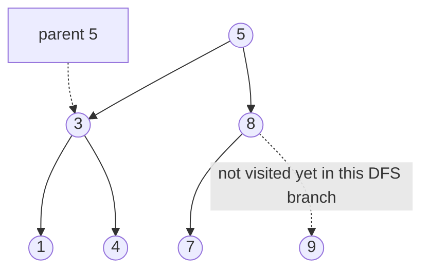

# Tree patterns (NeetCode / Blind 75)

## Problem in your own words

A binary tree gives you a node, a left child, and a right child, and either child may be missing. The work is almost always "look at this node, then combine what the two subtrees say." Depth-first search does that with recursion or an explicit stack. Breadth-first search does it level by level with a queue. A binary search tree adds a global order: every value in the left subtree is strictly less than the node, and every value in the right subtree is strictly greater. That order is stronger than "my left child is smaller than me," and several of these problems are wrong if you only check the parent.

## Easy analogy

DFS is walking a hiking trail to the end of every spur before you try the next spur: you go deep, then back up. BFS is sending a wave of friends who all take one step at the same time, so everyone at distance 3 arrives before anyone at distance 4. A BST is a library where the whole left room is "before this book," not just the book sitting on the left.

## Diagram



```
DFS preorder of the solid walk: 5, 3, 1, 4, 8, 7, 9
BFS levels: [5] [3, 8] [1, 4, 7, 9]
BST check at 7: low bound is 5, high bound is 8.
Comparing 7 only to its parent 8 would miss nothing here,
but a 4 under 8's left would pass the parent test and fail the bound.
```

The dotted edge is a branch this call is not walking yet, and the dotted parent link is the bound you carry down because the node does not store its parent.

## Intuition

**DFS skeleton.** Base case: null returns the identity (0 depth, true for "valid", a null gain, "not the same"). Otherwise compute left, compute right, combine. Preorder acts before the children, inorder between them, postorder after. Most "return an answer up" problems are postorder: you need both children before you know the node.

**BFS skeleton.** Push the root. While the queue is not empty, snapshot `size = queue.size()`. That size is exactly one level. Poll that many nodes, record them, push their children. Forgetting the snapshot mixes levels.

**BST.** Carry `(low, high)` exclusive bounds. A node must satisfy `low < val < high`. The left call gets `high = val`. The right call gets `low = val`. Inorder of a BST is sorted, so the kth smallest is the kth inorder node, and validation can also be "inorder is strictly increasing." Bounds are easier to explain than a previous-pointer if the interviewer is worried about the traversal order.

**Build and serialize.** Preorder says where the root is (first value). Inorder says which values are in the left subtree (everything before the root). Together they rebuild the tree in linear time if you can find the root's inorder index in `O(1)`. Serialize by writing that same shape, including null children, so deserialize can rebuild without a second array.

**Global answer vs returned gain.** Maximum path sum needs both. The value you return to your parent is "best single downward chain through me." The value you record globally is "best chain that turns around at me," using left and right. Negative downward chains are refused with `max(0, gain)`.

## Step-by-step tiny walkthrough

Tree `1` with left `2` and right `3`. Max depth, DFS:

1. `depth(2)`: both children null, return `1`.
2. `depth(3)`: return `1`.
3. `depth(1)`: `1 + max(1, 1) = 2`.

Same tree, BFS level order: queue starts `[1]`. Snapshot size 1, emit `[1]`, push `2` and `3`. Snapshot size 2, emit `[2, 3]`. Done. Result `[[1], [2, 3]]`.

BST bounds on `5 / \ 1 6`, and `6` has left child `4`:

1. `5` is inside `(-inf, +inf)`.
2. Left `1` must be `< 5`. Good.
3. Right `6` must be `> 5`. Good.
4. `4` is a left child of `6`, so it must be `< 6` and still `> 5`. `4 > 5` fails. The tree is not a BST. A parent-only check would see `4 < 6` and accept it.

## Java

```java
import java.util.*;

class Solution {
    class TreeNode { int val; TreeNode left, right; TreeNode(int x){val=x;} }

    public int maxDepth(TreeNode root) {
        if (root == null) return 0;
        return 1 + Math.max(maxDepth(root.left), maxDepth(root.right));
    }

    public List<List<Integer>> levelOrder(TreeNode root) {
        List<List<Integer>> out = new ArrayList<>();
        if (root == null) return out;
        Queue<TreeNode> q = new ArrayDeque<>();
        q.offer(root);
        while (!q.isEmpty()) {
            int size = q.size();
            List<Integer> level = new ArrayList<>();
            for (int i = 0; i < size; i++) {
                TreeNode node = q.poll();
                level.add(node.val);
                if (node.left != null) q.offer(node.left);
                if (node.right != null) q.offer(node.right);
            }
            out.add(level);
        }
        return out;
    }

    // Exclusive bounds. null child is valid. Parent-only compare is not enough.
    public boolean isValidBST(TreeNode root) {
        return valid(root, Long.MIN_VALUE, Long.MAX_VALUE);
    }

    private boolean valid(TreeNode node, long low, long high) {
        if (node == null) return true;
        if (node.val <= low || node.val >= high) return false;
        return valid(node.left, low, node.val) && valid(node.right, node.val, high);
    }
}
```

## Python

```python
from collections import deque

class TreeNode:
    def __init__(self, x):
        self.val = x
        self.left = None
        self.right = None

class Solution:
    def maxDepth(self, root):
        if not root:
            return 0
        return 1 + max(self.maxDepth(root.left), self.maxDepth(root.right))

    def levelOrder(self, root):
        if not root:
            return []
        out, q = [], deque([root])
        while q:
            level = []
            for _ in range(len(q)):
                node = q.popleft()
                level.append(node.val)
                if node.left:
                    q.append(node.left)
                if node.right:
                    q.append(node.right)
            out.append(level)
        return out

    def isValidBST(self, root):
        def valid(node, low, high):
            if not node:
                return True
            if node.val <= low or node.val >= high:
                return False
            return valid(node.left, low, node.val) and valid(node.right, node.val, high)
        return valid(root, float("-inf"), float("inf"))
```

## Complexity

A tree walk that does `O(1)` work per node is **`O(n)` time**. DFS recursion uses **`O(h)` stack**, which is `O(log n)` on a balanced tree and `O(n)` on a skewed one. BFS uses **`O(w)` queue memory** where `w` is the maximum width, up to `O(n)` on the last level of a perfect tree. A parent map or a heap of nodes adds its own cost; say which auxiliary structure you allocated. "The tree has n nodes" is the `n` in these bounds, not the height, unless you are talking about stack.

## Pitfalls

- Checking only the parent for a BST. A node can be a legal child and an illegal descendant.
- Using `int` bounds and initializing them to `Integer.MIN_VALUE` / `MAX_VALUE` when a node may legally hold those values. Use `long`, or nullable bounds that mean "no bound yet."
- Forgetting the level-size snapshot in BFS, so the whole tree comes out as one list.
- Returning a downward gain that includes both children. A parent can extend only one side. Record the turn-around path separately (max path sum).
- Treating null and a missing child as different. In these problems they are the same.
- Building a tree from preorder and inorder by scanning inorder from scratch at every node. That is `O(n^2)`. Index the inorder positions once.
- Serializing without null markers. Distinct shapes can share the same preorder of real values, so deserialize cannot tell them apart.

## 2-minute interview script

"Most of these are a DFS that returns an answer from each subtree, or a BFS that emits one level at a time. I start with the null base case so I never dereference a missing child. For depth, sameness, invert, and subtree I recurse left and right and combine. For level order I use a queue and I snapshot the size before I push children, otherwise the levels blur. For anything BST I use the full property: every node carries an exclusive low and high bound, and a child inherits a tightened bound. Comparing a node only to its parent is wrong, and I have a counterexample ready, a four sitting in the left subtree of a six that itself is right of a five. Inorder of a BST is sorted, so the kth smallest is the kth inorder visit. If I need a global best path I keep two numbers: the best chain I can hand my parent, which is only one branch, and the best turn-around I record at this node. I drop negative branches. Time is linear in the number of nodes. Stack is the height for DFS, queue is the width for BFS. I say the empty tree out loud before I code."
