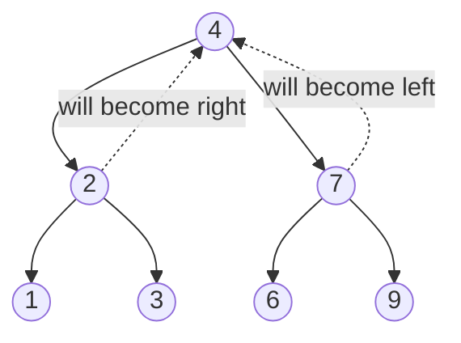

# 25. Invert Binary Tree (LC 226)

**Link:** https://leetcode.com/problems/invert-binary-tree/

## Problem in your own words

You are given the root of a binary tree. Swap every left child with the matching right child, all the way down, and return the root. The root node itself stays the root; only child links change. An empty tree stays empty. This is the "mirror the tree" problem.

## Easy analogy

A mobile hanging from the ceiling. You flip every crossbar so the ornament that was on the left hangs on the right, and you do that for every smaller mobile dangling below. The hook in the ceiling does not move.

## Diagram



```
before          after
    4              4
   / \            / \
  2   7          7   2
 / \ / \        / \ / \
1  3 6  9      9  6 3  1
```

Dotted edges are the links after the swap at the root. The same swap happens inside each subtree, so `2`'s children also trade places.

## Intuition

The mirror of a tree is: mirror the left subtree, mirror the right subtree, then swap the two children. Order of swap versus recursive calls does not matter as long as both subtrees are mirrored and the children are exchanged. The null base case returns null so a missing child stays missing.

An iterative version pushes the root on a queue or stack and swaps the children of every popped node, then pushes the original children (now on opposite sides). Same visits, explicit memory instead of the call stack.

## Step-by-step tiny walkthrough

Tree: `4` with left `2` (leaves `1`, `3`) and right `7` (leaves `6`, `9`).

1. Enter `4`. Recurse left into `2`.
2. Enter `2`. Recurse into `1`. `1` has two null children; swap does nothing; return `1`.
3. Recurse into `3`. Return `3`.
4. Swap `2`'s children. `2` now has left `3` and right `1`. Return `2`.
5. Similarly `7` becomes left `9`, right `6`.
6. Swap `4`'s children. Left is `7`, right is `2`. Return `4`.

The leaf values moved exactly as the picture shows.

## Java

```java
import java.util.ArrayDeque;
import java.util.Queue;

class Solution {
    class TreeNode { int val; TreeNode left, right; TreeNode(int x){val=x;} }

    public TreeNode invertTree(TreeNode root) {
        if (root == null) return null;
        TreeNode left = invertTree(root.left);
        TreeNode right = invertTree(root.right);
        root.left = right;
        root.right = left;
        return root;
    }

    public TreeNode invertTreeIterative(TreeNode root) {
        if (root == null) return null;
        Queue<TreeNode> q = new ArrayDeque<>();
        q.offer(root);
        while (!q.isEmpty()) {
            TreeNode node = q.poll();
            TreeNode tmp = node.left;
            node.left = node.right;
            node.right = tmp;
            if (node.left != null) q.offer(node.left);
            if (node.right != null) q.offer(node.right);
        }
        return root;
    }
}
```

## Python

```python
from collections import deque

class TreeNode:
    def __init__(self, x):
        self.val = x
        self.left = None
        self.right = None

class Solution:
    def invertTree(self, root):
        if not root:
            return None
        root.left, root.right = self.invertTree(root.right), self.invertTree(root.left)
        return root

    def invertTreeIterative(self, root):
        if not root:
            return None
        q = deque([root])
        while q:
            node = q.popleft()
            node.left, node.right = node.right, node.left
            if node.left:
                q.append(node.left)
            if node.right:
                q.append(node.right)
        return root
```

## Complexity

**Time `O(n)`.** Every node is visited once and the swap is `O(1)`.

**Extra memory `O(h)`** for the recursive stack, `O(n)` worst case on a skewed tree, `O(log n)` when the tree is balanced. The queue version is `O(w)` with `w` the maximum width. You do not allocate new tree nodes.

## Pitfalls

- Swapping values instead of links when the subtrees have different shapes. Swapping `node.left.val` with `node.right.val` crashes when one child is null and does not move grandchildren correctly if you only swap one level.
- Losing a child. Use a temporary, or a simultaneous assignment. `node.left = node.right; node.right = node.left` makes both sides the old right.
- Forgetting to recurse, so only the root's children flip.
- Returning `root.left` after the swap. The original root is still the root.
- Building a brand-new tree when the interviewer asked you to invert in place. Both can be correct; in place is the expected one and uses less memory.

## 2-minute interview script

"I'll mirror the tree in place. If the node is null I return null. Otherwise I invert the left subtree and the right subtree, then I swap the two child pointers and return this node. Swapping the pointers, not the values, is what moves whole subtrees, and a temporary or a tuple swap keeps me from overwriting a child. The root doesn't change identity. Empty tree returns null, a single node stays as it is, and a node with one child ends up with that child on the other side. Time is linear in the number of nodes. The call stack is the height. If they don't want recursion I do the same swap in a BFS: pop a node, swap its children, push whichever children exist. The bug I watch is assigning left to right without saving the old left, which drops half the tree."
