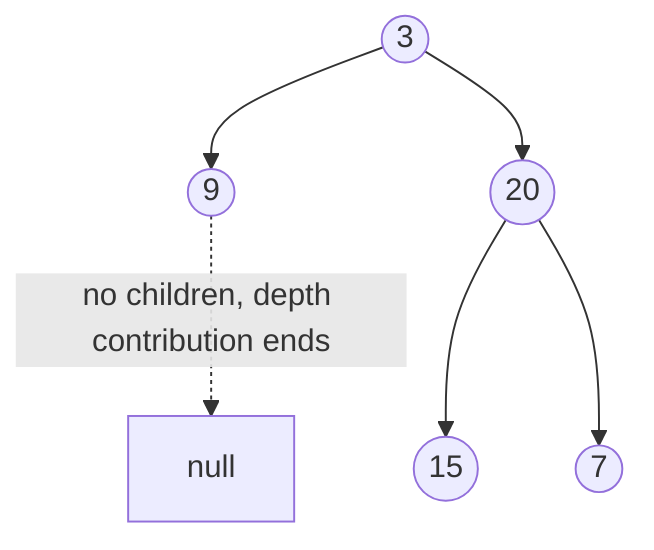

# 26. Maximum Depth of Binary Tree (LC 104)

**Link:** https://leetcode.com/problems/maximum-depth-of-binary-tree/

## Problem in your own words

Return how many nodes sit on the longest root-to-leaf path. An empty tree has depth 0. A single node has depth 1. Every step down to a child adds one. This is the height of the tree, measured in nodes rather than edges. You need the maximum over the two sides, not the sum.

## Easy analogy

You ask each subtree "how far is your deepest leaf from you?" A missing branch answers 0. You take the farther of the two answers and add one for yourself. Like asking two trail scouts how long their canyons are and then adding the step you are standing on.

## Diagram



```
        3          depth from this node
       / \
      9   20       9 -> 1
         /  \      15 -> 1, 7 -> 1, so 20 -> 2
        15   7     3 -> 1 + max(1, 2) = 3
```

The dotted edge is the empty side of `9`, the branch you do not walk. It contributes 0, and `max` discards that shorter side.

## Intuition

Depth is defined from the children: `1 + max(depth(left), depth(right))`, and `depth(null) = 0`. That is a postorder recursion because you need both answers before you can answer. BFS also works: the number of times you can take a full level off the queue is the depth. DFS is the one-liner; BFS is useful when you already think in levels or when you want to avoid a skewed stack and you are fine with queue memory.

## Step-by-step tiny walkthrough

Tree above: `3`, left `9`, right `20` with children `15` and `7`.

1. `depth(9)`: left and right are null, both return 0, so `1 + max(0, 0) = 1`.
2. `depth(15) = 1`, `depth(7) = 1`.
3. `depth(20) = 1 + max(1, 1) = 2`.
4. `depth(3) = 1 + max(1, 2) = 3`.

Empty tree: the root call sees null and returns 0 without adding 1. That is the difference between "no nodes" and "a leaf."

## Java

```java
import java.util.ArrayDeque;
import java.util.Queue;

class Solution {
    class TreeNode { int val; TreeNode left, right; TreeNode(int x){val=x;} }

    public int maxDepth(TreeNode root) {
        if (root == null) return 0;
        int left = maxDepth(root.left);
        int right = maxDepth(root.right);
        return 1 + Math.max(left, right);
    }

    public int maxDepthBFS(TreeNode root) {
        if (root == null) return 0;
        Queue<TreeNode> q = new ArrayDeque<>();
        q.offer(root);
        int depth = 0;
        while (!q.isEmpty()) {
            int size = q.size();
            depth++;
            for (int i = 0; i < size; i++) {
                TreeNode node = q.poll();
                if (node.left != null) q.offer(node.left);
                if (node.right != null) q.offer(node.right);
            }
        }
        return depth;
    }
}
```

## Python

```python
from collections import deque

class TreeNode:
    def __init__(self, x):
        self.val = x
        self.left = None
        self.right = None

class Solution:
    def maxDepth(self, root):
        if not root:
            return 0
        return 1 + max(self.maxDepth(root.left), self.maxDepth(root.right))

    def maxDepthBFS(self, root):
        if not root:
            return 0
        q, depth = deque([root]), 0
        while q:
            depth += 1
            for _ in range(len(q)):
                node = q.popleft()
                if node.left:
                    q.append(node.left)
                if node.right:
                    q.append(node.right)
        return depth
```

## Complexity

**Time `O(n)`** for both. Every node is visited once.

**DFS extra memory `O(h)`.** Worst case `O(n)` on a skewed tree.

**BFS extra memory `O(w)`.** You also have to remember to snapshot the level size; otherwise you cannot tell when a level ends and the counter is meaningless.

## Pitfalls

- Returning `depth(left) + depth(right)`. That sums both sides and counts a branching tree like a path. Depth takes `max`.
- Defining the empty tree as depth `-1` or `1`. LeetCode wants `0` for null and `1` for a leaf. If you use the edge-count convention (leaf = 0), you must add one at the end and still map null to `-1` so a leaf becomes 0, then the public function is off-by-one relative to this problem unless you convert.
- Incrementing depth inside BFS once per node instead of once per level.
- Forgetting the null base case and reading `root.left` on an empty tree.

## 2-minute interview script

"Depth of an empty tree is 0, and the depth of any other node is one plus the deeper of its two subtrees. I write that as a recursion with a null base case. I take max, not sum, because a path doesn't go down both sides. A single node returns 1. Time is linear, stack is the height. If I want an iterative answer I BFS and count how many level-snapshots I process, starting at 0 for a null root so I don't report 1 for an empty tree. The off-by-one I watch is treating a leaf as 0, which is the edge-count height, not this problem's node-count depth. I'll say the formula out loud before coding so the base case and the plus one stay consistent."
