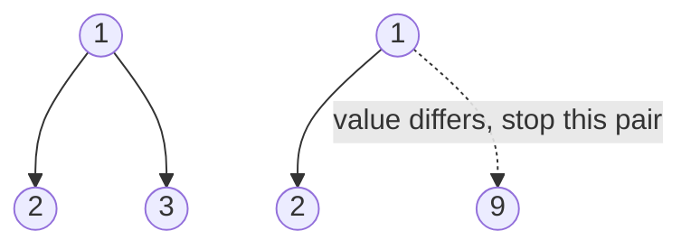

# 27. Same Tree (LC 100)

**Link:** https://leetcode.com/problems/same-tree/

## Problem in your own words

Two binary trees are the same when they have the same shape and the same values in the same places. Both roots empty counts as the same. One empty and one not is different. If the roots exist, their values must match and both pairs of children must be the same trees. You are comparing structure, not "the same values somewhere in the tree."

## Easy analogy

Two paper snowflakes. You hold them up to a window. If one has a branch where the other has a hole, they differ, even if the rest matches. If both have a hole in that spot, that spot matches. You then check the left arm against the left arm and the right against the right.

## Diagram



```
p:  1          q:  1
   / \            / \
  2   3          2   9

roots match, left children match, right children 3 != 9 -> false

both null at a leaf's child: true, and that dotted "missing" side
is a successful base case, not a failure.
```

## Intuition

This is structural recursion with three base cases before you touch children:

1. Both null: same.
2. Exactly one null: different.
3. Values differ: different.

Otherwise both subtrees must match. Short-circuit: if the left subtree already differs you do not need the right. The order "null checks, then value, then children" matters because you cannot read `.val` until you know both nodes exist.

A common cousin is the subtree problem, which calls this exact predicate at every node of the larger tree.

## Step-by-step tiny walkthrough

`p = 1` with left `2`, `q = 1` with left `2` and right `3`? Wait, make them identical first.

Identical trees `1 / \ 2 3`:

1. Both roots are `1`. Compare left.
2. Both left children are `2`. Their children are all null. Both-null returns true for each side. Left pair returns true.
3. Right pair `3` and `3` returns true the same way.
4. Overall true.

Now change `q`'s right child to null:

1. Roots match, left `2` and `2` match.
2. Right: `p` has `3`, `q` has null. Exactly one null. Return false.

That second case is the one a value-only walk would miss if it skipped nulls.

## Java

```java
class Solution {
    class TreeNode { int val; TreeNode left, right; TreeNode(int x){val=x;} }

    public boolean isSameTree(TreeNode p, TreeNode q) {
        if (p == null && q == null) return true;
        if (p == null || q == null) return false;
        if (p.val != q.val) return false;
        return isSameTree(p.left, q.left) && isSameTree(p.right, q.right);
    }
}
```

## Python

```python
class TreeNode:
    def __init__(self, x):
        self.val = x
        self.left = None
        self.right = None

class Solution:
    def isSameTree(self, p, q):
        if p is None and q is None:
            return True
        if p is None or q is None:
            return False
        if p.val != q.val:
            return False
        return self.isSameTree(p.left, q.left) and self.isSameTree(p.right, q.right)
```

## Complexity

**Time `O(n)`** where `n` is the smaller tree in the early-exit case, and `O(min)` of the two sizes more carefully: you stop at the first mismatch, so the worst case is when they are equal and you visit every node of both, `O(n + m)` which is `O(n)` if you let `n` be the total number of nodes you might look at. Say **`O(n)`** with `n` the number of nodes in the smaller tree when they differ in shape late, and **`O(n)`** over the size of one tree when they match.

**Extra memory `O(h)`** for the stack, the height of the deeper recursion, which tracks the shorter mismatch path or the full height if they match.

## Pitfalls

- Checking values before nulls. `p.val` throws when `p` is null.
- Treating two nulls as false. Two empty trees are the same.
- Comparing only preorder lists of values without null markers. `1, 2` can be a left child or a right child. The recursion compares position by which child pointer you followed, so you do not need an auxiliary list.
- Using `==` on node objects. You want value equality plus structure, not reference equality. The nodes are different objects that happen to carry the same numbers.
- Short-circuit written with `&` instead of `&&` is still correct but always walks both sides. Prefer `&&`.

## 2-minute interview script

"Two trees are the same if every position matches, including the holes. I compare them with one recursion. If both nodes are null I return true. If only one is null I return false. If both exist and the values differ I return false. Otherwise I require the left subtrees to be the same and the right subtrees to be the same. I check null before I read val. I don't flatten to a list unless I also record nulls, because otherwise a left child and a right child look identical. Time is linear in the nodes I have to look at, worst case both trees, and the stack is the height. Empty versus empty is true, empty versus a node is false, and a single node matches only the same value. This predicate is exactly what subtree-of-another-tree calls at each candidate root."
