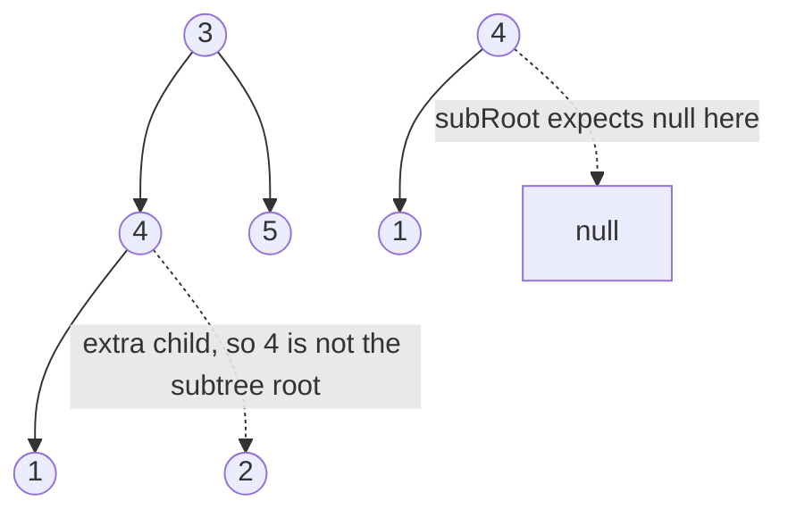

# 28. Subtree of Another Tree (LC 572)

**Link:** https://leetcode.com/problems/subtree-of-another-tree/

## Problem in your own words

Decide whether there is some node in `root` whose whole downward tree matches `subRoot` exactly: same values, same shape, same missing children. A match has to include every descendant. "The values of `subRoot` appear somewhere" is not enough, and a partial overlap with extra children on the big tree's side is not a match. Either argument can be empty; an empty `subRoot` is a subtree of anything, and a non-empty `subRoot` is not a subtree of an empty `root`.

## Easy analogy

You have a large paper snowflake and a small one. You slide the small one over every junction of the large one. At each junction you hold them up to the light, which is the same-tree check. Extra arms on the large snowflake at that junction count as a mismatch. You stop as soon as one junction matches perfectly.

## Diagram



```
root              subRoot
    3                 4
   / \               /
  4   5             1
 / \
1   2

Same-tree at 3: no.
Same-tree at 4: right child is 2 vs null -> no.
Same-tree at 1, at 2, at 5: no.
Answer false.

If subRoot is 4 with children 1 and 2, same-tree at 4 succeeds.
```

The dotted edge is the branch that ruins a near-match: `subRoot` does not have that child, so this candidate fails, and the search continues at other nodes. It is the path that is not a proof.

## Intuition

Two different questions:

1. **Are these two rooted trees identical?** That is `isSameTree` from LC 100.
2. **Does the identical copy start here, or somewhere lower?** That is "same at this node, or subtree of the left, or subtree of the right."

Do not mix them. The outer function may return true because a descendant matched, even when the current node is not equal to `subRoot`. The inner function may not. If you use the outer function as the equality test, a too-small tree will match inside a larger one and you will accept extra descendants.

## Step-by-step tiny walkthrough

`root` as in the diagram, `subRoot = 4` with left `1` and right `2`.

1. At `3`: `isSame(3, subRoot)` compares `3 != 4`, false. Search left and right.
2. At `4`: values match. Left `1` vs `1`, both leaves, true. Right `2` vs `2`, true. `isSame` returns true.
3. Outer function returns true immediately. The right subtree `5` is never examined.

Counterexample walk, `subRoot = 4` with only left `1`:

1. At `3`, values differ.
2. At `4`, values match, left matches, right is `2` versus null. `isSame` is false.
3. Search `1`, `2`, and `5`. None of them is a `4`. Return false.

That false result is the point of requiring full descendants.

## Java

```java
class Solution {
    class TreeNode { int val; TreeNode left, right; TreeNode(int x){val=x;} }

    public boolean isSubtree(TreeNode root, TreeNode subRoot) {
        if (subRoot == null) return true;
        if (root == null) return false;
        if (isSame(root, subRoot)) return true;
        return isSubtree(root.left, subRoot) || isSubtree(root.right, subRoot);
    }

    private boolean isSame(TreeNode a, TreeNode b) {
        if (a == null && b == null) return true;
        if (a == null || b == null) return false;
        if (a.val != b.val) return false;
        return isSame(a.left, b.left) && isSame(a.right, b.right);
    }
}
```

## Python

```python
class TreeNode:
    def __init__(self, x):
        self.val = x
        self.left = None
        self.right = None

class Solution:
    def isSubtree(self, root, subRoot):
        if subRoot is None:
            return True
        if root is None:
            return False
        if self.isSame(root, subRoot):
            return True
        return self.isSubtree(root.left, subRoot) or self.isSubtree(root.right, subRoot)

    def isSame(self, a, b):
        if a is None and b is None:
            return True
        if a is None or b is None:
            return False
        if a.val != b.val:
            return False
        return self.isSame(a.left, b.left) and self.isSame(a.right, b.right)
```

## Complexity

**Time `O(n * m)`** in the worst case. For each of the `n` nodes in `root` you may run a same-tree check that looks at `O(m)` nodes of `subRoot` and the corresponding region of `root`. A tree of identical values forces the check to walk a lot before it fails.

**Extra memory `O(h)`** for the recursion, plus the depth of the same-tree calls. Worst case `O(n)` on a skewed tree.

You can do better with string serialization plus a linear string search (Knuth–Morris–Pratt): serialize both trees with null markers and explicit commas so values cannot glue together, then ask whether `serialize(subRoot)` occurs in `serialize(root)`. That is `O(n + m)` but easier to get wrong at the boundaries. The quadratic DFS is the expected interview answer.

## Pitfalls

- Using one function for both "search" and "exact match." Then a node with extra children still returns true because the recursive search walks into the matching child.
- Forgetting that the match must include null children. `4` with children `1` and `2` is not the subtree `4` with only child `1`.
- Comparing preorder value lists without null markers. Different shapes collide.
- Starting the same-tree check only when values are equal is a good optimization, but you must still search both children when it fails. Returning false at the first value mismatch, without searching downward, drops real matches that start lower.
- Null `subRoot`: returning false fails the usual "empty tree is a subtree" reading. LeetCode's constraints often give a non-null `subRoot`, but the guard above is the safe one.

## 2-minute interview script

"I split the problem in two. isSame is the usual structural equality: both null is true, one null is false, values must match, and both child pairs must match. isSubtree searches for a node where isSame against subRoot succeeds. If the current node isn't an exact match I try the left subtree and the right subtree. I must not use the searching function as the equality test, because then extra children would still count as a match by walking downward. Worst-case time is n times m when every node triggers a full comparison, for example a tree full of the same value. Stack is the height. I'll mention the linear trick only if asked: serialize both with null markers and search for the subtree string, and I'll be careful that concatenation of digits doesn't create false hits. Edge cases: empty subRoot is true, empty root with a real subRoot is false, and a near miss with an extra child is false."
