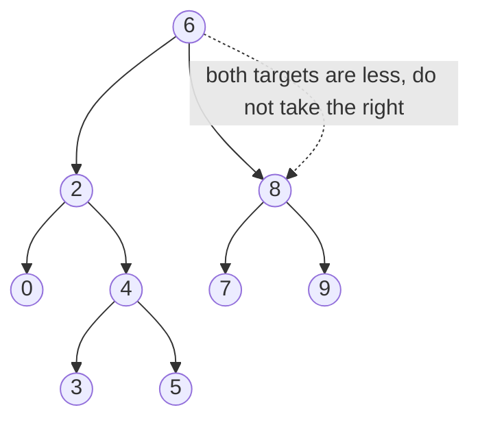

# 29. Lowest Common Ancestor of a BST (LC 235)

**Link:** https://leetcode.com/problems/lowest-common-ancestor-of-a-binary-search-tree/

## Problem in your own words

You are given a binary search tree and two nodes `p` and `q` that both exist in it. Return the lowest node that has both `p` and `q` in its subtree (a node counts as being in its own subtree, so if one node is an ancestor of the other, that ancestor is the answer). Because this is a BST you can decide which way to walk by comparing values. You do not need a parent map, and you do not need to search both children.

## Easy analogy

A number line folded into a tree. Both people have a target number. From where you stand, if both targets are smaller you both belong down the left hallway. If both are larger, both belong down the right hallway. The first time they disagree — or one of them is standing on you — you are the last common meeting point. Going any lower would leave one person behind.

## Diagram



```
BST:
        6
       / \
      2   8
     / \ / \
    0  4 7  9
      / \
     3   5

p = 2, q = 8: 2 < 6 < 8, so 6 is the split. Answer 6.
p = 2, q = 4: both are <= 2 once you step left... 
  at 6 both are < 6, go left.
  at 2, p is the node itself. Answer 2.
```

The dotted edge is the child you do not walk, because both values already told you the other side.

## Intuition

BST property, applied to both targets at once:

- If `p.val` and `q.val` are both strictly less than `root.val`, the LCA is in the left subtree.
- If both are strictly greater, the LCA is in the right subtree.
- Otherwise this node is the split: one value is on each side, or one value equals this node. That node is the LCA.

You can implement the walk as a loop. The recursion is the same test. Both are `O(h)` and do not visit the rest of the tree.

This logic is false on a general binary tree, where a smaller value can sit anywhere. The general LCA (LC 236) is a different algorithm and belongs in the follow-up, not in this solution.

## Step-by-step tiny walkthrough

Tree in the diagram. `p = 3`, `q = 5`.

1. At `6`: both `3` and `5` are `< 6`. Go left. The whole right subtree is irrelevant.
2. At `2`: both `3` and `5` are `> 2`. Go right.
3. At `4`: `3 < 4 < 5`. They split. Return `4`.

Second walk, `p = 2`, `q = 4`.

1. At `6`: both `< 6`, go left.
2. At `2`: `q` is greater, but `p.val == 2`. Not both less, not both greater. Return `2`.

`2` is an ancestor of `4`, and it is the lowest one that covers both because `2` is one of the targets.

## Java

```java
class Solution {
    class TreeNode { int val; TreeNode left, right; TreeNode(int x){val=x;} }

    public TreeNode lowestCommonAncestor(TreeNode root, TreeNode p, TreeNode q) {
        TreeNode cur = root;
        while (cur != null) {
            if (p.val < cur.val && q.val < cur.val) {
                cur = cur.left;
            } else if (p.val > cur.val && q.val > cur.val) {
                cur = cur.right;
            } else {
                return cur;
            }
        }
        return null;
    }
}
```

## Python

```python
class TreeNode:
    def __init__(self, x):
        self.val = x
        self.left = None
        self.right = None

class Solution:
    def lowestCommonAncestor(self, root, p, q):
        cur = root
        while cur:
            if p.val < cur.val and q.val < cur.val:
                cur = cur.left
            elif p.val > cur.val and q.val > cur.val:
                cur = cur.right
            else:
                return cur
        return None
```

## Complexity

**Time `O(h)`.** Each step discards a subtree and descends one edge. On a balanced BST that is `O(log n)`. On a skewed BST it is `O(n)`. You do not scan nodes you have ruled out.

**Extra memory `O(1)`** for the loop. The recursive version is `O(h)` stack and the same time. You do not build a parent map; that would be `O(n)` time and memory and would ignore the BST property.

## Pitfalls

- Treating this like a general binary tree and always searching both sides. That still finds the answer but it is `O(n)` even on a balanced BST, and it hides whether you understand the ordering.
- Using `<=` in the "go left" test. If `p` is the current node, `p.val < cur.val` is false, so you correctly fall through and return `cur`. If you wrote `<=` you would walk left past `p` and miss it.
- Assuming `p.val < q.val`. The split test does not need them sorted. If you want, you can swap so `p` is smaller, then the test is `q.val < cur.val` go left, `p.val > cur.val` go right, else return. Same thing.
- Returning a node because it equals one value without being sure the other value is in this subtree. The problem guarantees both exist, so the first split is safe. If that guarantee disappeared you would have to verify both are present.
- Comparing node references incorrectly when values can duplicate. Standard BST LCA problems use unique values. Compare values, and return the node you are standing on.

## 2-minute interview script

"This is a BST, so I'll use the ordering instead of a general tree search. I start at the root and look at p and q. If both values are smaller than the current node, the ancestor has to be in the left subtree and I step left. If both are larger, I step right. The first time that's not true, I'm either sitting on one of them or they're on opposite sides, and this node is the lowest common ancestor. A node is an ancestor of itself, so if p is under q the loop stops at q. I write it as a loop, O(h) time and constant memory. I don't search both children. I have to be careful not to use less-than-or-equal, or I'll walk past a target that equals the current node. If the tree were not a BST I couldn't do this; the general problem searches both sides in postorder and bubbles up whether each subtree contains a target. That's a different question and I won't code it unless they ask. Both nodes are guaranteed to exist, which is why the first split is the answer."
