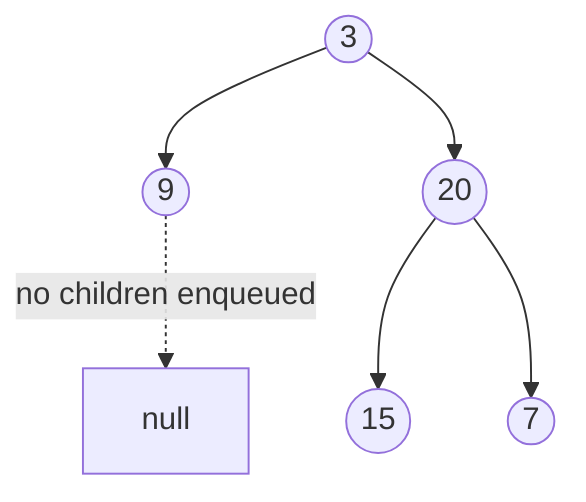

# 30. Binary Tree Level Order Traversal (LC 102)

**Link:** https://leetcode.com/problems/binary-tree-level-order-traversal/

## Problem in your own words

Walk a binary tree from the root downward and return a list of lists: the first inner list is the root's value, the next is every node one edge away, then every node two edges away, left to right inside each level. An empty tree returns an empty list, not a list containing an empty level. This is breadth-first search with a marker that separates levels.

## Easy analogy

A line at a coffee shop that refills only from the back. You serve everyone who was already in line when you started the current wave, and while you serve them their children join the back. When the wave you started with is gone, the people now in line are exactly the next wave. You write down each wave as its own row.

## Diagram



```
queue wave 0: [3]         emit [3]      then enqueue 9, 20
queue wave 1: [9, 20]     emit [9, 20]  then enqueue 15, 7
queue wave 2: [15, 7]     emit [15, 7]

result: [[3], [9, 20], [15, 7]]
```

The dotted edge is a child that does not exist, so nothing is enqueued for it. If you enqueued nulls you would have to filter them, and the level size would lie.

## Intuition

A queue naturally finishes closer nodes before farther ones if you push children at the back and pop from the front. The missing piece is where one level ends. Snapshot `size = queue.size()` before you push anyone new. The next `size` pops are exactly the current level; anything you push belongs to the next one. Then append that row and repeat.

DFS with an explicit depth also works: pass `depth` down, and append the value to `result[depth]`, creating the row when you first reach that depth. You must visit left before right if the row should be left to right. BFS is the version that matches the definition directly.

## Step-by-step tiny walkthrough

Tree: `3`, left `9`, right `20`, and `20` has left `15` and right `7`.

1. Queue is `[3]`. Size snapshot is 1.
2. Pop `3`, row is `[3]`. Push `9` and `20`. Queue is `[9, 20]`. Append `[3]`.
3. Snapshot is 2. Pop `9`, no children. Pop `20`, push `15` then `7`. Row `[9, 20]`. Queue `[15, 7]`.
4. Snapshot is 2. Pop `15`, pop `7`, neither has children. Row `[15, 7]`.
5. Queue empty. Return `[[3], [9, 20], [15, 7]]`.

If you forgot the snapshot and looped until empty while pushing children inside, you would still visit every node but you would not know where to split the rows. One big list `[3, 9, 20, 15, 7]` is preorder-looking BFS order without levels.

## Java

```java
import java.util.ArrayDeque;
import java.util.ArrayList;
import java.util.List;
import java.util.Queue;

class Solution {
    class TreeNode { int val; TreeNode left, right; TreeNode(int x){val=x;} }

    public List<List<Integer>> levelOrder(TreeNode root) {
        List<List<Integer>> out = new ArrayList<>();
        if (root == null) return out;
        Queue<TreeNode> q = new ArrayDeque<>();
        q.offer(root);
        while (!q.isEmpty()) {
            int size = q.size();
            List<Integer> level = new ArrayList<>();
            for (int i = 0; i < size; i++) {
                TreeNode node = q.poll();
                level.add(node.val);
                if (node.left != null) q.offer(node.left);
                if (node.right != null) q.offer(node.right);
            }
            out.add(level);
        }
        return out;
    }
}
```

## Python

```python
from collections import deque

class TreeNode:
    def __init__(self, x):
        self.val = x
        self.left = None
        self.right = None

class Solution:
    def levelOrder(self, root):
        if not root:
            return []
        out = []
        q = deque([root])
        while q:
            level = []
            for _ in range(len(q)):
                node = q.popleft()
                level.append(node.val)
                if node.left:
                    q.append(node.left)
                if node.right:
                    q.append(node.right)
            out.append(level)
        return out
```

## Complexity

**Time `O(n)`.** Each node is enqueued and dequeued once, and each edge is looked at once.

**Extra memory `O(w)`** for the queue, where `w` is the maximum width. On a perfect tree the last level has about `n / 2` nodes, so this is `O(n)` worst case. The output itself is `Θ(n)` and does not count as extra memory if the problem asks you to return it. The DFS version uses `O(h)` stack plus the output.

## Pitfalls

- Using `q.poll()` in the condition and also pushing children before you know the level boundary. Without a frozen `size`, the for-loop bound grows as you push and you either infinite-loop or swallow the next level into this row. Freeze the size.
- `LinkedList` as a queue is fine; `ArrayDeque` is the usual choice. Do not use a `Stack` and call it BFS. Popping the same end you push is DFS.
- In Python, `pop()` on a list pops the right end. Use `collections.deque` and `popleft`, or you process the level right to left and mix the order.
- Enqueueing null children. They waste slots and `node.val` throws when you pop one. Check before offer.
- Returning `[[ ]]` for a null root. The result should be `[]`.

## 2-minute interview script

"Level order is BFS. I'll use a queue, start by pushing the root, and if the root is null I return an empty list immediately. Each iteration of the outer loop is one level. I read the queue size first and only pop that many nodes. For each I record the value and push the left child then the right child if they exist. Anything I push is the next level, so it must not be part of this size. I append the row and repeat until the queue is empty. Left-then-right pushes give left-to-right order inside the level. Time is linear, the queue holds at most one level, which can be O(n) wide. The bugs I watch are forgetting to freeze the size, popping from the wrong end in Python, and treating an empty tree as a list with an empty row. DFS with a depth index also works if I want the same output without a queue; I still visit left before right."
