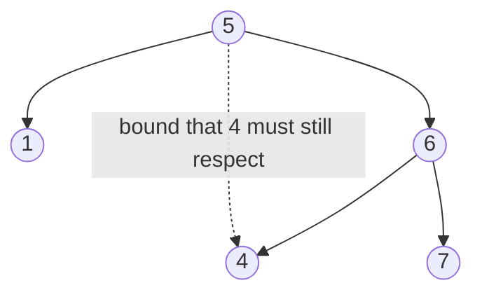

# 31. Validate Binary Search Tree (LC 98)

**Link:** https://leetcode.com/problems/validate-binary-search-tree/

## Problem in your own words

Decide whether a binary tree is a binary search tree. Every node must be strictly greater than every node in its left subtree and strictly less than every node in its right subtree. Checking a node against its parent is not enough: a grandchild can break an ancestor's bound while still sitting on the correct side of its own parent. Equal values are not allowed. The empty tree is valid.

## Easy analogy

Each room in a museum inherits a price range from the hallway that led there. "Everything in this room costs less than the statue at the door, and more than the statue at the previous door." Looking only at the nearest statue misses the earlier one. A painting that is cheaper than its own doorway but also cheaper than a statue you already passed does not belong.

## Diagram



```
        5
       / \
      1   6
         / \
        4   7

Parent-only: 4 < 6, looks fine.
Bounds at 4: must be > 5 and < 6. 4 > 5 fails.
The dotted edge is the ancestor constraint, which the node
does not store. You carry it down as a number.
```

A second legal tree, `2` with left `1` and right `3`, passes because `1` is in `(-inf, 2)` and `3` is in `(2, +inf)`.

## Intuition

Carry an exclusive window `(low, high)`. The root starts with `(Long.MIN_VALUE, Long.MAX_VALUE)`, wider than any `int` key. A node is valid only if `low < val < high`. The left child inherits `high = val` and keeps `low`. The right child inherits `low = val` and keeps `high`. A null child is valid.

Use `long` (or a nullable bound that means "no constraint yet") so a node is allowed to be `Integer.MIN_VALUE` or `Integer.MAX_VALUE`. If the window itself is stored as `int` and you initialize it to those sentinels, a legitimate key equal to the sentinel looks out of range, or your `low - 1` overflows.

Inorder is the other correct approach: a BST's inorder walk is strictly increasing. Keep the previous value and reject a node that is not greater than it. That also catches the `4` under `6` under `5`, because inorder would visit `5` before `4`. Bounds are easier to defend in an interview because the ancestor constraint is visible in the arguments.

## Step-by-step tiny walkthrough

Invalid tree from the diagram.

1. `5` versus `(-inf, +inf)`. Ok. Left call gets `(-inf, 5)`. Right call will get `(5, +inf)`.
2. `1` versus `(-inf, 5)`. Ok. Its children are null.
3. `6` versus `(5, +inf)`. Ok. Left call gets `(5, 6)`. Right call gets `(6, +inf)`.
4. `4` versus `(5, 6)`. `4 <= 5`. Return false.
5. The `&&` short-circuit makes the whole tree false. You may never look at `7`.

Valid edge: a single node `Integer.MIN_VALUE`. Compare against `long` bounds. `MIN_VALUE > Long.MIN_VALUE` and `< Long.MAX_VALUE`. True. If you had passed `Integer.MIN_VALUE` as the low bound and used `<=`, this only node would be rejected. That is why the initial window is wider than every int.

## Java

```java
class Solution {
    class TreeNode { int val; TreeNode left, right; TreeNode(int x){val=x;} }

    public boolean isValidBST(TreeNode root) {
        return valid(root, Long.MIN_VALUE, Long.MAX_VALUE);
    }

    private boolean valid(TreeNode node, long low, long high) {
        if (node == null) return true;
        if (node.val <= low || node.val >= high) return false;
        return valid(node.left, low, node.val)
            && valid(node.right, node.val, high);
    }
}
```

Inorder alternative:

```java
class SolutionInorder {
    class TreeNode { int val; TreeNode left, right; TreeNode(int x){val=x;} }

    private long prev = Long.MIN_VALUE;
    private boolean ok = true;

    public boolean isValidBST(TreeNode root) {
        walk(root);
        return ok;
    }

    private void walk(TreeNode node) {
        if (node == null || !ok) return;
        walk(node.left);
        if (node.val <= prev) ok = false;
        prev = node.val;
        walk(node.right);
    }
}
```

The inorder version also needs a `long` previous value. Initializing `prev` to `Integer.MIN_VALUE` rejects a tree whose first inorder node is that minimum, or accepts an equal duplicate if you use `<` incorrectly. `Long.MIN_VALUE` is strictly below every `int`, so the first node always passes `val <= prev` as false and then `prev` becomes that node.

## Python

```python
class TreeNode:
    def __init__(self, x):
        self.val = x
        self.left = None
        self.right = None

class Solution:
    def isValidBST(self, root):
        def valid(node, low, high):
            if not node:
                return True
            if node.val <= low or node.val >= high:
                return False
            return valid(node.left, low, node.val) and valid(node.right, node.val, high)
        return valid(root, float("-inf"), float("inf"))
```

## Complexity

**Time `O(n)`.** Every node is compared to its window once. Early exit can stop at the first violation; the worst case still walks the whole tree when it is valid or the bad node is last.

**Extra memory `O(h)`** for the recursion stack. The iterative inorder with an explicit stack is the same bound. You do not allocate a list of all values unless you choose the "dump inorder, then scan" style, which is `O(n)` extra memory and also correct.

## Pitfalls

- Only `node.left.val < node.val && node.right.val > node.val`. The diagram is the counterexample.
- Inclusive bounds. The parent value is not a legal value for the child. The test is `<= low` or `>= high` as failure when the parent was passed as the bound.
- `int` overflow. `(low + high) / 2` is unrelated here, but `Integer.MIN_VALUE - 1` as a bound overflows. Prefer `long` windows or nullable `Integer` bounds where null means "unbounded."
- Inorder `prev` stored as `Integer` and seeded with `MIN_VALUE`, so a valid tree that starts with `MIN_VALUE` returns false.
- Allowing duplicates. This problem's BST is strict. `val <= prev` must fail, not `val < prev`.
- Forgetting that both subtrees must be valid, and returning true after only the left check.

## 2-minute interview script

"A BST means every node is a strict upper bound for its entire left subtree and a strict lower bound for its entire right subtree, not just for its children. I'll pass an exclusive low and high into the recursion. The root starts with bounds outside every 32-bit int, using long. A null node is valid. Otherwise the value has to sit strictly inside the window, the left child gets a high bound of this value, and the right child gets a low bound of this value. The classic counterexample is five, with a right child six, with a left child four: four is less than its parent six, but it is not greater than five, so the tree is invalid. I won't initialize int bounds to Integer.MIN_VALUE because that key can appear in the tree. Time is linear, stack is the height. The other correct solution is inorder: the walk must be strictly increasing, and the previous value has to be a long so the smallest int is legal. Duplicates fail either way."
