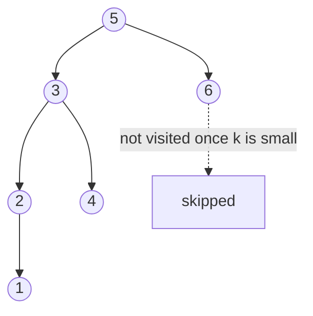

# 32. Kth Smallest Element in a BST (LC 230)

**Link:** https://leetcode.com/problems/kth-smallest-element-in-a-bst/

## Problem in your own words

The tree is a binary search tree with `n` nodes and distinct values. Return the kth smallest value, counting from 1: `k = 1` is the minimum. You can assume `k` is between 1 and `n`. The useful fact is that an inorder walk of a BST visits values in sorted order, so the kth inorder node is the answer. You should stop once you have seen k nodes, not build the whole sorted list.

## Easy analogy

The books on BST shelves are already in alphabetical order if you read "left room, this book, right room" at every shelf. You count books as you touch them in that order and leave the library when the count hits k. You do not photocopy the whole catalog first.

## Diagram



```
inorder: 1, 2, 3, 4, 5, 6

k = 3 -> 3
The walk goes left to 1, counts 1, back to 2, counts 2,
back to 3, counts 3, and returns.
The dotted right subtree of 5 is never entered.
```

## Intuition

Iterative inorder uses a stack. Go left as far as you can, pushing nodes. Pop one: that is the next smallest. Decrement `k`. If `k` hits 0, return that value. Otherwise step to the right child and repeat the "go left" process from there.

Recursive inorder is the same visit order: recurse left, visit, recurse right, and stop when the counter says you are done. The recursive form still walks back up the stack, so "stop" means "do not start the right subtree," not "instantly discard the frames." The iterative form returns as soon as it pops the kth node.

If the interviewer says the tree is modified often and you will query k many times, augment each node with the size of its left subtree. Then you can walk from the root like a binary search: if the left size is `k - 1`, this node is the answer; if the left size is at least `k`, go left; otherwise go right and subtract `leftSize + 1` from `k`. That is `O(h)` per query after `O(n)` augmentation. It is a follow-up, not the first solution.

## Step-by-step tiny walkthrough

Tree: `5` with left `3` (left `2` with left `1`, right `4`) and right `6`. Find `k = 3`.

1. Push the left spine: push `5`, `3`, `2`, `1`. Stack from top: `1, 2, 3, 5`.
2. Pop `1`. `k` becomes 2. Right of `1` is null.
3. Pop `2`. `k` becomes 1. Right of `2` is null.
4. Pop `3`. `k` becomes 0. Return `3`.

You never push `4`, `5`'s right, or `6`.

`k = 1` on the same tree: after pushing the spine you pop `1` and return immediately. That is the minimum, which also shows why `k` is 1-based.

## Java

```java
import java.util.ArrayDeque;
import java.util.Deque;

class Solution {
    class TreeNode { int val; TreeNode left, right; TreeNode(int x){val=x;} }

    public int kthSmallest(TreeNode root, int k) {
        Deque<TreeNode> stack = new ArrayDeque<>();
        TreeNode cur = root;
        while (cur != null || !stack.isEmpty()) {
            while (cur != null) {
                stack.push(cur);
                cur = cur.left;
            }
            cur = stack.pop();
            if (--k == 0) return cur.val;
            cur = cur.right;
        }
        return -1;
    }
}
```

## Python

```python
class TreeNode:
    def __init__(self, x):
        self.val = x
        self.left = None
        self.right = None

class Solution:
    def kthSmallest(self, root, k):
        stack = []
        cur = root
        while cur or stack:
            while cur:
                stack.append(cur)
                cur = cur.left
            cur = stack.pop()
            k -= 1
            if k == 0:
                return cur.val
            cur = cur.right
        return -1
```

## Complexity

**Time `O(h + k)`.** You push the left spine, which is `O(h)`, and then you pop `k` nodes. Each of those can push a right child's left spine, but every node is pushed at most once, and you stop after `k` pops, so the nodes you touch are the k smallest plus the ancestors you needed to reach them. A safe simple bound is **`O(n)`** worst case when `k` is `n` or the tree is skewed. The tight iterative bound people expect is **`O(h + k)`**.

**Extra memory `O(h)`** for the stack. You do not store the sorted list, which would be `O(n)` memory and `O(n)` time always.

Augmented subtree sizes: `O(h)` per query, `O(n)` memory to store the sizes.

## Pitfalls

- Preorder or postorder. Neither is sorted. Only inorder (left, node, right) is.
- `k` starting at 0 in your head. The problem is 1-based. Decrement then test `== 0`, or test `== k` against a counter that starts at 0 and increments first. Mixing them returns the `(k + 1)`th or the `(k - 1)`th.
- Building the full inorder list and indexing `list.get(k)` instead of `k - 1`. Off-by-one, and you did extra work.
- Forgetting to walk `cur = pop.right` after a visit. You then only see the left spine and miss the kth node when it is a right child.
- Assuming the tree is balanced. Quote `O(h + k)`, and say `h` can be `n`.
- The `-1` return never runs when `k` is valid. It is there so the method has a return on every path. Do not "fix" a bug by returning `-1` from the middle of a valid tree.

## 2-minute interview script

"Inorder of a BST is the sorted order, so I need the kth node in an inorder walk, and k starts at one. I'll do it iteratively so I can return as soon as I've popped k nodes. I walk left, pushing a spine. When I can't go left I pop, that's the next smallest, and I decrement k. If k is zero I return that value. Otherwise I set current to the popped node's right child and go left again. I never materialize the full sorted array. Time is O(h plus k) because I stop early, stack is the height. For k equals 1 this returns the minimum. The bugs I watch are counting from zero, visiting in preorder, and forgetting to enter the right subtree after a pop. If they say there will be many queries and the tree changes, I'll augment each node with the size of its left subtree and walk from the root in O(h), subtracting the left size when I go right."
