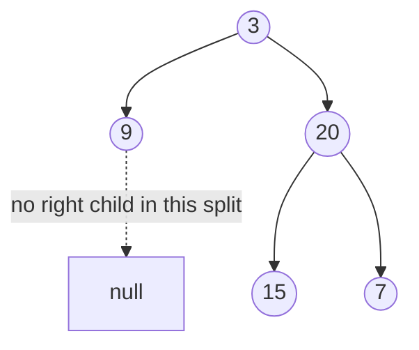

# 33. Construct Binary Tree from Preorder and Inorder (LC 105)

**Link:** https://leetcode.com/problems/construct-binary-tree-from-preorder-and-inorder-traversal/

## Problem in your own words

You are given two arrays that describe the same binary tree. Preorder lists the root, then the entire left subtree, then the entire right subtree. Inorder lists the entire left subtree, then the root, then the entire right subtree. Values are unique. Rebuild the tree and return its root. The two arrays are permutations of the same values; together they pin down exactly one shape.

## Easy analogy

Preorder is a diary that always names the next new room before it describes what is inside. Inorder is a map that shows, for that room's name, which rooms sit to the left and which sit to the right. You take the next diary name, find it on the map, give everything left of it on the map to the left subtree, and everything right of it to the right subtree. The diary is already in the order you will need those names, as long as you build the left subtree before the right.

## Diagram



```
preorder: 3, 9, 20, 15, 7
inorder:  9, 3, 15, 20, 7

3 is the root. Inorder says left of 3 is [9], right is [15, 20, 7].
Next preorder value 9 is the left subtree (a leaf).
Next preorder value 20 is the root of the right side.
Inorder of that side: 15 | 20 | 7, so 15 is left of 20 and 7 is right.
```

The dotted edge is a child the split proved does not exist: `9` has an empty inorder range on both sides.

## Intuition

The first unused preorder value is always the root of the subtree you are building, because preorder emits a node before either subtree and you build left before right. Look that value up in inorder. Everything in the current inorder window to the left of that index is the left subtree, everything to the right is the right subtree. Recurse on the left window first, which consumes exactly the preorder values that belong to the left, then recurse on the right window.

A hash map from value to inorder index makes each lookup `O(1)`. Without it, scanning the window is `O(n)` per node and the build becomes `O(n^2)`.

The preorder cursor is shared state. A plain integer parameter that you increment inside a child does not come back incremented unless you return the new cursor or store it in a field. The usual bug is copying the index by value and then building the right subtree from the same preorder value as the left.

An inorder window is empty when `left > right`. That is a null child, and it must not consume a preorder value.

## Step-by-step tiny walkthrough

`preorder = [3, 9, 20, 15, 7]`, `inorder = [9, 3, 15, 20, 7]`.
Map: `9→0, 3→1, 15→2, 20→3, 7→4`. Cursor starts at 0. Window is `[0, 4]`.

1. Cursor takes `3`. Root is `3`. Inorder index `1`. Left window `[0, 0]`, right window `[2, 4]`.
2. Build left `[0, 0]`. Cursor takes `9`. Index `0`. Left window `[0, -1]` empty, right window `[1, 0]` empty. `9` is a leaf.
3. Build right `[2, 4]`. Cursor takes `20`. Index `3`. Left window `[2, 2]`, right window `[4, 4]`.
4. Left of `20`: cursor takes `15`. Index `2`. Both child windows empty. Leaf.
5. Right of `20`: cursor takes `7`. Index `4`. Both child windows empty. Leaf.

Tree:

```
    3
   / \
  9   20
     /  \
    15   7
```

Cursor ends at 5, which is the length. Every value was used once.

A right-only check: `preorder = [1, 2]`, `inorder = [1, 2]`. Root `1` at inorder index 0. Left window `[0, -1]` is empty and consumes nothing. Right window `[1, 1]` takes `2`. If you had built the right child first, the cursor would feed `2` to the right and then try to build a left child from an exhausted array.

## Java

```java
import java.util.HashMap;
import java.util.Map;

class Solution {
    class TreeNode { int val; TreeNode left, right; TreeNode(int x){val=x;} }

    private int preIndex;
    private Map<Integer, Integer> inIndex;

    public TreeNode buildTree(int[] preorder, int[] inorder) {
        preIndex = 0;
        inIndex = new HashMap<>();
        for (int i = 0; i < inorder.length; i++) {
            inIndex.put(inorder[i], i);
        }
        return build(preorder, 0, inorder.length - 1);
    }

    private TreeNode build(int[] preorder, int inLeft, int inRight) {
        if (inLeft > inRight) return null;
        int rootVal = preorder[preIndex++];
        TreeNode root = new TreeNode(rootVal);
        int mid = inIndex.get(rootVal);
        root.left = build(preorder, inLeft, mid - 1);
        root.right = build(preorder, mid + 1, inRight);
        return root;
    }
}
```

## Python

```python
class TreeNode:
    def __init__(self, x):
        self.val = x
        self.left = None
        self.right = None

class Solution:
    def buildTree(self, preorder, inorder):
        index = {val: i for i, val in enumerate(inorder)}
        self.pre_i = 0

        def build(in_left, in_right):
            if in_left > in_right:
                return None
            root_val = preorder[self.pre_i]
            self.pre_i += 1
            root = TreeNode(root_val)
            mid = index[root_val]
            root.left = build(in_left, mid - 1)
            root.right = build(mid + 1, in_right)
            return root

        return build(0, len(inorder) - 1)
```

## Complexity

**Time `O(n)`.** You create each node once, and each inorder index is a hash lookup. Building the map is `O(n)`.

**Extra memory `O(n)`** for the map, plus **`O(h)`** recursion stack. On a skewed tree the stack is `O(n)`. The output tree is `Θ(n)` and is the required result.

A scan of inorder at every node instead of the map is **`O(n^2)`** time: a right-leaning or left-leaning chain makes each scan walk a shrinking suffix that still sums to quadratic.

## Pitfalls

- Building the right subtree before the left. Preorder is not "root, right, left." The next cursor value after the root belongs to the left subtree if the left window is non-empty.
- Passing the preorder index by value and not threading the updated index back. Both children then read the same slot.
- Using `inLeft >= inRight` as the empty test. A window of one index (`inLeft == inRight`) is a real leaf, not a null. Empty is `inLeft > inRight`.
- Assuming duplicate values. The map would keep only one index and the split would attach the wrong nodes. The problem guarantees uniqueness.
- Slicing new arrays for every window. It can be correct but copies `O(n)` values per level and becomes `O(n^2)` time and memory. Pass index bounds.
- Forgetting that the inorder index is an index into the full array, while the recursive window is a subrange. The split is `mid - 1` and `mid + 1` inside the current window, not "half the array."

## 2-minute interview script

"Preorder tells me the next root, inorder tells me which values hang on the left and which hang on the right. I'll put every inorder value in a map to its index so the split is constant time. A shared cursor starts at the beginning of preorder. The recursive function gets an inorder window. If the window is empty, left index greater than right index, I return null and I do not consume a preorder value. Otherwise I take the next preorder value, make it the root, find it in the map, build the left window completely, then the right window. Left before right is required because that's the order preorder stored them. One node, when the two indices are equal, is a leaf, so the empty test is strict greater-than, not greater-or-equal. Time is linear, extra memory is the map plus the height of the stack. I won't slice the arrays. Duplicates aren't in the input; if they were, this map would be wrong. The bugs I watch are building the right child first and treating a one-element window as empty."
