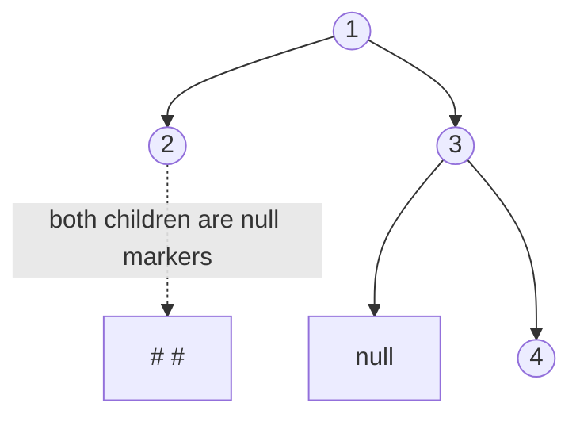

# 35. Serialize and Deserialize Binary Tree (LC 297)

**Link:** https://leetcode.com/problems/serialize-and-deserialize-binary-tree/

## Problem in your own words

Turn a binary tree into a string, and turn that string back into a tree with the same shape and the same values. There is no "best" format; any format is fine if your two functions agree. The hard part is that different shapes can share the same list of node values, so the string has to record where the missing children are. Values may repeat and may be negative. LeetCode wraps the two methods in a class named `Codec`, not `Solution`.

## Easy analogy

You walk the tree and write a diary. Every time a doorway has no room behind it you write a blank mark, so the reader knows not to invent a room and not to attach the next real room to the wrong door. Replaying the diary, the next token is always the next room the walk would enter, and a blank means "this child is missing, go back."

## Diagram



```
        1
       / \
      2   3
           \
            4

preorder with nulls: 1, 2, #, #, 3, #, 4, #, #
The dotted marks under 2 are written. Without them, 3 could be
misread as 2's left child.
```

## Intuition

Use preorder and write an explicit marker for every null child. The stream for a node is:

```
value, serialize(left), serialize(right)
```

and for a missing node it is just `#`. That is a complete description: the first token is the root, then a whole left subtree (which knows its own end because every null is marked), then a whole right subtree.

Deserialize with the same recursion. Pull the next token. If it is `#`, return null and do not pull further for that call. Otherwise make a node, then the next calls consume the left subtree completely before the right subtree starts. One shared queue or iterator is the cursor. Both sides must use the same separator so values like `-10` stay one token and so `12` is not confused with `1` and `2`.

Level-order with null markers also works (the LeetCode example often looks like that). Preorder is less bookkeeping: you do not track a queue of parents waiting for a right child. Either is correct if serialize and deserialize match.

Do not omit nulls. Preorder values alone cannot tell a left child from a right child.

## Step-by-step tiny walkthrough

Tree: `1`, left `2`, right `3`, and `3` has only a right child `4`.

Serialize:

1. Write `1`.
2. Left: write `2`, then `#` for its left, `#` for its right.
3. Right: write `3`, `#` for its left, then `4`, then `#`, `#`.

String: `1,2,#,#,3,#,4,#,#`.

Deserialize, tokens `[1, 2, #, #, 3, #, 4, #, #]`:

1. Pull `1`, create node `1`. Its left call starts.
2. Pull `2`, create `2`. Left pulls `#` and returns null. Right pulls `#` and returns null. `2` is a leaf.
3. Right of `1`: pull `3`, create `3`. Left pulls `#`. Right pulls `4`, whose two children pull `#` and `#`.
4. Tokens are exhausted exactly at the end of the root call. The tree matches.

Null root serializes to `#` and deserializes to null. One node `0` serializes to `0,#,#`, which keeps the value 0 distinct from a missing child.

## Java

LeetCode's class name is `Codec`. The algorithm is the same if a local harness calls it `Solution`.

```java
import java.util.ArrayDeque;
import java.util.Arrays;
import java.util.Deque;

public class Codec {
    class TreeNode { int val; TreeNode left, right; TreeNode(int x){val=x;} }

    public String serialize(TreeNode root) {
        StringBuilder sb = new StringBuilder();
        write(root, sb);
        return sb.toString();
    }

    private void write(TreeNode node, StringBuilder sb) {
        if (sb.length() > 0) sb.append(',');
        if (node == null) {
            sb.append('#');
            return;
        }
        sb.append(node.val);
        write(node.left, sb);
        write(node.right, sb);
    }

    public TreeNode deserialize(String data) {
        if (data == null || data.isEmpty()) return null;
        Deque<String> tokens = new ArrayDeque<>(Arrays.asList(data.split(",")));
        return read(tokens);
    }

    private TreeNode read(Deque<String> tokens) {
        String token = tokens.poll();
        if (token == null || token.equals("#")) return null;
        TreeNode node = new TreeNode(Integer.parseInt(token));
        node.left = read(tokens);
        node.right = read(tokens);
        return node;
    }
}
```

## Python

```python
class TreeNode:
    def __init__(self, x):
        self.val = x
        self.left = None
        self.right = None

class Codec:
    def serialize(self, root):
        tokens = []

        def write(node):
            if not node:
                tokens.append("#")
                return
            tokens.append(str(node.val))
            write(node.left)
            write(node.right)

        write(root)
        return ",".join(tokens)

    def deserialize(self, data):
        tokens = iter(data.split(","))

        def read():
            token = next(tokens)
            if token == "#":
                return None
            node = TreeNode(int(token))
            node.left = read()
            node.right = read()
            return node

        return read()
```

## Complexity

**Time `O(n)`** for both directions. Serialize writes `2n + 1` tokens (every node, plus a null marker for every missing child, which totals `n + 1` nulls in a binary tree). Deserialize parses each token once and creates `n` nodes.

**Extra memory `O(n)`** for the string and the token queue, plus **`O(h)`** recursion stack. A skewed tree makes the stack `O(n)`. The string length is `O(n)` times the characters per value; with 32-bit ints that is still linear in `n`.

## Pitfalls

- Dropping null markers. `1,2,3` could be a left spine or a right spine or a balanced triple. Deserialize will attach `3` to the wrong parent or throw when it runs out of tokens.
- Building the right child before the left while serializing in preorder. The reader and the writer must use one order.
- Splitting on commas and then assuming a trailing comma survives. Java's `String.split` drops trailing empty strings. The writer above does not emit a trailing comma; nulls are the token `#`, so the last token is meaningful and is not an empty string.
- Encoding null as the empty token between commas without a `#`, then losing it to that split rule. Prefer an explicit marker.
- Forgetting negatives. `Integer.toString(-10)` is fine, and `parseInt` accepts it. Do not write a custom parser that stops at `-`.
- Using value `0` or `#` of a node as null. Only the marker token means null. The node value `0` is `0,#,#` when it is a leaf.
- A second format in `deserialize` that does not match `serialize` (level-order reader against a preorder writer). They are not interchangeable.

## 2-minute interview script

"I'll serialize in preorder and write a hash mark whenever a child is missing. The string for a node is its value, then the whole left subtree, then the whole right subtree, with commas between tokens so negative numbers and multi-digit values stay intact. Deserialize uses one shared queue. The next token, if it's a hash, is a null child and that call returns. Otherwise I build the node, recursively read the left subtree, which consumes everything that belongs to it, then read the right subtree. A null root is just the hash mark. A leaf zero is the tokens zero, hash, hash, so zero is not confused with null. Time is linear in the number of nodes, and the string is linear too. The stack is the height. I won't omit nulls, because preorder values alone don't encode shape. Level order with the same null marks is a fine alternative if I want the LeetCode picture, but then both methods have to be level order. The bugs I watch are a trailing empty token getting eaten by split, building right before left, and using a different walk on the way back."
