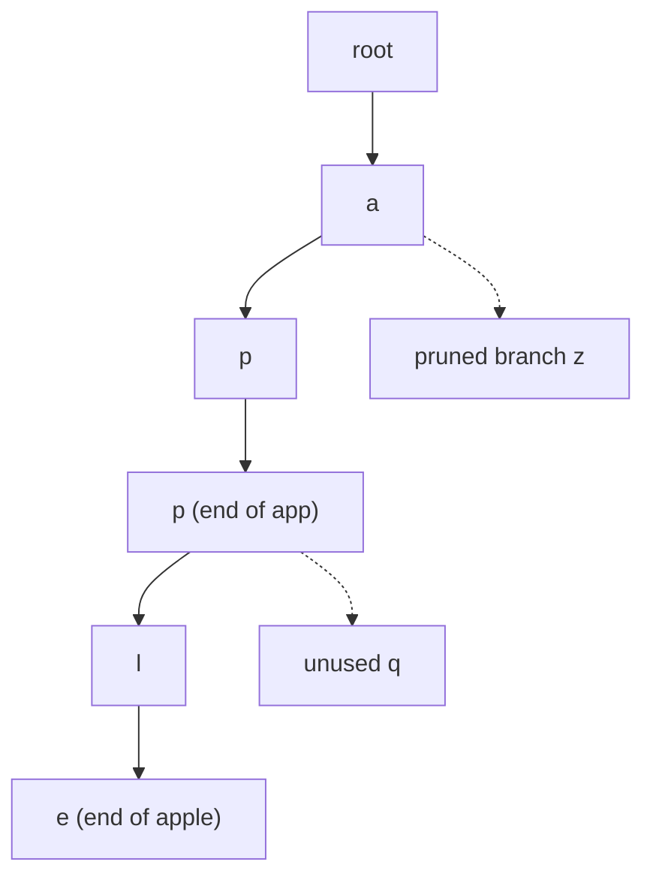

# Tries (prefix trees)

## Problem in my own words

A trie stores strings so that shared prefixes are stored once. Each edge is one character, and a node remembers whether some word ends there. Lookup walks one edge per character, which is why exact search, prefix checks, and character-by-character guesses all fall out of the same shape.

## Easy analogy

Think of a paper dictionary with thumb tabs. You do not scan every word to decide whether anything starts with "app". You open the "a" tab, then "p", then "p", and you are already in the right section. Words that diverge later are different pages under that same tab.

## Diagram

`apple` and `app` share a spine. The dotted edge is a child that was allocated in an earlier experiment and then dropped because no remaining word uses it. Search never walks that edge.



## Intuition

Hashing a whole word answers "have I seen this exact string?" A trie answers a stricter family of questions: "does this prefix exist?", "which letter could come next?", and "does a word end at this node?" Those questions show up whenever the input is revealed one character at a time (autocomplete, wildcard search, a board path).

Three flags matter more than the container you pick for children:

- A missing child means this prefix is impossible. Stop.
- A present child with `end == false` means the prefix exists but is not a stored word (`app` before you insert it).
- `end == true` means at least one inserted word stops here. Longer words may still continue past that node (`app` and `apple`).

Array children of size 26 make the lowercase English case obvious. A hash map is the same algorithm when the alphabet is large. The walk is still O(length).

Wildcard search (one unknown letter) is "try every child." Board search is "try the child that matches the neighboring cell, then undo the visit." Both are DFS on the trie, guided by an outside constraint. When a trie node no longer has an end-marker or children, delete the edge that pointed at it so later searches skip a dead prefix.

## Tiny walkthrough

Insert `apple`. Walk creates `a → p → p → l → e` and marks `e` as an end. `search("app")` lands on the second `p`, but that node is not an end, so the answer is false. `startsWith("app")` only asks whether the walk succeeded, so it is true. Insert `app`. The same node is now an end, and `search("app")` becomes true. `search("apricot")` dies at the missing `r` child under `a`.

## Java

```java
class Trie {
    private static class Node {
        Node[] next = new Node[26];
        boolean end;
    }

    private final Node root = new Node();

    public void insert(String word) {
        Node cur = root;
        for (int i = 0; i < word.length(); i++) {
            int idx = word.charAt(i) - 'a';
            if (cur.next[idx] == null) {
                cur.next[idx] = new Node();
            }
            cur = cur.next[idx];
        }
        cur.end = true;
    }

    /** Exact word: the walk must finish on an end node. */
    public boolean search(String word) {
        Node node = walk(word);
        return node != null && node.end;
    }

    /** Prefix: the walk only has to finish on some node. */
    public boolean startsWith(String prefix) {
        return walk(prefix) != null;
    }

    private Node walk(String s) {
        Node cur = root;
        for (int i = 0; i < s.length(); i++) {
            int idx = s.charAt(i) - 'a';
            if (cur.next[idx] == null) {
                return null;
            }
            cur = cur.next[idx];
        }
        return cur;
    }
}
```

## Python

```python
class Trie:
    def __init__(self) -> None:
        self.root: dict = {}

    def insert(self, word: str) -> None:
        node = self.root
        for ch in word:
            node = node.setdefault(ch, {})
        node["#"] = True

    def search(self, word: str) -> bool:
        node = self._walk(word)
        return node is not None and node.get("#", False)

    def startsWith(self, prefix: str) -> bool:
        return self._walk(prefix) is not None

    def _walk(self, s: str):
        node = self.root
        for ch in s:
            if ch not in node:
                return None
            node = node[ch]
        return node
```

## Complexity

Let `L` be the length of the string being inserted or queried, and let `N` be the number of inserted words.

- `insert`, `search`, and `startsWith` are O(`L`) time. The work does not depend on how many other words sit in unrelated branches.
- Space is O(total characters stored). Sharing prefixes makes this smaller than `N * L`, but the worst case (no shared prefixes) is still Θ(sum of lengths).
- A size-26 array at every node costs more memory and gives O(1) child lookup. A map costs less memory when nodes are sparse and adds the map's lookup cost.

## Pitfalls

- Treating a successful walk as a full word. Prefix existence and word existence are different bits.
- Forgetting that one node can be both an end and a parent (`app` inside `apple`).
- Off-by-one on the alphabet (`'A' - 'a'` is negative). These notes assume lowercase `a-z`, matching the usual problem statement.
- Using a single global "visited prefix" mark on the trie during a board search and never unmarking it. Visit marks belong to the board path. Trie pruning is a separate, permanent deletion of nodes that can no longer produce a new word.
- Storing only whole words in a hash set, then scanning the entire set at every board cell. That passes tiny tests and collapses when the dictionary is large.

## Two-minute interview script

"I'll store the dictionary in a trie. Each node has a child slot per letter and a boolean for whether a word ends here. Insert walks the word and creates missing edges, then sets the end bit. Search walks the same way and returns true only if every character exists and the last node is an end. Starts-with is the same walk without the end check. That split matters: `app` can be a prefix of `apple` before it is its own word.

The reason I want a trie, and not a hash set of whole words, is that later problems reveal the text one character at a time. A wildcard letter means 'try every child from here.' A board neighbor means 'follow the child for that letter, mark the cell, recurse, then unmark.' Shared prefixes are searched once. If a branch no longer contains any word, I delete that edge so the next starting cell does not rediscover a dead prefix. Time to touch one word is linear in its length. Memory is proportional to the number of stored characters, with a real tradeoff between a dense array of 26 children and a sparse map."
