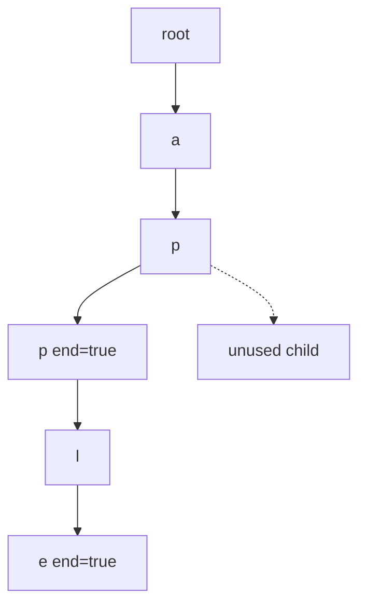

# 36. Implement Trie (Prefix Tree)

LeetCode 208.

## Problem in my own words

Build a string index with three operations on lowercase words. `insert` records a word, `search` reports whether that exact word was recorded, and `startsWith` reports whether any recorded word begins with a prefix. Each operation should take time proportional to the string you were given, not to the number of words already stored.

## Easy analogy

Each word is a walk down a hallway of lettered doors. Insert builds any missing doors and sticks a "word ends here" label on the last room. Search follows the doors and checks for that label. Starts-with only checks that the doors exist; the label can wait in a deeper room.

## Diagram

After `insert("apple")` and `insert("app")`, both words share `a-p-p`. The second `p` is an end because of `app`, and it still has a child for `apple`. The dotted edge is a letter nobody inserted.



## Intuition

The node is the prefix spelled by the path from the root. Two things live on it: the map (or array) of next letters, and a boolean that is true only when some `insert` stopped here. `search` and `startsWith` are the same walk. They differ only in the final question. Keeping those questions separate is the whole problem. A node can be an end and still have children, because a shorter word can be a prefix of a longer one.

An array of 26 children matches the lowercase constraint and makes a missing letter a null check. The root represents the empty prefix and is never null. An empty insert would mark the root as an end; the usual tests insert non-empty words.

## Tiny walkthrough

1. `insert("apple")`. Nodes `a, p, p, l, e` appear. Only `e.end` is true.
2. `search("apple")` follows five edges and sees `end`. Return true.
3. `search("app")` stops on the second `p`, where `end` is still false. Return false.
4. `startsWith("app")` uses that same node and returns true because the walk did not fall off.
5. `insert("app")` flips `end` on the second `p`. `search("app")` is now true, and `search("apple")` is unchanged.
6. `startsWith("b")` finds a null child at the root and returns false.

## Java

```java
class Trie {
    private static class Node {
        Node[] next = new Node[26];
        boolean end;
    }

    private final Node root = new Node();

    public void insert(String word) {
        Node cur = root;
        for (int i = 0; i < word.length(); i++) {
            int idx = word.charAt(i) - 'a';
            if (cur.next[idx] == null) {
                cur.next[idx] = new Node();
            }
            cur = cur.next[idx];
        }
        cur.end = true;
    }

    public boolean search(String word) {
        Node node = walk(word);
        return node != null && node.end;
    }

    public boolean startsWith(String prefix) {
        return walk(prefix) != null;
    }

    private Node walk(String s) {
        Node cur = root;
        for (int i = 0; i < s.length(); i++) {
            int idx = s.charAt(i) - 'a';
            if (cur.next[idx] == null) {
                return null;
            }
            cur = cur.next[idx];
        }
        return cur;
    }
}
```

## Python

```python
class Trie:
    def __init__(self) -> None:
        self.root: dict = {}

    def insert(self, word: str) -> None:
        node = self.root
        for ch in word:
            node = node.setdefault(ch, {})
        node["#"] = True

    def search(self, word: str) -> bool:
        node = self._walk(word)
        return node is not None and node.get("#", False)

    def startsWith(self, prefix: str) -> bool:
        return self._walk(prefix) is not None

    def _walk(self, s: str):
        node = self.root
        for ch in s:
            if ch not in node:
                return None
            node = node[ch]
        return node
```

The `"#"` key is the end marker. It is safe because inserted characters are letters, so a letter key and the marker key never collide. A boolean field on a tiny node class is the same idea if you would rather not overload the dict.

## Complexity

- `insert`: O(`L`) time, and O(`L`) new nodes only for the missing suffix.
- `search` and `startsWith`: O(`L`) time. A miss returns as soon as a child is absent, so the worst case is a full walk.
- Space: O(total nodes) = O(sum of word lengths) in the worst case, less when words share prefixes. Each Java node holds 26 references; each Python node holds a dict of the letters that occur.

## Pitfalls

- Returning true from `search` whenever `walk` returns a node. That implements `startsWith` by accident. The classic bug is `search("app") == true` after only `apple` was inserted.
- Clearing children when a shorter word is inserted. `insert("app")` after `apple` must only flip a boolean.
- Forgetting to set `end` on the final node, so every search fails.
- Indexing `word.charAt(i) - 'a'` for a string that may contain other characters. Under this problem's lowercase contract it is correct. Say the assumption out loud.
- Calling `search` to answer a prefix question in a later problem. Prefix checks must not require an end bit.

## Two-minute interview script

"I'll implement a prefix tree. Each node has 26 children, one per lowercase letter, and a boolean `end`. The root is the empty prefix. Insert walks the word, creates a node whenever a child is missing, and sets `end` on the last node. Search walks until a child is missing, in which case the word is absent, or until the string is consumed, in which case I return the end bit. Starts-with is that walk without the end bit.

I keep the end bit separate because a prefix of a word is not automatically a word. If I insert `apple`, `app` must be a successful prefix and a failed search. If I later insert `app`, I flip the bit on the existing node and leave the `l-e` chain alone. Each call is linear in the string I was given. The memory is the number of characters I actually stored, with sharing when words start the same way. I would switch the array for a map only if the alphabet were not a small fixed set."
