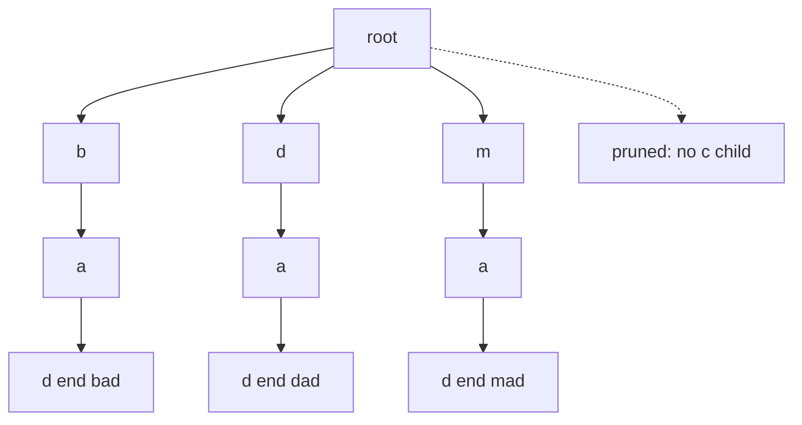

# 37. Design Add and Search Words Data Structure

LeetCode 211.

## Problem in my own words

Support `addWord` for lowercase words, and `search` for a pattern of the same kind of letters plus dots. A dot stands for exactly one unknown letter, not a free-length gap. Search returns true when at least one stored word matches the whole pattern. Different added words may share prefixes, and the same structure is queried many times.

## Easy analogy

Adding a word files it in a letter-by-letter cabinet, the same way a trie usually works. Searching with a concrete letter opens that one drawer. Searching with a dot means "I forgot this letter," so you open every drawer that exists at that depth and keep going. You still have to use up the whole pattern. Opening a drawer does not let you skip a later letter.

## Diagram

Dictionary `{bad, dad, mad}`. A search for `.ad` branches at the first letter. The dotted edge is a child that is not present (`c`, or any other missing letter): the dot does not invent it, so that branch is pruned immediately.



## Intuition

`addWord` is ordinary trie insertion. The new part is `search`. Walk one pattern character at a time, but the transition depends on the character:

- A letter follows that single child. A missing child is an immediate false for this branch.
- A dot tries every child that actually exists. If any child can match the rest of the pattern, the search succeeds.

The dot consumes one index either way. At the end of the pattern, the node must be an end node. That stops `.` from matching a proper prefix: after adding `bad`, the pattern `ba` is false, and `b.` is true because it lands on `d` with the end bit set.

DFS is a natural fit because each dot is a branch and the first success can return immediately. BFS would also be correct, but it would carry an explicit queue of `(node, index)` pairs and do the same work.

## Tiny walkthrough

Add `bad`, `dad`, and `mad`. The trie has three branches that meet again in shape (`*ad`) but not in shared nodes, because they differ at the first letter.

- `search("pad")` takes `p` from the root. There is no `p` child. False.
- `search("bad")` walks `b-a-d` and finds the end bit. True.
- `search(".ad")` tries `b`, `d`, and `m`. The `b` branch then needs `a` (present) and `d` (present, end). True, and the other branches are not required once one succeeds.
- `search("b..")` follows `b`, then any child (`a`), then any child (`d` with end). True.
- `search("...")` matches any stored 3-letter word. True.
- `search("....")` would need a fourth level. False.

## Java

```java
class WordDictionary {
    private static class Node {
        Node[] next = new Node[26];
        boolean end;
    }

    private final Node root = new Node();

    public void addWord(String word) {
        Node cur = root;
        for (int i = 0; i < word.length(); i++) {
            int idx = word.charAt(i) - 'a';
            if (cur.next[idx] == null) {
                cur.next[idx] = new Node();
            }
            cur = cur.next[idx];
        }
        cur.end = true;
    }

    public boolean search(String word) {
        return dfs(word, 0, root);
    }

    private boolean dfs(String word, int i, Node node) {
        if (i == word.length()) {
            return node.end;
        }
        char c = word.charAt(i);
        if (c == '.') {
            for (Node child : node.next) {
                if (child != null && dfs(word, i + 1, child)) {
                    return true;
                }
            }
            return false;
        }
        int idx = c - 'a';
        return node.next[idx] != null && dfs(word, i + 1, node.next[idx]);
    }
}
```

## Python

```python
class WordDictionary:
    def __init__(self) -> None:
        self.root: dict = {}

    def addWord(self, word: str) -> None:
        node = self.root
        for ch in word:
            node = node.setdefault(ch, {})
        node["#"] = True

    def search(self, word: str) -> bool:
        def dfs(i: int, node: dict) -> bool:
            if i == len(word):
                return bool(node.get("#", False))
            ch = word[i]
            if ch == ".":
                for key, child in node.items():
                    if key != "#" and dfs(i + 1, child):
                        return True
                return False
            if ch not in node:
                return False
            return dfs(i + 1, node[ch])

        return dfs(0, self.root)
```

## Complexity

- `addWord` is O(`L`) time and allocates at most O(`L`) new nodes.
- `search` with no dots is O(`L`).
- `search` with dots is O(26^D · L) in the worst case for a dense trie, where `D` is the number of dots. In a sparse trie the base is the number of real children, not 26. Each call still does work proportional to the pattern length along a single path.
- Space is the trie itself, O(total inserted characters), plus O(`L`) recursion depth during search.

## Pitfalls

- Letting `.` match any suffix, including the empty suffix. It matches exactly one character. The index always advances by one.
- Treating the end of the pattern as success without `node.end`. Then a pattern equal to a proper prefix returns true.
- Skipping the `"#"` marker when iterating Python dict children. Recursing into the marker as if it were a node throws or corrupts the walk. The Java array has no marker in the child slots, so this bug is Python-specific.
- Building a fresh regex or scanning every stored word on each search. It can be made correct, and it hides the intended trie DFS. It is also slower when many words share prefixes.
- Assuming dots are rare enough to ignore in the complexity answer. State the exponential worst case, then the sparse practical case.

## Two-minute interview script

"I'll store added words in a trie, same as the prefix-tree problem: one node per character, end bit on the last node. Add-word is the normal insert. Search is a depth-first walk over the pattern. When the pattern character is a letter, I follow that one child or fail. When it is a dot, I try every child that exists and accept the pattern if any recursive call matches the remaining suffix. The dot still consumes one position, so the recursion index goes up by one on every branch.

When the pattern is exhausted I return the end bit, not just 'the node exists.' Otherwise a shorter pattern would match a longer word's prefix. A concrete example: after `bad`, `dad`, and `mad`, `pad` dies immediately, `.ad` succeeds through `bad`, and `b..` succeeds by taking the only child twice. Worst-case search is exponential in the number of dots because each dot multiplies the live children. The trie keeps that multiplier equal to letters that were actually inserted, instead of the full dictionary on every call."
