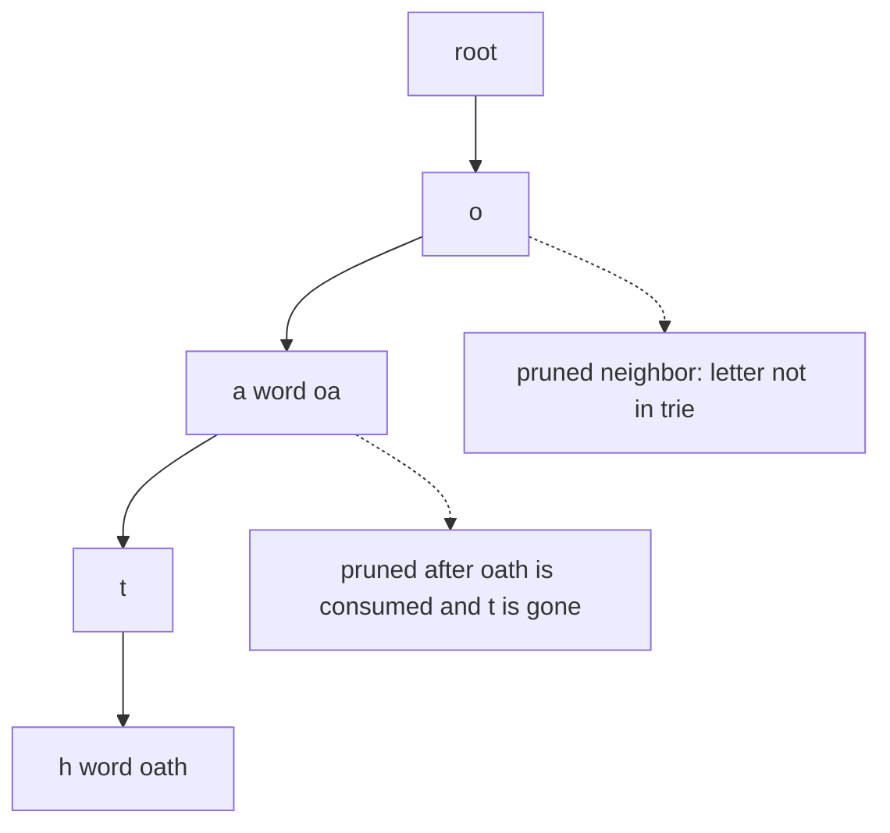

# 38. Word Search II

LeetCode 212.

## Problem in my own words

You get a letter grid and a list of words. A word counts if a path of up, down, left, and right steps spells it without reusing a cell. Return every word that appears at least once. Order does not matter, and a later path may use a cell that a different path already used.

## Easy analogy

The dictionary is a set of trails drawn on transparent paper. The board is a park. You only keep a trail when you can follow it step by step on the ground without stepping on the same stone twice. When a trail splits in the dictionary ("oat..." versus a word that already ended at "oa"), you try each continuation. Once a trail has been fully collected and has no leftover continuations, you throw that page away so the next starting stone does not walk it again.

## Diagram

Dictionary fragments for `oa` and `oath`, and a board cell `o` whose neighbor is not a trie child. The dotted edge is the pruned letter: the trie has no such child, or the child was deleted after its words were already found, so DFS does not enter it.



## Intuition

Checking each word with a fresh board DFS repeats the same prefixes and restarts from every cell. Put the words in a trie first. Then every board cell is a possible start, and each step on the board must match one trie edge.

From a cell, if the current trie node has no child for `board[r][c]`, stop. That is the first prune: the board and the dictionary disagree. If the child exists, take it. If that child stores a complete word, emit the word once and clear the stored word so a second path cannot emit it again.

Mark the cell as visited for the current path, recurse to the four neighbors, then restore the cell. The mark is backtracking. A different path, or a different start, may still need the cell.

The second prune is on the trie and is permanent. After the recursion returns, if this child no longer stores a word and no longer has children, delete the edge from the parent. Those children disappear only because their own searches already pruned them, or they never existed. Deleting the edge means a later start cell fails at the parent instead of walking a prefix whose every word is already in the answer. Do this on the way out, never before exploring children. A word that is a prefix of another word (`oa` inside `oath`) clears its own marker and leaves the longer child in place.

## Tiny walkthrough

Board:

```
o a a n
e t a e
i h k r
i f l v
```

Words: `oath`, `pea`, `eat`, `rain`.

Start at `(0,0) = o`. The trie has `o`. Neighbors include `a` at `(0,1)`. From that `a`, `t` is not a neighbor, but `a` at `(0,2)` is not the next letter either. The successful path is `o (0,0) → a (0,1) → t (1,1) → h (2,1)`, which is `oath`. Emit it, clear that end marker, and prune nodes that are now empty as the recursion unwinds.

`eat` is found later from `e` at `(1,0) → a (1,2) → t (1,1)`, or another valid spelling of those letters. `pea` dies because no path spells it. `rain` dies because the letters are not 4-connected in order. The answer is `oath` and `eat`, in whichever order the scan discovers them.

A second check: on board `[[a,a]]` with words `a` and `aa`, both are found. `aaa` is not, because the path would need a third cell and cannot reuse one. On a board that contains both a short word and its extension, the short word is emitted when its marker is seen, and the extension is still explored through the remaining child.

## Java

```java
import java.util.ArrayList;
import java.util.List;

class Solution {
    private static class Node {
        Node[] next = new Node[26];
        String word;
    }

    public List<String> findWords(char[][] board, String[] words) {
        Node root = new Node();
        for (String w : words) {
            Node cur = root;
            for (int i = 0; i < w.length(); i++) {
                int idx = w.charAt(i) - 'a';
                if (cur.next[idx] == null) {
                    cur.next[idx] = new Node();
                }
                cur = cur.next[idx];
            }
            cur.word = w;
        }

        List<String> found = new ArrayList<>();
        int rows = board.length;
        int cols = board[0].length;
        for (int r = 0; r < rows; r++) {
            for (int c = 0; c < cols; c++) {
                dfs(board, r, c, root, found);
            }
        }
        return found;
    }

    private void dfs(char[][] board, int r, int c, Node parent, List<String> found) {
        if (r < 0 || c < 0 || r >= board.length || c >= board[0].length) {
            return;
        }
        char ch = board[r][c];
        if (ch == '#') {
            return;
        }
        int idx = ch - 'a';
        Node node = parent.next[idx];
        if (node == null) {
            return;
        }
        if (node.word != null) {
            found.add(node.word);
            node.word = null;
        }
        board[r][c] = '#';
        dfs(board, r + 1, c, node, found);
        dfs(board, r - 1, c, node, found);
        dfs(board, r, c + 1, node, found);
        dfs(board, r, c - 1, node, found);
        board[r][c] = ch;
        if (node.word == null && isEmpty(node)) {
            parent.next[idx] = null;
        }
    }

    private boolean isEmpty(Node node) {
        for (Node child : node.next) {
            if (child != null) {
                return false;
            }
        }
        return true;
    }
}
```

## Python

```python
from typing import List


class Solution:
    def findWords(self, board: List[List[str]], words: List[str]) -> List[str]:
        trie: dict = {}
        for word in words:
            node = trie
            for ch in word:
                node = node.setdefault(ch, {})
            node["#"] = word

        rows, cols = len(board), len(board[0])
        found: List[str] = []

        def dfs(r: int, c: int, node: dict) -> None:
            ch = board[r][c]
            if ch not in node:
                return
            nxt = node[ch]
            word = nxt.pop("#", None)
            if word is not None:
                found.append(word)
            board[r][c] = "#"
            for dr, dc in ((1, 0), (-1, 0), (0, 1), (0, -1)):
                nr, nc = r + dr, c + dc
                if 0 <= nr < rows and 0 <= nc < cols and board[nr][nc] != "#":
                    dfs(nr, nc, nxt)
            board[r][c] = ch
            # Permanent prune: no remaining word uses this edge.
            if not nxt:
                node.pop(ch, None)

        for r in range(rows):
            for c in range(cols):
                dfs(r, c, trie)
        return found
```

## Complexity

Let the board be `R` by `C`, let `W` be the total number of characters across all words, and let `L` be the length of the longest word.

- Building the trie is O(`W`) time and O(`W`) space.
- Search is O(`R * C * 4^L`) in the worst case: from every cell, a path of length `L` can branch to 4 neighbors. Trie mismatches cut a branch as soon as the next letter is impossible, and deleting finished branches stops later start cells from paying for words that are already found.
- Output handling is O(number of matches). Each word is emitted at most once because its marker is cleared.
- Recursion depth is O(`L`). The visited state is stored in the board itself, so there is no extra `R * C` matrix. The board is restored before the function returns from each call, so a caller that keeps using the board sees the original letters after `findWords` finishes. During the search the cells are temporarily `#`.

## Pitfalls

- Forgetting to restore `board[r][c]`. Later paths, including paths for other words, then see a fake wall and miss real words.
- Clearing the word marker and also deleting the trie node while a longer word still hangs off that node. Prefix words and longer words must coexist. Delete only when the word field is empty and every child is gone.
- Pruning before the recursive calls. Children have not had a chance to match.
- Emitting the same word twice when two paths spell it. Clearing the marker (Java `word = null`, Python `pop("#")`) is the dedupe. Do not also require the word to be absent from a set unless you failed to clear it.
- Comparing against a visited set that is global across all starts and is never cleared between starts. That glues independent paths together. The visit mark is per path.
- Using `#` as the visit mark when the board could already contain `#`. Under the lowercase contract it is free. If the board alphabet is unknown, use a side matrix.
- Assuming the answer follows the input order of `words`. This scan returns words in discovery order. Sort only if a test harness demands it. The problem does not.

## Two-minute interview script

"I build a trie of the dictionary and store each full word on its end node. Then I start a DFS at every board cell. The DFS argument is the parent trie node. If this cell's letter has no child there, I return immediately — that is the match prune. If the child stores a word, I append it and clear the field so I will not report it twice. I mark the cell, explore the four neighbors against that child, and unmark the cell on the way back so another path can use it.

When a child is exhausted — no word left on it, and no children left under it — I delete that edge from the parent. That prune is permanent. It is safe only after the recursive exploration, and only because any longer word would still be a child and would have kept the node alive. For example `oa` can be reported while `oath` is still explored through the `t` child. The naive alternative, running word search separately for every dictionary word, repeats prefixes and is what the trie is replacing. Worst-case time is still exponential in word length because of the board branching, but mismatches and deleted branches are what make a large dictionary finish."
