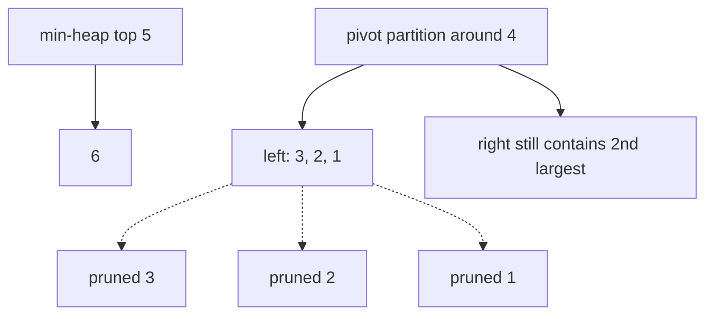

# Heaps, and when quickselect wins

## Problem in my own words

A binary heap keeps the smallest or largest item at the root and updates that root in logarithmic time when you insert or remove. That is the right tool when the set keeps changing. Quickselect finds one order statistic in a fixed array, average linear time, by partitioning like quicksort and ignoring the side that cannot contain the answer. It does not maintain a structure for the next insertion.

## Easy analogy

A heap is a tournament bracket that you repair only along the path from the changed player to the champion. The champion is always on top, and you do not sort the whole field. Quickselect is closer to a single-elimination cut: you pick a pivot, throw everyone clearly on the wrong side out of the gym, and repeat on the side that still contains the person you want. After the tournament is over you have no bracket left for a late entry.

## Diagram

Finding the 2nd-largest in `[3, 2, 1, 5, 6, 4]`. A size-2 min-heap keeps the two biggest values; `5` sits on top and is the answer. The dotted edges are values quickselect can discard once a partition proves they are outside the target rank. They are never put back.



## Intuition

Use a heap when at least one of these is true:

- Items arrive online and you need the current extreme or the current top k after each arrival.
- You repeatedly push new work and pop the best next piece (Dijkstra, merging sorted lists, scheduling).
- You need a running median. One heap cannot split a stream into "smaller half" and "larger half"; two heaps can. That design is problem 39.

Use quickselect when the array is frozen, you need a single kth value (or the value that partitions the array), and you may reorder the array. Average time is linear because each partition throws away a fraction of the elements and the expected work sums to O(n). The worst case is quadratic if pivots are always the minimum or maximum. Random pivots, or a median-of-medians pivot if you must guarantee linearity, are the fixes. Quickselect does not give you the items in order, and it does not support a fast "add one more number and update the kth."

A third, very common compromise is a heap of size k for the k largest numbers in a static array. It is O(n log k), worst-case bounded, and shorter to write than quickselect. For k close to n it is worse than sorting. For a streaming top-k with a huge n and a small k, it is often the intended answer.

Python's `heapq` is a min-heap. A max-heap is the same module with negated priorities, or with tuples whose first field is the reversed key. Java's `PriorityQueue` is a min-heap; `Collections.reverseOrder()` makes a max-heap of comparables.

## Tiny walkthrough

Array `[3, 2, 1, 5, 6, 4]`, k = 2. The kth largest is `5`.

Heap of size k: push 3, push 2. The min-heap is `[2, 3]`. `1` is smaller than the root, so ignore it. `5` evicts `2`. `6` evicts `3`. `4` is smaller than the root `5`, so ignore it. The root is `5`.

Quickselect: the target index in ascending order is `n - k = 4`. Partition until the pivot lands at index 4. Every element to the left is smaller, every element to the right is larger, so the pivot value is `5` even though the two sides are not fully sorted.

If a seventh number arrives later, the heap of size 2 updates in O(log k). Quickselect starts over on a new array of length 7.

## Java

```java
import java.util.PriorityQueue;
import java.util.Random;

class KthLargestHeap {
    /** kth largest in a static array. Min-heap holds the k biggest values. */
    public int findKthLargest(int[] nums, int k) {
        PriorityQueue<Integer> heap = new PriorityQueue<>();
        for (int x : nums) {
            heap.offer(x);
            if (heap.size() > k) {
                heap.poll();
            }
        }
        return heap.peek();
    }
}

class KthLargestQuickselect {
    private final Random random = new Random();

    public int findKthLargest(int[] nums, int k) {
        int target = nums.length - k;
        int lo = 0;
        int hi = nums.length - 1;
        while (lo <= hi) {
            int pivotIndex = partition(nums, lo, hi);
            if (pivotIndex == target) {
                return nums[pivotIndex];
            }
            if (pivotIndex < target) {
                lo = pivotIndex + 1;
            } else {
                hi = pivotIndex - 1;
            }
        }
        throw new IllegalArgumentException("k out of range");
    }

    private int partition(int[] nums, int lo, int hi) {
        int chosen = lo + random.nextInt(hi - lo + 1);
        swap(nums, chosen, hi);
        int pivot = nums[hi];
        int store = lo;
        for (int j = lo; j < hi; j++) {
            if (nums[j] <= pivot) {
                swap(nums, store, j);
                store++;
            }
        }
        swap(nums, store, hi);
        return store;
    }

    private void swap(int[] nums, int i, int j) {
        int tmp = nums[i];
        nums[i] = nums[j];
        nums[j] = tmp;
    }
}
```

## Python

```python
import heapq
import random
from typing import List


def kth_largest_heap(nums: List[int], k: int) -> int:
    """Min-heap of the k largest values. The root is the kth largest."""
    heap = nums[:k]
    heapq.heapify(heap)
    for x in nums[k:]:
        if x > heap[0]:
            heapq.heapreplace(heap, x)
    return heap[0]


def kth_largest_quickselect(nums: List[int], k: int) -> int:
    """Average O(n). Reorders nums. Target is index n-k in ascending order."""
    target = len(nums) - k

    def partition(lo: int, hi: int) -> int:
        chosen = random.randint(lo, hi)
        nums[chosen], nums[hi] = nums[hi], nums[chosen]
        pivot = nums[hi]
        store = lo
        for j in range(lo, hi):
            if nums[j] <= pivot:
                nums[store], nums[j] = nums[j], nums[store]
                store += 1
        nums[store], nums[hi] = nums[hi], nums[store]
        return store

    lo, hi = 0, len(nums) - 1
    while lo <= hi:
        pivot_index = partition(lo, hi)
        if pivot_index == target:
            return nums[pivot_index]
        if pivot_index < target:
            lo = pivot_index + 1
        else:
            hi = pivot_index - 1
    raise ValueError("k out of range")
```

## Complexity

- Binary heap insert and pop: O(log n) time. Peek: O(1). Build-heap from n items: O(n). Space: O(n), or O(k) if you keep only k items.
- Top-k with a size-k heap: O(n log k) time, O(k) extra space.
- Quickselect: average O(n) time, worst O(n²) with unlucky pivots. Random pivots make the bad case astronomically unlikely. Extra space is O(1) besides the input if the partition is in place. The input order is destroyed.
- Sorting to find the kth: O(n log n), simple, and strictly more work than either method when you do not need the full order.
- Streaming median (two heaps): O(log n) per insertion, O(1) per median read, O(n) space. Quickselect cannot update that median in logarithmic time.

## Pitfalls

- Treating `heapq` as a max-heap. It pops the smallest value. Negate numbers, or store `(-priority, item)`, and remember to un-negate when you read.
- Breaking heap order by writing `heap[i] = x` without `heapq.heapify` or the private sift helpers. The list is only a heap if every parent is smaller than its children.
- Using quickselect on a stream. You would copy the whole history and rerun it. That is O(n) per query and O(n²) for n queries.
- Forgetting that a size-k min-heap's root is the smallest of the large half, which is exactly the kth largest, not the largest. The largest is buried.
- Off-by-one on the quickselect index. kth largest is index `n - k` in zero-based ascending order, not index `k` and not index `n - k + 1`.
- Assuming quickselect is stable or that the left side is sorted. Partition only guarantees "smaller or equal on the left, larger or equal on the right" around the final pivot index.

## Two-minute interview script

"If the data is static and I only need the kth largest value, I reach for quickselect. It partitions around a random pivot, like quicksort, then recurs or loops into the side that contains index n minus k. Average time is linear because discarded elements are never touched again. Worst case is quadratic, so the random pivot matters. I can also keep a min-heap of size k and scan the array once in n log k. That is simpler to get right and has a tight worst case. I use it when k is small or when I want the k items themselves, not just the threshold.

If values arrive over time, quickselect is the wrong shape because it throws the partition away. A heap updates the extreme in log time. A size-k heap maintains a running top-k. Two heaps, a max-heap for the low half and a min-heap for the high half, maintain a running median. In Python I only have a min-heap, so the low half stores negated values. In Java I use PriorityQueue and reverseOrder for the low half. I do not sort the stream on every insertion."
