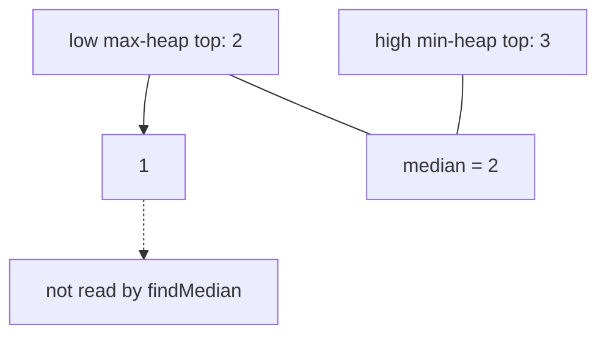

# 39. Find Median from Data Stream

LeetCode 295.

## Problem in my own words

Numbers arrive one at a time, and after any arrival you may be asked for the median of everything seen so far. An odd count uses the middle value; an even count uses the average of the two middle values. Both the update and the read need to stay fast as the stream grows, so sorting the whole history on every call is the wrong design.

## Easy analogy

Picture two bookshelves. The left shelf holds the smaller half of the numbers, with the biggest of that half at the front. The right shelf holds the larger half, with the smallest of that half at the front. The median is always the front of the left shelf, or the average of the two fronts when the shelves are the same length. A new book is placed by comparing it with those fronts, then you move at most one book so the left shelf is equal in size or one book taller.

## Diagram

After `1, 2, 3`, the low max-heap holds `1` and `2` with `2` at the top, and the high min-heap holds `3`. The dotted edges are values sitting under the heap tops. A median query does not walk them.



## Intuition

Keep two heaps:

- `lo` is a max-heap of the smaller half. Its top is the largest small number.
- `hi` is a min-heap of the larger half. Its top is the smallest large number.

Invariant after every insertion: every value in `lo` is less than or equal to every value in `hi`, and `lo` has either the same size as `hi` or one extra element. Then the median is `lo.top` when `lo` is larger, and the average of the two tops when the sizes match.

Insertion restores the invariant in two moves. Push the new number into `lo`, then move `lo`'s top into `hi`. That single move fixes order: the element that crossed was the largest of the low side, so it belongs on the high side if anything does, and everything left in `lo` is at most that value. If `hi` is now strictly taller, move `hi`'s top back into `lo`. Sizes differ by at most one, so one move is enough. Each move is a heap operation.

Python only provides a min-heap. `lo` stores negated numbers, so the smallest negated value is the largest original value. Java uses `PriorityQueue` with `Collections.reverseOrder()` for `lo` and a normal `PriorityQueue` for `hi`.

The average must be computed in floating point. In Java, adding two `int` tops before the division can overflow `int`. Cast one operand to `double` first.

## Tiny walkthrough

`addNum(1)`. Push 1 into `lo`, then move it to `hi`, then move it back because `hi` is taller. State: `lo = [1]`, `hi = []`. Median `1`.

`addNum(2)`. Push 2 into `lo`. `lo`'s max is 2, so move 2 into `hi`. Sizes are equal, so stop. State: `lo = [1]`, `hi = [2]`. Median `(1 + 2) / 2 = 1.5`.

`addNum(3)`. Push 3 into `lo`, move 3 into `hi`. `hi` is taller, so move its min, which is 2, back to `lo`. State: `lo = [1, 2]` with top 2, `hi = [3]`. Median `2`.

Negatives follow the same rules. After `-1, -2`, tops are `-2` and `-1`, and the median is `-1.5`. Duplicates are allowed: two `1`s give tops `1` and `1`, median `1`.

## Java

```java
import java.util.Collections;
import java.util.PriorityQueue;

class MedianFinder {
    /** Smaller half. Top is the largest of the small numbers. */
    private final PriorityQueue<Integer> lo =
            new PriorityQueue<>(Collections.reverseOrder());
    /** Larger half. Top is the smallest of the large numbers. */
    private final PriorityQueue<Integer> hi = new PriorityQueue<>();

    public void addNum(int num) {
        lo.offer(num);
        hi.offer(lo.poll());
        if (hi.size() > lo.size()) {
            lo.offer(hi.poll());
        }
    }

    public double findMedian() {
        if (lo.size() > hi.size()) {
            return lo.peek();
        }
        return ((double) lo.peek() + hi.peek()) / 2.0;
    }
}
```

## Python

```python
import heapq


class MedianFinder:
    def __init__(self) -> None:
        self.lo: list[int] = []  # max-heap via negation, smaller half
        self.hi: list[int] = []  # min-heap, larger half

    def addNum(self, num: int) -> None:
        heapq.heappush(self.lo, -num)
        heapq.heappush(self.hi, -heapq.heappop(self.lo))
        if len(self.hi) > len(self.lo):
            heapq.heappush(self.lo, -heapq.heappop(self.hi))

    def findMedian(self) -> float:
        if len(self.lo) > len(self.hi):
            return float(-self.lo[0])
        return (-self.lo[0] + self.hi[0]) / 2.0
```

`heapq` is a min-heap. Pushing `-num` into `lo` makes `lo[0]` the negation of the largest value in the smaller half. Every read of a `lo` top un-negates it. `hi` stores original values.

## Complexity

- `addNum`: O(log n). At most three heap pushes or pops, each logarithmic in the current size. No shifting of the whole array.
- `findMedian`: O(1). Only the two roots are read. The dotted nodes in the diagram are not visited.
- Space: O(n) for every number seen so far. You cannot drop old numbers because a later value can land in either half and change which old value sits on the boundary.
- Sorting on each query would be O(n log n) per query, or O(n) per query with insertion into a sorted list. Both fail the point of the problem once the stream is long.

## Pitfalls

- Letting the heaps differ by more than one element, or letting `hi` hold the extra odd element while the median code assumes the extra element is in `lo`. Pick one convention and rebalance to it every time. This note keeps the extra element in `lo`.
- Forgetting to negate on the way in and on the way out of the Python max-heap. One missing minus sign silently sorts the wrong half.
- Integer division. In Python 3, `/` is fine. In Java, `(lo.peek() + hi.peek()) / 2` divides two ints. Two large tops can also overflow before the cast if you add them as ints. The cast-first form `((double) lo.peek() + hi.peek()) / 2.0` does both jobs.
- Using one min-heap and reading the middle of the underlying array. A heap array is not sorted, so index `n/2` is not the median.
- Calling `findMedian` on an empty structure. The problem asks for the median only after at least one number. The code above relies on that. An empty `lo` would make `peek` or `lo[0]` fail.
- Balancing by size and forgetting the order invariant. Always pour `lo`'s max into `hi` before the size fix. Pushing into `lo` only when `num <= hi.top`, and into `hi` otherwise, is the other correct insertion; mixing the two styles is how the halves get crossed.

## Two-minute interview script

"I'll keep the smaller half in a max-heap and the larger half in a min-heap, with every low value less than or equal to every high value. I'll also keep the low heap the same size as the high heap, or exactly one larger. The median is then the low top, or the average of both tops when the counts match. That read is constant time.

To insert, I push into the low heap and immediately pop its maximum into the high heap. That repairs order with one move. If the high heap is now bigger, I pop its minimum back into the low heap. Each insert is a couple of logarithmic heap operations, and the space is every element seen so far.

In Python, heapq is a min-heap, so the low half stores negative numbers and I negate again when I read the top. In Java I use PriorityQueue, with Collections.reverseOrder for the low half. When I average the two tops in Java I cast to double before adding, so an int sum cannot overflow and the division is not integer division. I would only re-sort the stream if the interviewer dropped the time requirement."
