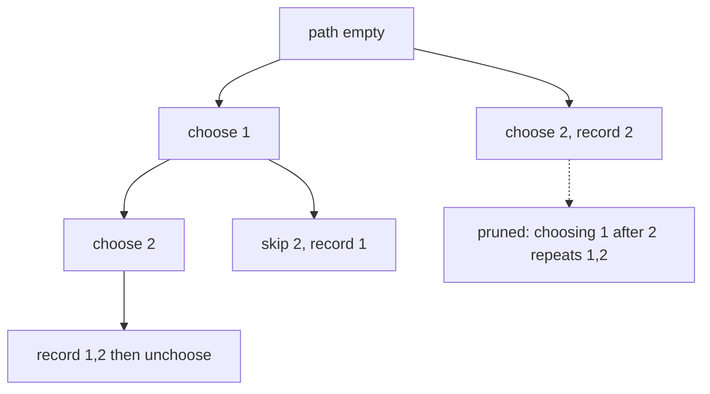

# Backtracking: choose, explore, unchoose

## Problem in my own words

Backtracking builds an answer one decision at a time. You choose an option, explore everything that can follow from that choice, then unchoose it so the next option can reuse the same slot. It is depth-first search over a space of partial solutions, with pruning when a partial solution can no longer become valid.

## Easy analogy

Packing a small bag for a trip with a weight limit. You put an item in, picture the trips that still fit, then take the item back out and try a different one. You do not buy a second bag for every attempt. The "unchoose" is taking the item back out. If the bag is already over the limit, you stop imagining deeper versions of that packing.

## Diagram

Subsets of `[1, 2]`. Each level chooses to include the next number or to skip the rest of a branch that would repeat an earlier decision. The dotted edge is a branch you prune because that number's index is already behind the start pointer, so exploring it would rebuild a subset you already listed.



## Intuition

Every backtracking solution in this folder has the same three lines, even when the "choice" looks different:

1. **Choose.** Push a candidate onto the path, mark a grid cell, or move an index forward.
2. **Explore.** Recurse. The recursive call sees a world in which that choice is locked in.
3. **Unchoose.** Pop the path or restore the cell before the next iteration of the loop. If you skip this, the next choice inherits state that belonged only to the previous branch.

What changes from problem to problem is the rule that generates the next choice and the rule that prunes.

- Subsets and permutations: decisions are "take this unused element." Permutations try every unused element; subsets try elements in index order so `{1,2}` is not also built as `{2,1}`.
- Combination sum: you may reuse a number, so the recursive call starts at the same index, not the next one. You still move a start index forward across the loop so you never pick an earlier number later. That keeps each combination non-decreasing and kills duplicate permutations of the same multiset.
- Word search: the choice is a neighbor cell equal to the next character. The mark is the choose, the recursive neighbor calls are the explore, and writing the letter back is the unchoose. A cell that fails the character test is a pruned branch, drawn as a dotted edge in the problem notes.

Record a copy of the path when it becomes a solution. If you append the live list object, later pops will edit answers you already stored.

## Tiny walkthrough

Subsets of `[1, 2]`, start index 0, path empty.

Choose 1, path `[1]`, explore from index 1. Choose 2, path `[1, 2]`, nothing left, record a copy. Unchoose 2. The loop at this level ends, so record `[1]` if you record on the way in (the usual subsets template records every node, not only the leaves). Unchoose 1. Choose 2, record `[2]`, unchoose 2. The empty subset was recorded at the root. Result: `[], [1], [1, 2], [2]`.

The dotted prune in the diagram is the decision you never attempt: building `[2, 1]` after `[1, 2]`. The start index makes that branch not exist, which is cheaper than building it and throwing it away in a set.

## Java

```java
import java.util.ArrayList;
import java.util.List;

class Subsets {
    public List<List<Integer>> subsets(int[] nums) {
        List<List<Integer>> answers = new ArrayList<>();
        explore(nums, 0, new ArrayList<>(), answers);
        return answers;
    }

    private void explore(int[] nums, int start, List<Integer> path, List<List<Integer>> answers) {
        answers.add(new ArrayList<>(path));
        for (int i = start; i < nums.length; i++) {
            path.add(nums[i]);                 // choose
            explore(nums, i + 1, path, answers); // explore; i+1 forbids reusing nums[i]
            path.remove(path.size() - 1);     // unchoose
        }
    }
}
```

## Python

```python
from typing import List


def subsets(nums: List[int]) -> List[List[int]]:
    answers: List[List[int]] = []
    path: List[int] = []

    def explore(start: int) -> None:
        answers.append(path[:])  # copy; the live path will be mutated
        for i in range(start, len(nums)):
            path.append(nums[i])   # choose
            explore(i + 1)         # explore
            path.pop()             # unchoose

    explore(0)
    return answers
```

Combination sum changes exactly one argument: the recursive call passes `i` instead of `i + 1`, so the same number can be chosen again. Word search changes the choice itself from "an index" to "a neighbor cell," and the unchoose restores the grid. The skeleton stays.

## Complexity

- The shape is a recursion tree. Time is proportional to the number of nodes in that tree, times the work at each node. Copying a path of length `L` costs O(`L`), and that cost is easy to forget.
- Subsets: 2^n leaves of decisions, O(n · 2^n) time once copies are counted, O(n) stack space besides the output.
- Combination sum: the tree is larger when reuse is allowed. A useful bound is O(n^(T/M)) candidates explored, where `T` is the target and `M` is the smallest candidate, because the deepest path has length `T/M`. Pruning when `candidate > remain` cuts the right-hand side of the loop if the array is sorted.
- Word search: O(cells · 4^L) for a word of length `L`, with the same choose / unchoose mark on cells. Space is O(`L`) for the stack if the mark lives in the grid.
- Backtracking is exponential in the decision depth. Say that plainly. The interview win is pruning and not duplicating work, not a polynomial claim.

## Pitfalls

- Forgetting the unchoose. The path or the board silently accumulates every previous branch.
- Storing `path` instead of a copy. Every answer becomes the empty list by the time the function returns, because it is the same list after every pop.
- Using a start index of `i + 1` when reuse is required, or `i` when each element may be used once. That single argument is the difference between combination-sum variants.
- Sorting and skipping duplicates only in the "each element once, input contains copies" problem. Unlimited reuse of distinct candidates does not need a "skip equal neighbors" test. It needs the non-decreasing index.
- Pruning after the recursive call instead of before it. The bad branch already ran.
- Treating backtracking as BFS. You can search the same space with a queue, but the natural undo is the return from a recursive call. An explicit queue has to copy the path on every edge.

## Two-minute interview script

"Backtracking is depth-first search over partial decisions. I choose one option, recurse, then undo that option before trying the next one. The undo is the whole trick: one path list and one board are reused for every branch. When I record an answer I copy the path, because the live list is about to be popped.

I keep duplicate answers out by restricting the choices, not by stuffing a set at the end. For subsets I only take numbers at or after a start index, so combinations stay in input order. For combination sum, where a number may be reused, the recursive call uses that same index, and the loop still moves forward so I never pick a smaller index afterward. Paths stay non-decreasing. For word search the choice is a neighbor that matches the next character. Choose means mark the cell, unchoose means write the letter back. If the partial path is already illegal — sum too big, letter mismatch, cell reused — I return before branching. That is the dotted prune. The time is the size of the decision tree. I state that exponential bound, then I state what the prune removes."
