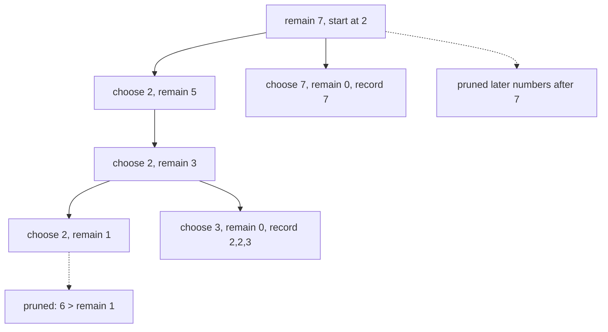

# 40. Combination Sum

LeetCode 39.

## Problem in my own words

You are given distinct positive integers and a target. Find every collection of those integers that adds up to the target. You may use the same integer as many times as you want. Two collections that contain the same numbers with the same frequencies are the same answer even if you would have picked them in a different order, so `[2, 2, 3]` should appear once, not also as `[2, 3, 2]` and `[3, 2, 2]`.

## Easy analogy

Making exact change when the cashier will give you as many coins of each type as you want, but you have to list each combination once. You always move from smaller coin types to larger ones, and you are allowed to take another coin of the type still in your hand. You never go back to a smaller type you already passed. That rule is what stops the same handful of coins from being counted in every order.

## Diagram

Candidates `[2, 3, 6, 7]`, target `7`. From the remaining value 3, choosing 2 is legal and choosing 6 is not. The dotted edge is that prune. Because the array is sorted, 7 is pruned with the same `break`.



## Intuition

This is backtracking over a non-decreasing sequence. Sort the candidates so that "too big" means "this one and everything after it." The path is the combination under construction. The remaining target shrinks by the chosen value.

The loop index `i` runs from `start` to the end. Choosing `candidates[i]` and recursing with the same `start = i` allows unlimited reuse. The next iteration uses `i + 1` as its start, so a later choice never goes back to an earlier candidate. Every generated combination is sorted, and every multiset has one sorted form, so duplicates never appear. You do not need a set of answers.

Base cases: remaining 0 means record a copy of the path. A candidate larger than the remaining total means `break` out of the loop. An empty candidate list, or a smallest candidate that is already too big, produces no combinations.

Candidates are positive, so the remaining total strictly decreases and the recursion cannot cycle. That promise is load-bearing. A zero in the input would recurse forever on unlimited reuse.

## Tiny walkthrough

Candidates `[2, 3, 6, 7]`, target `7`.

- Path `[]`, remain 7. Take 2. Path `[2]`, remain 5. Take 2. Path `[2, 2]`, remain 3. Take 2. Path `[2, 2, 2]`, remain 1. The next 2 is already bigger than 1, so break. Unchoose back to `[2, 2]`. Take 3. Remain 0. Record `[2, 2, 3]`.
- Unwind to `[2]`. Taking 3 leads to remain 2, then another 2 would require looking backward; the start index is already at 3, so the only continuations are 3, 6, 7, all too big. That branch dies. This is correct: `[2, 3, 2]` is the same multiset as `[2, 2, 3]`, already recorded.
- Next first pick is 3. `[3, 3]` leaves 1, which is too small for another coin. No record from this branch. `[3]` then 6 overshoots.
- First pick 6 overshoots nothing at remain 7, then remain 1 dies. First pick 7 hits 0. Record `[7]`.
- Answers: `[2, 2, 3]` and `[7]`.

## Java

```java
import java.util.ArrayList;
import java.util.Arrays;
import java.util.List;

class Solution {
    public List<List<Integer>> combinationSum(int[] candidates, int target) {
        Arrays.sort(candidates);
        List<List<Integer>> answers = new ArrayList<>();
        explore(candidates, target, 0, new ArrayList<>(), answers);
        return answers;
    }

    private void explore(int[] candidates, int remain, int start,
                         List<Integer> path, List<List<Integer>> answers) {
        if (remain == 0) {
            answers.add(new ArrayList<>(path));
            return;
        }
        for (int i = start; i < candidates.length; i++) {
            if (candidates[i] > remain) {
                break;
            }
            path.add(candidates[i]);
            explore(candidates, remain - candidates[i], i, path, answers);
            path.remove(path.size() - 1);
        }
    }
}
```

## Python

```python
from typing import List


class Solution:
    def combinationSum(self, candidates: List[int], target: int) -> List[List[int]]:
        candidates.sort()
        answers: List[List[int]] = []
        path: List[int] = []

        def explore(start: int, remain: int) -> None:
            if remain == 0:
                answers.append(path[:])
                return
            for i in range(start, len(candidates)):
                if candidates[i] > remain:
                    break
                path.append(candidates[i])
                explore(i, remain - candidates[i])
                path.pop()

        explore(0, target)
        return answers
```

The recursive call passes `i`, not `i + 1`. That is the unlimited-reuse decision. The loop's next `i` is what moves the start forward and keeps the combination non-decreasing.

## Complexity

- Let `n` be the number of candidates, `T` the target, and `M` the smallest candidate. The longest path has length `T / M`, because each pick subtracts at least `M`.
- Time is exponential in that depth. A standard loose bound is O(n^(T/M)): at each step you may try up to n candidates, and sorting adds O(n log n), which is dominated. Pruning reduces the constant a lot and does not change the worst-case shape when every candidate is small.
- Stack space is O(`T / M`) for the path. Output space is proportional to the number of combinations times their lengths. Copying each answer is O(path length) and is part of the time.

## Pitfalls

- Passing `i + 1` and forbidding reuse. You then miss `[2, 2, 3]`. That argument belongs to the "each number once" variant.
- Passing `0` on every call and using a set to unique the results. You will generate every permutation. It can be made correct and it is the slow version of this solution.
- Forgetting to copy `path` before storing it. The output lists stay tied to the one mutable buffer and end up empty.
- Forgetting to pop after the recursive call. The next candidate is appended to a dirty path.
- Using `continue` instead of `break` after sorting. Later candidates are larger, so continuing is only a missed prune, not a wrong answer. Breaking before the array is sorted is a wrong answer, because a later smaller candidate might still fit.
- A zero or negative candidate. Unlimited reuse of 0 never reduces `remain`. The problem states positive candidates. If that promise disappeared, I would guard `candidate <= 0` before recursing.

## Two-minute interview script

"I need every multiset of the candidates that sums to the target, and I may reuse a candidate. I'll sort the array and run backtracking with a start index. The loop only considers candidates from that index onward, so each combination is built in non-decreasing order and I never emit both `[2,3,2]` and `[2,2,3]`. When I choose `candidates[i]`, the recursive call uses the same index `i`, which is what allows another copy of that value. The following loop iteration uses a later index, which is what moves on to the next distinct value.

I subtract the choice from the remaining target. If the remaining target hits zero I append a copy of the path. If a candidate is larger than what remains, I break, because sorting means the rest are larger too. Then I pop the choice and try the next candidate. Candidates are positive, so the remaining total shrinks and the search terminates. Time is exponential in `target / min(candidate)`. The important implementation detail is that one index argument: `i` for reuse, and a copied list when I record."
