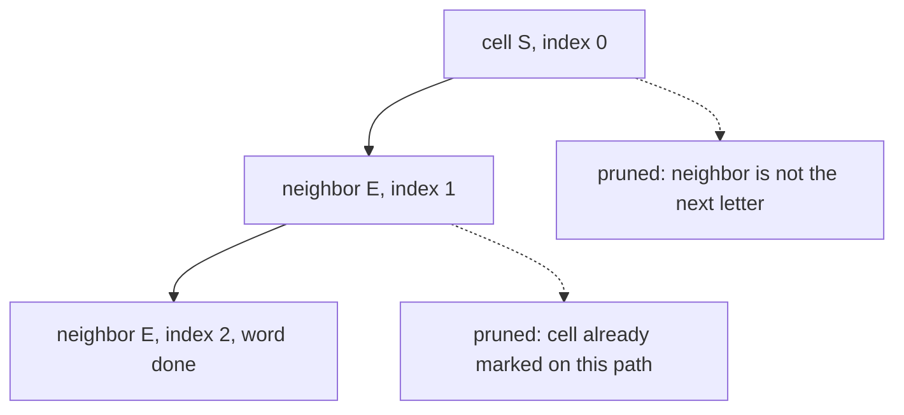

# 41. Word Search

LeetCode 79.

## Problem in my own words

Decide whether one word can be spelled by a 4-directional path on a letter grid without revisiting a cell. You only need yes or no, and you can stop at the first path that works. Searching a whole dictionary is a separate problem that puts a trie on top of this same walk.

## Easy analogy

Tracing a word in a bowl of alphabet soup with a finger. The next letter has to sit against the current one, not diagonally and not across the bowl. You will not use the same noodle twice in one word. If a step is wrong you lift your finger off that noodle and try a different neighbor. When the last letter fits, you are done. You do not keep fishing for a second copy of the word.

## Diagram

Board fragment and the word `SEE`. From `S`, the neighbor `E` is a real choice. The dotted edge is a neighbor that is the wrong letter or is already on the path: DFS returns without marking it.



## Intuition

Search from every cell that could be the first letter. The DFS state is `(row, column, index into the word)`. If the index equals the word length, every character matched and the answer is true.

Before matching, reject the cell if it is off the board, already marked, or not equal to `word[index]`. Those are the prunes. There is nothing to undo because the cell was not taken.

If it matches, mark it, then try the four neighbors at `index + 1`. As soon as one neighbor returns true, return true. If all four fail, restore the original letter and return false so a different path can use this cell. The mark plus the restore is choose / explore / unchoose.

Storing the mark in the grid avoids a parallel visited matrix. Any sentinel outside the letter alphabet works; `#` is fine when the board is English letters. The letter is put back before the call returns, so a failed search leaves the board as it found it. A successful search may return while frames are still unwinding; those frames should still restore the letter if the caller cares about the board. Restoring before the `return true` is the clean habit. The code below restores on the way out in every case, including success, because the restore is placed before the final return of that frame. Early `return true` from a child does not skip the parent's restore.

Checking "index == length" before the bounds check lets the call that just matched the last character succeed by invoking neighbors with a finished index. Those neighbor calls return true immediately, even if the coordinates are off the board. That is deliberate. The last letter was already matched in the parent frame.

## Tiny walkthrough

Board:

```
A B C E
S F C S
A D E E
```

Word `ABCCED`. One successful path is `(0,0) A → (0,1) B → (0,2) C → (1,2) C → (2,2) E → (2,1) D`. Each cell is marked while the path sits on it. When the index reaches 6, the word is done.

Word `SEE` can start at the bottom-right area: `S` at `(1,3)`, `E` at `(2,3)`, and the second `E` needs a neighboring `E`. `(2,2)` is `E` and is free. True.

Word `ABCB` matches `A-B-C` and then needs `B`. The `B` it would want is the cell already used at the start of the path. The mark rejects it. Other starts fail too. False.

## Java

```java
class Solution {
    public boolean exist(char[][] board, String word) {
        int rows = board.length;
        int cols = board[0].length;
        for (int r = 0; r < rows; r++) {
            for (int c = 0; c < cols; c++) {
                if (dfs(board, word, r, c, 0)) {
                    return true;
                }
            }
        }
        return false;
    }

    private boolean dfs(char[][] board, String word, int r, int c, int i) {
        if (i == word.length()) {
            return true;
        }
        if (r < 0 || c < 0 || r >= board.length || c >= board[0].length) {
            return false;
        }
        if (board[r][c] != word.charAt(i)) {
            return false;
        }
        char saved = board[r][c];
        board[r][c] = '#';
        boolean found = dfs(board, word, r + 1, c, i + 1)
                || dfs(board, word, r - 1, c, i + 1)
                || dfs(board, word, r, c + 1, i + 1)
                || dfs(board, word, r, c - 1, i + 1);
        board[r][c] = saved;
        return found;
    }
}
```

## Python

```python
from typing import List


class Solution:
    def exist(self, board: List[List[str]], word: str) -> bool:
        rows, cols = len(board), len(board[0])

        def dfs(r: int, c: int, i: int) -> bool:
            if i == len(word):
                return True
            if not (0 <= r < rows and 0 <= c < cols) or board[r][c] != word[i]:
                return False
            saved = board[r][c]
            board[r][c] = "#"
            found = (
                dfs(r + 1, c, i + 1)
                or dfs(r - 1, c, i + 1)
                or dfs(r, c + 1, i + 1)
                or dfs(r, c - 1, i + 1)
            )
            board[r][c] = saved
            return found

        for r in range(rows):
            for c in range(cols):
                if dfs(r, c, 0):
                    return True
        return False
```

The `or` chain stops calling neighbors after the first true result. The cell is still restored after that expression, before this frame returns.

## Complexity

- Let the board have `R * C` cells and the word have length `L`.
- From a cell the walk branches to at most 4 neighbors and stops at depth `L`, so one start is O(4^L). Times every start, the bound is O(`R * C * 4^L`). Mismatches return immediately, so real grids prune earlier. The bound is still the one to say.
- Extra space is O(`L`) for the call stack. The visit marks reuse the board, so there is no second matrix. If mutation is forbidden, a visited set of size O(`L`) along the path (you add and remove) keeps the same stack bound, or a full matrix uses O(`R * C`).

## Pitfalls

- Forgetting to restore the cell. After the first failed path the board is full of `#` and later starts cannot see letters.
- Marking the cell and not checking the mark. A path can sit on one cell for the entire word whenever the letter happens to match, so `AAA` becomes true on a single `A`.
- Moving diagonally. The problem is 4-directional. Adding the four diagonal deltas changes the problem.
- Starting DFS only at `(0, 0)`. The word may start anywhere. The outer double loop is required. Pruning starts whose letter is not `word[0]` is a useful extra, and the DFS already does that on the first comparison.
- Building the answer path as a string by concatenation at every step. It is correct and allocates more. The index into the original word is enough for a boolean problem.
- Leaving the finished-index check until after the bounds check in a way that demands a phantom extra cell. Either match the last character and then return true inside that frame, or allow the `i == length` check to win before bounds, as this code does. Mixing them off-by-one rejects every word.

## Two-minute interview script

"This is grid backtracking. I try every cell as the start of the word. The DFS carries the row, the column, and how many characters I have matched. If the match count equals the word length, I return true. Otherwise an out-of-range cell, a cell that does not equal the next character, or a cell I already marked is a dead end.

When the cell matches, I overwrite it with a sentinel so this path cannot reuse it, then I try the four orthogonal neighbors with the index plus one. I restore the letter after those calls, whether they succeeded or not, so the next branch sees the real board. The first true neighbor finishes the search. I do not keep scanning for another occurrence.

The choose is the sentinel, the explore is the four calls, and the unchoose is the restore. Time is on the order of cells times 4 to the word length. The stack is the word length. If we were searching many words instead of one, I would put the dictionary in a trie and run this same marked walk against trie children, and I would delete trie branches that have already produced their word."
