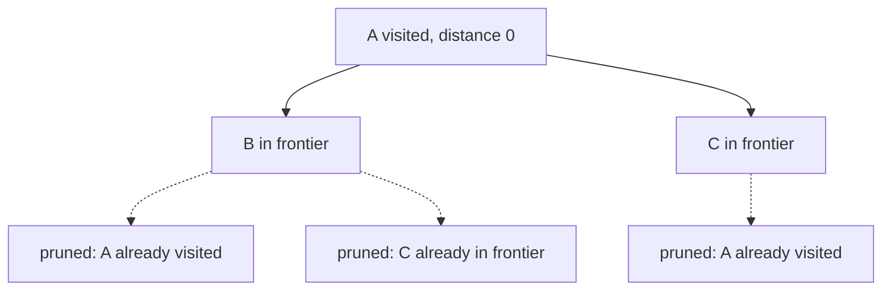

# Graph search: BFS, DFS, and visited

## Problem in my own words

Graph search answers what you can reach, and in what order. Depth-first search follows one neighbor until it dead-ends, then backtracks, while breadth-first search finishes the current distance before going farther. Both need a visited rule, or a cycle runs forever. The question you were asked — components, a clone, a shortest path, a cycle — decides which traversal to write.

## Easy analogy

DFS is walking one hallway of a museum until it dead-ends, then returning to the last fork. BFS is a group of friends spreading out so that everyone one room away is checked before anyone two rooms away. The velvet rope at a doorway you have already entered is the visited set. Without it, a circular gallery keeps you walking all night. The rope goes up when you first commit to a room, not after you have finished the whole wing, if a cycle could send you back in the meantime.

## Diagram

An undirected triangle `A-B-C-A`, searched with BFS from `A`. The queue's next wave is the frontier. Dotted edges point at nodes that are already queued or visited, so they are not enqueued again.



## Intuition

Represent the graph in the form the problem already has. A grid is an implicit graph: four neighbors, bounds checks instead of an adjacency list. An adjacency list is the default for an explicit graph. A matrix is comfortable only when the node set is tiny and dense.

Visited has two jobs. It prevents infinite loops on cycles, and it prevents exponential rework when many paths reach the same node. Mark a node the moment you push it, not when you pop it. Marking on pop lets the same node sit in the queue many times. On a grid, "mark" might mean flipping a `'1'` to `'0'`, or writing into a boolean matrix of the same shape. On a graph of objects, use a set of node identities, not a set of values, unless the value is guaranteed unique.

Pick the tool:

- **Component count, existence of a path, clone, flood fill:** DFS or BFS both work. DFS is shorter. Recursion depth is the risk on a huge skinny graph; then use an explicit stack or BFS.
- **Shortest path in an unweighted graph:** BFS. The first time you reach a node is the fewest edges. DFS does not have that property.
- **Cycle in a directed graph:** DFS with three colors (unseen, on the current stack, finished), or Kahn's algorithm (indegree BFS). A plain visited set is not enough, because a back edge into the current stack is a cycle and an edge into a finished node might be a cross edge, which is legal in a DAG.
- **Dependencies / course order:** the same cycle tools. The boolean "can I finish?" is false exactly when a cycle exists, assuming every node is a course.

Grid problems in this folder (islands, water flow) are just DFS with a bounds check. Clone graph is DFS with a map from old node to new node, and the map is the visited set. Course schedule is directed cycle detection.

## Tiny walkthrough

Grid:

```
1 1 0
1 0 0
0 0 1
```

Start DFS at `(0,0)`. Mark it and walk to `(0,1)` and `(1,0)`. Both are land. Their other neighbors are water or already marked. That component is finished. The scan finds `(2,2)`, a second component. BFS from `(0,0)` would enqueue `(0,1)` and `(1,0)` as the frontier, then pop them and find no new land. The dotted edges in the diagram are the same idea: a neighbor that is already marked is not a new discovery.

On a directed graph `0 → 1 → 0`, a DFS that marks 0 gray, then 1 gray, then sees 0 still gray, reports a cycle. A BFS that only uses a boolean visited set may never notice, depending on how you define the walk. Color or indegree is required for that question.

## Java

```java
import java.util.ArrayDeque;
import java.util.ArrayList;
import java.util.List;
import java.util.Queue;

class GraphSearch {
    /** Reachable count in an unweighted undirected graph, including start. */
    public int bfsCount(List<List<Integer>> graph, int start) {
        boolean[] seen = new boolean[graph.size()];
        Queue<Integer> queue = new ArrayDeque<>();
        queue.offer(start);
        seen[start] = true;
        int count = 0;
        while (!queue.isEmpty()) {
            int node = queue.poll();
            count++;
            for (int next : graph.get(node)) {
                if (!seen[next]) {
                    seen[next] = true; // mark on push, not on pop
                    queue.offer(next);
                }
            }
        }
        return count;
    }

    public int dfsCount(List<List<Integer>> graph, int start) {
        boolean[] seen = new boolean[graph.size()];
        return dfs(graph, start, seen);
    }

    private int dfs(List<List<Integer>> graph, int node, boolean[] seen) {
        seen[node] = true;
        int count = 1;
        for (int next : graph.get(node)) {
            if (!seen[next]) {
                count += dfs(graph, next, seen);
            }
        }
        return count;
    }
}
```

## Python

```python
from collections import deque
from typing import List


def bfs_count(graph: List[List[int]], start: int) -> int:
    seen = [False] * len(graph)
    queue = deque([start])
    seen[start] = True
    count = 0
    while queue:
        node = queue.popleft()
        count += 1
        for nxt in graph[node]:
            if not seen[nxt]:
                seen[nxt] = True
                queue.append(nxt)
    return count


def dfs_count(graph: List[List[int]], start: int) -> int:
    seen = [False] * len(graph)

    def dfs(node: int) -> int:
        seen[node] = True
        total = 1
        for nxt in graph[node]:
            if not seen[nxt]:
                total += dfs(nxt)
        return total

    return dfs(start)
```

Both functions count nodes reachable from `start`, including `start`. On a connected undirected graph that equals `n`. The visited array is what stops the triangle in the diagram from enqueuing the same nodes forever.

## Complexity

- Adjacency-list BFS or DFS visits each reachable node once and each reachable edge once: O(V + E) time. Grid versions are O(rows · cols) because each cell has a constant number of edges.
- Extra space is O(V) for the visited structure and the queue or recursion stack. A path-shaped graph makes recursive DFS O(V) frames deep. That can overflow a small thread stack; an explicit stack has the same asymptotics and a bigger constant budget.
- Marking on pop can make BFS O(V · E) operations on a dense graph, because one node is queued once per incoming edge. The asymptotic "O(V + E)" claim assumes mark-on-push.
- Shortest unweighted paths from one source are a BFS with a distance array, still O(V + E). Weighted non-negative edges move you to Dijkstra. Those weights are outside this folder's basic pattern.

## Pitfalls

- Forgetting visited on an undirected edge. The walk bounces between the two endpoints.
- Marking a grid cell only after exploring its neighbors. The sibling call walks back into it.
- Using BFS and claiming the first hit is shortest when edges have weights. It is shortest in hop count only.
- Using one boolean visited set to detect directed cycles. You need gray/black colors or indegrees. A finished node's back-reference from a later branch is not a cycle.
- Comparing graph nodes by value when two nodes may share a value, or when the clone must preserve identity. Visited keys are object identity for clone graph.
- Recursing on a grid without a bounds check first. The neighbor formula will index off the array before the visited test can save you.

## Two-minute interview script

"I treat the input as a graph even when it is drawn as a grid. Cells or objects are nodes, and the legal moves are edges. I write down whether the edges are directed. Then I pick BFS or DFS. Both are linear in vertices plus edges if I mark a node visited when I first discover it. BFS uses a queue and explores in rings of equal distance, so I use it for fewest steps. DFS follows one path and backtracks, and I use it when I am flooding a component, cloning, or looking for a cycle with colors.

The visited structure is not optional once a cycle exists. On a grid I can mutate the cell or fill a boolean matrix. On an object graph I use a set or a map keyed by the node. I mark before I push children. Marking when I pop lets the queue fill with duplicates.

If the question is a directed cycle or a course schedule, a single visited bit is the wrong tool. I color a node gray while it is on the recursion stack and black when its whole subtree is done. A gray neighbor is a back edge, which is a cycle. Kahn's algorithm is the BFS version: repeatedly peel off indegree-zero nodes, and if any node is left, there was a cycle. I say the O(V + E) bound out loud and I name the stack depth if I recurse."
