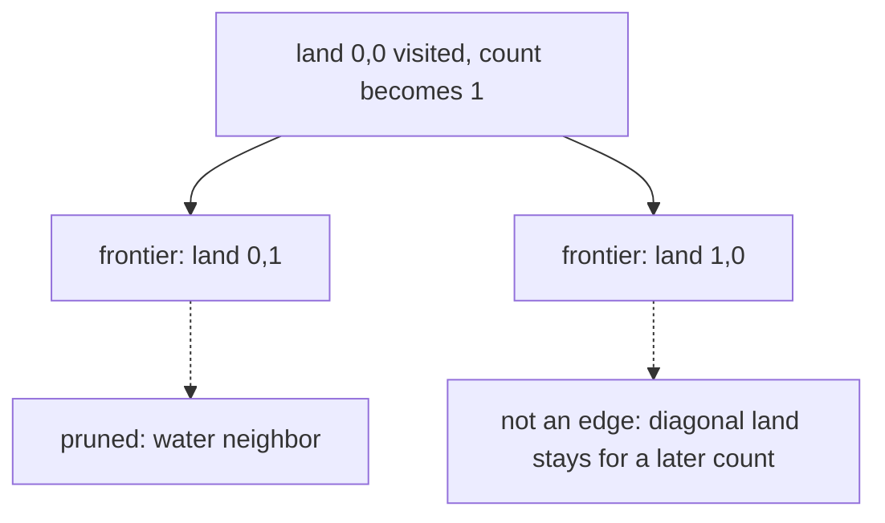

# 42. Number of Islands

LeetCode 200.

## Problem in my own words

The grid is water and land, and an island is a maximal group of land cells joined by shared sides, not by corners. Return how many islands there are. The grid may be mutated. Once a land cell has been claimed by an island, it must not start a second count.

## Easy analogy

A map of puddles and dry rocks. You scan the map in reading order. Every time you step on a dry rock you have not visited, you add one island and then walk to every rock touching it, painting them as you go, so the scan will not start a second count on the same archipelago. Rocks that only touch at a corner are different islands. You do not need to remember the shape after the paint is down. You only need the tally.

## Diagram

Two islands. BFS from the top-left land cell has already visited that cell. The dotted edges are the frontier that will be marked and expanded next. The diagonal land cell is not a neighbor, so it is a different component and is not on this frontier.



## Intuition

This is connected components on an implicit grid graph. Scan every cell. When you see land, increment the answer and flood the whole component so each island is counted once. Flooding can be DFS or BFS. The code below is DFS: from a land cell, sink it to water (the visited mark) and recurse on the four neighbors. Sinking first prevents the neighbor from walking straight back.

Water cells and out-of-range coordinates are the prunes. They return without branching. Diagonal cells are never generated, because the delta list has no `(1,1)` style moves.

If the interviewer forbids mutation, the same DFS writes into a `boolean[][] seen` instead of overwriting the grid. The count does not change. Union-find also works: union each land cell with its upper and left land neighbors, then count distinct roots. That is more code for the same asymptotic bound, and it is a better fit when the problem later adds and removes land dynamically.

## Tiny walkthrough

```
1 1 0
1 0 0
0 0 1
```

Scan hits `(0,0)`. Count becomes 1. DFS sinks `(0,0)`, `(0,1)`, and `(1,0)`. The other neighbors are water or off-board. Scan continues across the sunk cells and ignores them. `(2,2)` is land. Count becomes 2. Its four neighbors are not land. Final answer 2.

A second grid of all water returns 0. A single land cell returns 1. Two land cells touching only at a corner return 2, because the diagonal is not in the delta list.

## Java

```java
class Solution {
    public int numIslands(char[][] grid) {
        if (grid.length == 0 || grid[0].length == 0) {
            return 0;
        }
        int rows = grid.length;
        int cols = grid[0].length;
        int islands = 0;
        for (int r = 0; r < rows; r++) {
            for (int c = 0; c < cols; c++) {
                if (grid[r][c] == '1') {
                    islands++;
                    sink(grid, r, c);
                }
            }
        }
        return islands;
    }

    private void sink(char[][] grid, int r, int c) {
        if (r < 0 || c < 0 || r >= grid.length || c >= grid[0].length) {
            return;
        }
        if (grid[r][c] != '1') {
            return;
        }
        grid[r][c] = '0';
        sink(grid, r + 1, c);
        sink(grid, r - 1, c);
        sink(grid, r, c + 1);
        sink(grid, r, c - 1);
    }
}
```

## Python

```python
from typing import List


class Solution:
    def numIslands(self, grid: List[List[str]]) -> int:
        if not grid or not grid[0]:
            return 0
        rows, cols = len(grid), len(grid[0])

        def sink(r: int, c: int) -> None:
            if not (0 <= r < rows and 0 <= c < cols) or grid[r][c] != "1":
                return
            grid[r][c] = "0"
            sink(r + 1, c)
            sink(r - 1, c)
            sink(r, c + 1)
            sink(r, c - 1)

        islands = 0
        for r in range(rows):
            for c in range(cols):
                if grid[r][c] == "1":
                    islands += 1
                    sink(r, c)
        return islands
```

## Complexity

- Time O(`R * C`). Each cell is inspected by the scan, and each land cell is sunk at most once. Each cell attempts four neighbor calls, a constant.
- Space O(`R * C`) in the worst case for the recursion stack, when the island is one long snake. A full rectangular island is shallower, but the safe bound is the number of cells. BFS uses a queue with the same worst-case size and avoids the call-stack limit.
- The output is a single integer. If mutation is not allowed, the seen matrix is O(`R * C`) extra space and the time bound is unchanged.

## Pitfalls

- Counting every land cell instead of every component. The flood, or an equivalent visited mark, is what turns area into a count.
- Including diagonal deltas. Corner-touching land then becomes one island and the answer drops.
- Sinking the cell after the recursive calls. The opposite neighbor immediately recurses back and overflows.
- Treating the character `"1"` and the integer `1` as the same value in Python. Grid problems usually pass strings. Compare with `"1"`.
- Forgetting the empty-grid guard and reading `grid[0]` on a zero-row input.
- Assuming the scan order changes the count. It changes which island is found first, not how many there are.

## Two-minute interview script

"I scan the grid. Every time I find a land cell, I increment the island count and flood that whole component so I will not count it again. Flooding is DFS to the four orthogonal neighbors. The first thing the DFS does is turn the land into water, which is my visited mark, and then it recurses. Water and out-of-bounds cells return immediately. Those are the pruned branches.

I do not walk diagonals. Two lands that touch only at a corner are two islands. Time is linear in the number of cells, because each cell is sunk at most once. The extra space is the recursion stack, which can be the whole grid on a snake-shaped island. If that stack is a concern I switch to BFS with a queue and the same mark-when-discovered rule. If I cannot mutate the input I use a boolean matrix instead of writing zeros. Union-find is a correct alternative: each land cell unions with the land above it and to its left, and the answer is the number of roots. For a static grid, the flood is the shorter code."
